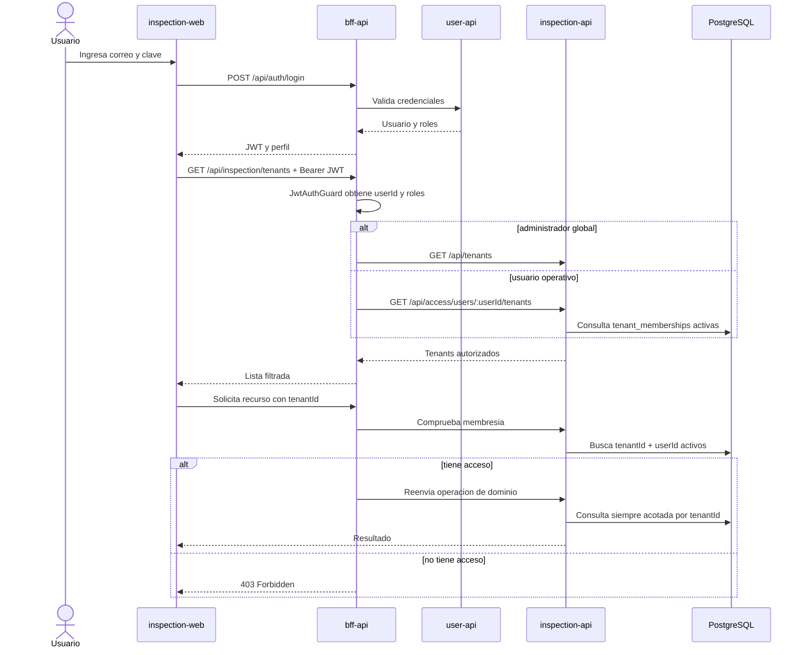

# Referencia: autenticacion y tenants de GridAssets

Esta referencia describe la implementacion validada el 11 de septiembre de 2026. Sirve como ejemplo para futuras aplicaciones; antes de copiarla hay que
compararla con el codigo actual.

## Mapa del flujo



La idea clave es esta:

```text
login = prueba quien es el usuario
membresia = decide a que empresas puede entrar
rol = decide que acciones puede ejecutar
tenantId = limita sobre que datos actua
```

## Modelo de datos

La tabla `tenant_memberships` conecta identidades de `user-api` con empresas de
GridAssets:

```text
users (user-api)                  tenants (inspection_db)
      id                                      id
       |                                      |
       +------ tenant_memberships ------------+
               id
               user_id
               tenant_id
               active
               created_at
               updated_at

UNIQUE (tenant_id, user_id)
```

`tenant_id` tiene FK hacia `tenants` y borrado en cascada. `user_id` no tiene
FK porque el usuario vive en otra base y otro servicio. El BFF consulta
`user-api` antes de otorgar acceso y luego guarda el UUID externo.

Una membresia no concede el rol global `admin`. Solo concede entrada al tenant.
En el modelo actual:

- `admin`: administrador global de la plataforma y acceso a todos los tenants;
- `user` con membresia: usuario operativo del tenant;
- `user` sin membresia: sesion valida, sin acceso a empresas de GridAssets.

Pendiente de producto: separar `platform_admin`, `tenant_admin`, supervisor,
inspector y consulta antes de ampliar la delegacion dentro de cada empresa.

## Archivos de referencia

### Frontend `inspection-web`

- `src/features/auth/models.ts`: contrato de usuario, roles y sesion.
- `src/features/auth/auth-storage.ts`: lectura, validacion de expiracion y
  limpieza del JWT.
- `src/features/auth/auth-api.ts`: login y perfil a traves del BFF.
- `src/features/auth/authenticated-fetch.ts`: agrega Bearer token; ante `401`
  limpia la sesion y emite `gridassets:session-expired`.
- `src/features/auth/auth-context.tsx`: restaura y valida la sesion, inicia y
  cierra sesion y escucha su expiracion.
- `src/pages/login-page.tsx`: login comun para operacion y control global.
- `src/routes/app-routes.tsx`: guards de autenticacion, operacion y
  administracion global. `/platform/login` redirige al login comun.
- `src/app/app.tsx`: instala un solo `AuthProvider` para toda la aplicacion.
- `src/features/platform/platform-api.ts`: cliente autenticado del control
  global.

Los clientes de activos, conceptos, plantillas y trabajos tambien usan
`authenticatedFetch`. Los layouts consumen la misma sesion y muestran u
ocultan navegacion segun el rol.

### BFF `bff-api`

- `src/app/auth/`: login, estrategia JWT, `JwtAuthGuard`, `RolesGuard` y
  decorador `@Roles` compartidos.
- `src/app/inspection-api/inspection-api.controller.ts`: fachada publica de
  GridAssets; valida JWT, tenant y roles.
- `src/app/inspection-api/inspection-tenant-access.guard.ts`: omite la
  comprobacion para `admin`; para los demas consulta la membresia usando el
  `userId` del JWT y el `tenantId` de la ruta.
- `src/app/inspection-api/inspection-api.client.ts`: cliente de las rutas
  internas de `inspection-api`.
- `src/app/inspection-api/platform-admin.controller.ts`: administracion de
  tenants y accesos, protegida globalmente por rol `admin`.
- `src/app/user-api/user-api.client.ts`: consulta identidades antes de asociar
  su UUID a un tenant.

`GET /api/inspection/tenants` es especial: devuelve todos los tenants activos a
un administrador global y solo los asignados a un usuario normal.

### API y PostgreSQL `inspection-api`

- `src/app/platform/entities/tenant-membership.entity.ts`: entidad TypeORM.
- `src/app/platform/platform.service.ts`: tenants accesibles, comprobacion,
  alta/reactivacion y revocacion de membresias.
- `src/app/platform/platform.controller.ts`: administracion interna de tenants
  y membresias.
- `src/app/platform/tenant-access.controller.ts`: consultas internas usadas
  por el guard del BFF.
- `src/migrations/1799101100000-CreateTenantMemberships.ts`: tabla, indices y
  restricciones.
- `src/app/config/database.config.ts`: registro de la migracion.

La API sigue validando `tenantId` y `siteId` en servicios y relaciones. El guard
del BFF impide llegar a un tenant ajeno; el aislamiento de la API y la base
impide mezclar entidades si aparece un defecto en otra capa.

## Contrato HTTP actual

Rutas publicas consumidas por el navegador:

```text
POST   /api/auth/login
GET    /api/auth/profile

GET    /api/inspection/tenants
...    /api/inspection/tenants/:tenantId/**

GET    /api/platform/tenants
POST   /api/platform/tenants
PATCH  /api/platform/tenants/:tenantId
GET    /api/platform/tenants/:tenantId/users
PUT    /api/platform/tenants/:tenantId/users/:userId/access
DELETE /api/platform/tenants/:tenantId/users/:userId/access
```

Rutas internas de `inspection-api` consumidas por el BFF:

```text
GET    /api/access/users/:userId/tenants
GET    /api/access/users/:userId/tenants/:tenantId
GET    /api/platform/tenants/:tenantId/memberships
PUT    /api/platform/tenants/:tenantId/memberships/:userId
DELETE /api/platform/tenants/:tenantId/memberships/:userId
```

Las rutas internas deben permanecer en la red privada de servicios. No se debe
publicar `inspection-api` directamente en Caddy para resolver un problema de
frontend.

## Orden recomendado para repetir el patron

1. Confirmar que el login del BFF y `user-api` funciona.
2. Definir roles globales y roles propios del tenant antes de codificar guards.
3. Crear entidad y migracion de membresia en la base del dominio.
4. Crear servicios y endpoints internos de acceso.
5. Crear cliente y guard de tenant en el BFF.
6. Proteger controladores y clasificar mutaciones por rol.
7. Filtrar el listado de tenants en el servidor.
8. Crear una unica sesion y un unico cliente autenticado en el frontend.
9. Proteger rutas y adaptar navegacion.
10. Agregar UI para conceder y revocar acceso.
11. Ejecutar pruebas unitarias, builds y una prueba funcional completa.
12. Documentar reglas nuevas en `docs/INSPECTION_RULES.md` o su equivalente.

## Prueba funcional minima

Usar usuarios temporales y limpiar los datos al terminar:

```text
anonimo -> /api/inspection/tenants                         = 401
admin   -> /api/platform/tenants                           = 200
user sin membresia -> lista operativa                      = []
admin otorga tenant A al user                              = 200
user -> lista operativa                                    = [tenant A]
user -> recurso de tenant A                                = 200
user -> recurso de tenant B                                = 403
admin revoca tenant A                                      = 200
user -> recurso de tenant A                                = 403
```

Comprobar tambien que un `403` no borra la sesion y que un `401` vencido si la
limpia.

## Errores que este patron evita

- Proteger botones, pero dejar el endpoint abierto.
- Permitir que el frontend envie otro `userId` para consultar sus accesos.
- Devolver todos los tenants y filtrarlos solo con JavaScript.
- Tener un login para operacion y otro contexto incompatible para plataforma.
- Interpretar cualquier administrador local como administrador global.
- Usar `localStorage` como autoridad de roles o membresias.
- Consultar entidades solo por `id` cuando tambien deben pertenecer al tenant.
- Crear una FK hacia una tabla de usuarios que vive en otra base.
- Responder `401` cuando falta una membresia y expulsar al usuario por error.

## Decisiones y deuda conocida

El JWT se almacena actualmente en `localStorage` para mantener la misma linea
de las aplicaciones web existentes. Antes de produccion conviene migrar a una
cookie `HttpOnly`, `Secure` y `SameSite`, y definir renovacion, revocacion y
caducidad de sesiones.

Tambien quedan pendientes auditoria de accesos, trazabilidad de quien asigna o
revoca membresias y roles separados para administracion global y administracion
de cada tenant.

## Validacion realizada en la implementacion de referencia

- TypeScript, ESLint y Prettier en los tres proyectos afectados.
- 31 pruebas en 7 suites de `inspection-api`.
- 39 pruebas en 10 suites de `bff-api`.
- Builds Nx de `inspection-api`, `bff-api` e `inspection-web`.
- Configuracion Compose, imagenes y health checks.
- Migracion aplicada y tabla `tenant_memberships` verificada.
- Smoke test real de `401`, concesion, aislamiento `403` y revocacion.
- Login, restauracion de perfil y vista responsive validados.

Repetir las pruebas contra el estado vigente; estos resultados no sustituyen
una nueva validacion despues de modificar el codigo.
