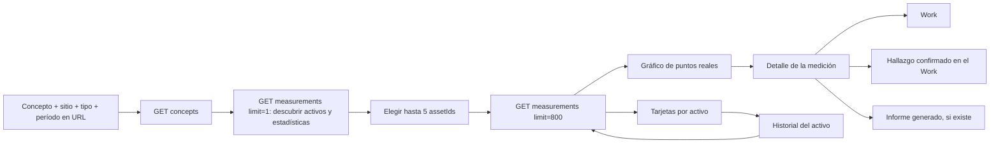

# Analytics, fase 4: comparador histórico de mediciones

`/analytics/measurements` compara un mismo concepto analógico entre hasta cinco activos. Cada punto proviene de una respuesta de un Work terminado o revisado. El frontend no lee Works ni respuestas para calcular series: usa `GET /analytics/concepts` y `GET /analytics/measurements`, protegidos por el tenant verificado en el BFF. No se agregaron tablas ni migraciones.

## Selección y construcción de las series

La barra incluye empresa, faena/sitio, concepto, tipo de activo, tipo de trabajo y período (30 días, 3, 6 o 12 meses, o personalizado). El rango inicial es seis meses. La URL conserva `tenantId`, `conceptId`, `assetIds`, `siteId`, `workTypeId`, `assetTypeId`, `period`, `from` y `to`, por lo que una comparación se puede compartir y recuperar al volver atrás. Al cambiar de empresa se limpian los IDs del catálogo anterior. El BFF valida la membresía; los IDs de la URL nunca conceden acceso por sí solos.

`/analytics/concepts` devuelve conceptos `ANALOG` con mediciones para el filtro actual, incluida su unidad. Una vez seleccionado uno, el frontend consulta `/analytics/measurements` con `limit=1`: la respuesta contiene **todas las estadísticas agrupadas por activo** y solo un punto, suficiente para poblar el selector sin descargar el historial entero. El usuario elige hasta cinco activos. Una segunda consulta envía esos `assetIds` y carga como máximo 800 puntos del período.

El gráfico usa **Recharts**, la misma librería del dashboard ejecutivo. El eje X usa `measuredAt`, el Y el valor y cada activo tiene su propia línea y símbolo. Los puntos se ordenan cronológicamente; enero, marzo y septiembre son tres observaciones, sin puntos artificiales en los meses intermedios. Los segmentos solo conectan observaciones reales. Si hay más de 800 puntos, se muestran las tarjetas con estadísticas completas del backend, pero se oculta el gráfico parcial y se solicita acotar filtros. No hay downsampling ni una comparación visual engañosa.

## Rango, estado y detalle de un punto

Los límites `minValue` y `maxValue` proceden del `form_snapshot` del Work que produjo **esa respuesta**. Si todos los puntos visibles tienen los mismos límites, el gráfico traza líneas horizontales etiquetadas. Si algún límite cambia o falta, no dibuja una línea global; el tooltip y el detalle muestran el rango de cada punto. Así, 85 °C con máximo 80 aparece fuera de rango y otro 85 °C con máximo 90 aparece en rango.

Los símbolos también distinguen el estado sin depender solo del color: círculo (en rango), triángulo (fuera) y cuadrado (sin límite evaluable). El tooltip muestra activo, valor, fecha, rango, estado, título del Work y título del hallazgo cuando existe. Seleccionar un punto abre un panel con enlaces:

- **Ver trabajo** lleva a `/works/:id`.
- **Ver hallazgo** aparece solo si hay `findingId` confirmado; abre ese Work y enfoca el hallazgo en su tabla.
- **Ver informe** aparece solo si hay un registro en `generated_reports` para ese Work.

El modelo actual guarda `concept_responses.measured_at` como **fecha** (`date`), no como timestamp. Por eso se muestra `dd/MM/yyyy` sin hora. Usar la hora de recepción o de edición sería atribuir a la medición una precisión que no existe. No se modificó el modelo para crear una hora ficticia.

## Tarjetas e historial del activo

Una tarjeta por activo usa exclusivamente `series.statistics` del servidor: cantidad, mínimo/máximo/**promedio observados**, último valor, fecha del último punto, límites **permitidos en esa última medición** y porcentaje en rango. `percentageInRange` considera solo respuestas con al menos un límite. Si `evaluable=0`, la tarjeta dice «Sin rango configurado», sin mostrar 0 %. Las estadísticas abarcan todo el filtro aunque la respuesta de puntos esté limitada.

El nombre del activo abre `/assets/:id/history`. Allí aparecen su ruta jerárquica, tipo, totales, última inspección, timeline de Works y Findings, y conceptos con mediciones. El backend incluye un Work del activo padre si un ítem de su formulario apunta al hijo; los Findings, en cambio, se atribuyen al `finding.assetId` del hijo. Desde un concepto del historial se abre el comparador con ese activo preseleccionado. El hallazgo del timeline enlaza al Work y lo enfoca.

## Archivos modificados

| Área                    | Archivos y responsabilidad                                                                                                                                                                                                                                     |
| ----------------------- | -------------------------------------------------------------------------------------------------------------------------------------------------------------------------------------------------------------------------------------------------------------- |
| Consulta backend        | `apps/inspection-api/src/app/analytics/analytics.service.ts`: agrega a cada punto ID estable, título del Work, título del Finding y presencia de informe; a las estadísticas agrega fecha, límites y estado del último punto, además de cantidades evaluables. |
| Contrato frontend       | `apps/inspection-web/src/features/analytics/models.ts`, `analytics-api.ts`: tipos y llamada autenticada a `/analytics/measurements`.                                                                                                                           |
| Cálculo de presentación | `measurement-comparison.ts`: límites constantes, fechas, símbolos, filas cronológicas y máximo de activos/puntos. No calcula estadísticas desde Works.                                                                                                         |
| Vista principal         | `apps/inspection-web/src/pages/measurement-analytics-page.tsx`: URL, filtros, descubrimiento de activos, comparación y estados de carga/error/vacío/offline.                                                                                                   |
| Componentes             | `components/measurement-filters.tsx`, `measurement-assets.tsx`, `measurement-chart.tsx`, `measurement-detail.tsx`, `measurement-stat-card.tsx`.                                                                                                                |
| Navegación              | `apps/inspection-web/src/pages/asset-history-page.tsx`, `work-detail-page.tsx` y `features/works/components/finding-review.tsx`: timeline, regreso al comparador y enfoque del hallazgo.                                                                       |
| Pruebas                 | `analytics.service.spec.ts`, `measurement-comparison.test.tsx` y `analytics-api.test.ts`: límites históricos distintos, activo hijo, URL, enlaces condicionales, estadísticas y ausencia de puntos interpolados.                                               |

## Diferencia con la referencia funcional

La vista adopta la comparación, tarjetas y exploración de puntos de un dashboard técnico, pero su fuente no es telemetría continua. No presupone muestreo periódico, sensores ni lecturas en tiempo real. La fecha y los límites pertenecen a cada Work ejecutado; el vínculo con Work, Finding e informe conduce al registro de inspección real. No se implementaron WebSockets, polling, predicciones, alertas automáticas ni recomendaciones.
