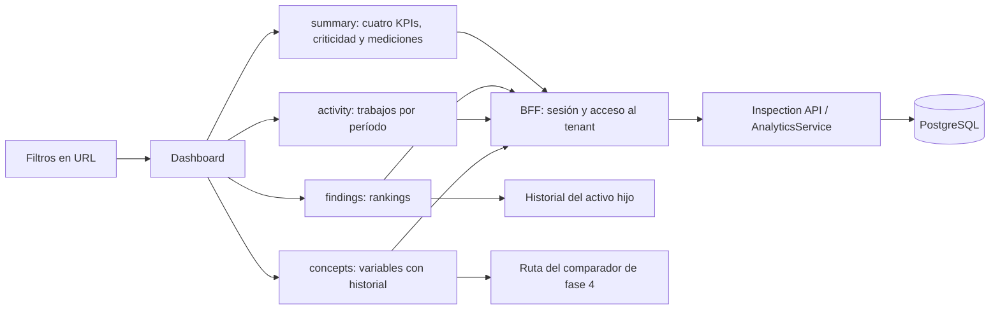

# Analytics, fase 3: dashboard ejecutivo

`/dashboard` presenta el estado de los trabajos realizados para la empresa seleccionada. Los números llegan de Analytics; el navegador no suma Works, respuestas ni hallazgos por su cuenta. La fase no agrega tablas ni migraciones. El único ajuste del contrato backend permite que `/analytics/concepts` reciba los mismos filtros de fecha, sitio, tipo de trabajo y tipo de activo que las demás consultas.

## Qué se muestra

| Bloque                       | Endpoint                           | Regla visible                                                                                                             |
| ---------------------------- | ---------------------------------- | ------------------------------------------------------------------------------------------------------------------------- |
| Trabajos realizados          | `GET /analytics/summary`           | Works finalizados o revisados, según la regla del servidor.                                                               |
| Activos inspeccionados       | `GET /analytics/summary`           | Activos únicos, incluidos los descendientes con ítems inspeccionados.                                                     |
| Hallazgos                    | `GET /analytics/summary`           | Hallazgos confirmados; muestra el grupo de criticidad predominante cuando existe.                                         |
| Mediciones en rango          | `GET /analytics/summary`           | Porcentaje y fracción «en rango / evaluables». Sin evaluables se muestra «—», no 0 %.                                     |
| Hallazgos por criticidad     | `GET /analytics/summary`           | Barras con los nombres y conteos que entrega cada tenant. Usa un color neutro porque no hay metadata visual de severidad. |
| Trabajos en el tiempo        | `GET /analytics/activity`          | Barras por mes en rangos largos; por día en 30 días o un rango personalizado de hasta 90 días.                            |
| Activos con más hallazgos    | `GET /analytics/findings?limit=10` | Ranking del `Finding.assetId`, que puede ser un activo hijo aunque su Work sea del padre.                                 |
| Hallazgos por tipo de activo | `GET /analytics/findings`          | Conteos agrupados por el tipo del activo del hallazgo.                                                                    |
| Estado de mediciones         | `GET /analytics/summary`           | En rango y fuera de rango. No se inventa el total de mediciones no evaluables.                                            |
| Mediciones disponibles       | `GET /analytics/concepts`          | Hasta seis conceptos analógicos con cantidad de mediciones para el filtro actual.                                         |

Los catálogos de sitios, tipos de trabajo y tipos de activo alimentan **únicamente las opciones** de la barra de filtros. Ninguna tarjeta o gráfico recalcula valores desde esos catálogos.

## Filtros y aislamiento entre empresas

La URL conserva `tenantId`, `siteId`, `workTypeId`, `assetTypeId`, `period`, `from` y `to`. El período inicial es seis meses; las opciones son 30 días, 3, 6 y 12 meses o fechas personalizadas. Cambiar cualquier filtro modifica la URL y vuelve a consultar las cuatro fuentes. Cambiar de empresa limpia sitio y tipos de la selección anterior. Si un enlace trae un `tenantId` al que el usuario no tiene acceso, se usa una empresa autorizada y se eliminan esos filtros de catálogo antes de consultar.

En esta arquitectura el frontend incluye `tenantId` en la ruta de API. El BFF lo valida contra la sesión y la membresía, y la consulta SQL filtra por ese tenant. Así se respeta la seguridad actual sin suponer que el JWT lleva un tenant único. En modo offline el dashboard explica que necesita conexión y no inicia consultas.

Cada consulta tiene su propia carga, error y estado vacío: un fallo en `activity` no borra los KPIs ni los rankings que sí llegaron. Un tenant nuevo recibe un mensaje inicial y cada bloque explica que no hay datos para el período. Las tarjetas se ordenan 1 por fila en móvil, 2 en tablet y 4 en escritorio. Los gráficos reutilizan **Recharts**, dependencia que ya estaba instalada.

## Navegación

- La tarjeta de Hallazgos abre `/findings`, una lista paginada de hallazgos confirmados.
- Cada activo del ranking abre `/assets/:id/history`. La vista usa `GET /analytics/assets/:id/history` y presenta sus Works, Findings y conceptos analógicos, incluidos los Works del activo padre que contengan ítems del hijo.
- Cada concepto abre `/analytics/measurements?conceptId=...`. La ruta muestra el concepto y su cantidad de mediciones; el comparador avanzado queda para la fase 4.

Estas rutas conservan los filtros de la URL al navegar y permiten regresar al dashboard con el mismo contexto. No introducen una consulta directa a Works para calcular métricas.

## Archivos de esta fase

| Archivo                                                                              | Responsabilidad                                                                  |
| ------------------------------------------------------------------------------------ | -------------------------------------------------------------------------------- |
| `apps/inspection-web/src/pages/dashboard-page.tsx`                                   | Coordina filtros, llamadas y composición responsive.                             |
| `apps/inspection-web/src/features/analytics/models.ts`                               | Tipos de las respuestas de Analytics y filtros.                                  |
| `apps/inspection-web/src/features/analytics/analytics-api.ts`                        | Cliente autenticado de los cinco endpoints utilizados por estas vistas.          |
| `apps/inspection-web/src/features/analytics/dashboard-filters.ts`                    | Períodos, validación de fechas y estado en URL.                                  |
| `apps/inspection-web/src/features/analytics/use-analytics-section.ts`                | Carga independiente, cancelación y descarte de respuestas de filtros anteriores. |
| `apps/inspection-web/src/features/analytics/components/dashboard-filters.tsx`        | Selectores de empresa, sitio, período y tipos.                                   |
| `apps/inspection-web/src/features/analytics/components/metric-card.tsx`              | Tarjeta de indicador con contexto, carga y error.                                |
| `apps/inspection-web/src/features/analytics/components/dashboard-section.tsx`        | Contenedor con loading/error/empty por bloque.                                   |
| `apps/inspection-web/src/features/analytics/components/dashboard-charts.tsx`         | Barras de criticidad y actividad con Recharts.                                   |
| `apps/inspection-web/src/features/analytics/components/dashboard-rankings.tsx`       | Rankings y enlaces a historial/comparador.                                       |
| `apps/inspection-web/src/features/analytics/components/measurements-status-card.tsx` | Conteos de mediciones evaluables.                                                |
| `apps/inspection-web/src/pages/findings-page.tsx`                                    | Lista de hallazgos filtrada y paginada.                                          |
| `apps/inspection-web/src/pages/asset-history-page.tsx`                               | Historial de un activo desde Analytics.                                          |
| `apps/inspection-web/src/pages/measurement-analytics-page.tsx`                       | Destino provisional para la fase 4.                                              |
| `apps/inspection-web/src/routes/app-routes.tsx`                                      | Registra las rutas nuevas.                                                       |
| `apps/inspection-api/src/app/analytics/dto/analytics-filters.dto.ts`                 | Aplica filtros comunes a `/concepts`.                                            |
| `apps/inspection-api/src/app/analytics/analytics.module.ts`                          | Registra el repositorio de tenant requerido por `ActiveTenantGuard`.             |
| `docs/ANALYTICS_ENDPOINTS_FASE_2.md`                                                 | Actualiza la relación entre la fase 2 y este dashboard.                          |

Las pruebas `dashboard-filters.test.ts`, `analytics-api.test.ts` y `dashboard-components.test.tsx` cubren períodos y URL, propagación de filtros a cada consulta, cifras de ejemplo 182/74/31/91 %, ausencia de 0 % engañoso y enlace del hallazgo de un hijo hacia su historial. `analytics.module.spec.ts` comprueba que el módulo y el guard resuelven sus dependencias al arrancar, sin requerir una base de datos real.

## Límite de la fase

El comparador técnico queda pendiente: series de múltiples activos, límites históricos en el gráfico, detalle al seleccionar un punto y controles avanzados de medición. Se construirá sobre `GET /analytics/measurements` en la fase 4. Tampoco se agregaron telemetría, sensores, predicciones, alertas ni mapas.
