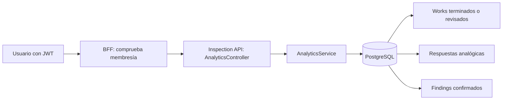

# Analytics, fase 2: endpoints para el dashboard

Esta fase agregó consultas de solo lectura. La fase 3 conectó el dashboard y sus gráficos a estos endpoints; se documenta en [ANALYTICS_DASHBOARD_FASE_3.md](./ANALYTICS_DASHBOARD_FASE_3.md). Los datos salen de `works`, `concept_responses`, `findings` y el `form_snapshot` conservado en cada Work. No se agregaron tablas de resultados precalculados.



## Contrato HTTP

Todas las rutas públicas usan el prefijo `/api/inspection/tenants/:tenantId/analytics`. `:tenantId` selecciona la empresa entre las autorizadas; el BFF compara esa selección con la membresía del usuario autenticado y entrega al servicio el tenant verificado. Un administrador global puede consultar cualquier tenant activo. Los demás usuarios reciben 403 al intentar seleccionar uno ajeno. Inspection API también exige tenant activo y todas sus consultas SQL filtran por `tenant_id`.

| Sufijo GET                 | Uso                                            | Filtros adicionales                                                                |
| -------------------------- | ---------------------------------------------- | ---------------------------------------------------------------------------------- |
| `/summary`                 | Totales ejecutivos y criticidad                | Filtros comunes                                                                    |
| `/findings`                | Totales, agrupaciones y registros              | `severityId`, `assetId`, `limit` (ranking), `page`, `pageSize`                     |
| `/measurements`            | Series y estadísticas de un concepto analógico | `conceptId` obligatorio, `assetId`, `assetIds` separados por coma, `limit`, `page` |
| `/assets/:assetId/history` | Historial técnico del activo                   | `page`, `pageSize`                                                                 |
| `/activity`                | Works ejecutados por período                   | `groupBy=day\|week\|month`                                                         |
| `/concepts`                | Conceptos analógicos con datos históricos      | Filtros comunes                                                                    |

Los filtros comunes son `siteId`, `workTypeId`, `assetTypeId`, `from` y `to`. Las fechas son días de inspección o medición en formato `YYYY-MM-DD`, ambos extremos inclusivos; `from=2026-09-01&to=2026-09-30` incluye todo el 30 de septiembre. No se filtra por la fecha de recepción en el servidor. IDs deben ser UUID. Los parámetros desconocidos o inválidos reciben 400.

Ejemplo:

```http
GET /api/inspection/tenants/<tenant-uuid>/analytics/measurements?conceptId=<concept-uuid>&assetIds=<radiador-r1-uuid>,<radiador-r2-uuid>&from=2026-09-01&to=2026-09-30
Authorization: Bearer <jwt>
```

## Reglas de cálculo

`summary.totalWorks` cuenta Works `FINISHED` o `REVIEWED`, la misma regla central de la fase 1. `DRAFT` e `IN_PROGRESS` quedan fuera. `totalInspectedAssets` cuenta IDs únicos de los **ítems del snapshot** del Work; así, Radiador R1 y R2 cuentan por separado aunque el Work pertenezca a Transformador T1. Para snapshots antiguos sin ítems se usa el activo raíz. No se suman ítems repetidos ni se cuenta automáticamente el padre si solo se inspeccionaron hijos.

`totalFindings` y las agrupaciones por criticidad leen exclusivamente `findings`, unidos a Works válidos. `finding_candidates` no participa. Cada severidad devuelve `severityId`, `code`, `name` y `count`. Las severidades sin hallazgos no aparecen; la UI puede mostrar ceros usando su catálogo. `/findings` suma, agrupa por activo y tipo, y devuelve una página `items`. El ranking de activos tiene `limit=10` por defecto, máximo 50. `pageSize` es 25 por defecto, máximo 100. El orden del ranking es cantidad descendente; la lista usa fecha de ejecución descendente e ID como desempate.

Para `measurementsEvaluable` se toman solo respuestas numéricas de conceptos `ANALOG` cuyo ítem guardó `minValue` o `maxValue`. Cada respuesta usa **sus límites del snapshot del Work**, no los límites actuales del catálogo. Un valor igual al límite está dentro de rango. El porcentaje es `measurementsInRange / measurementsEvaluable × 100`; si no hay mediciones evaluables, el porcentaje se omite.

`/measurements` agrupa puntos por activo. Cada punto incluye Work, fecha de Work, `measuredAt`, valor, límites históricos, evaluación de rango y Finding analógico definitivo vinculado, si existe. El orden de los puntos es `measuredAt ASC`, con fecha/IDs de Work e ítem como desempate. PostgreSQL calcula `count`, `min`, `max`, `avg`, último valor y cantidad evaluable por activo. `latest` se obtiene ordenando por `measuredAt DESC`; el porcentaje por serie considera solo puntos evaluables. `limit` controla el total global de puntos entregados por página (1000 por defecto, máximo 5000), no cada serie; `totalMeasurements` y las estadísticas se calculan sobre **todo el filtro**, no solo la página. `assetIds` acepta 1–50 UUID. La serie puede estar vacía en una página posterior aunque conserve estadísticas.

`/assets/:assetId/history` primero comprueba que el activo pertenezca al tenant; un ID ajeno devuelve 404. El historial incluye Works cuyo `asset_id` es el activo **o** cuyo `form_snapshot.sections[].items[].assetId` apunta a él. Para Radiador R1, por tanto, se incluye el Work de Transformador T1 que contiene un ítem de R1. Los Findings se cuentan solo si pertenecen a R1. Devuelve datos y ruta jerárquica del activo, resumen, páginas de Works y Findings (mismo `page`/`pageSize`) y conceptos analógicos con cantidad de mediciones. Works se ordenan por `execution_date DESC` e ID; Findings por fecha e ID.

`/activity` agrupa Works válidos por día, semana ISO o mes a partir de `execution_date`. Devuelve `{ period, works }[]` en orden cronológico. `/concepts` devuelve solo conceptos `ANALOG` que ya tienen al menos una respuesta numérica histórica en un Work válido. Cuenta mediciones por concepto aplicando los mismos filtros comunes del dashboard.

## Consultas, índices y rendimiento

Las consultas usan `COUNT`, `COUNT DISTINCT`, `MIN`, `MAX`, `AVG`, `GROUP BY`, `FILTER` y una agregación ordenada para `latest`. Se expanden los ítems de `form_snapshot` con `jsonb_array_elements` dentro de SQL; Node solo adapta resultados a la forma de respuesta. Cada endpoint ejecuta un número fijo de consultas, independiente del número de activos, Findings o respuestas. Los nombres de activos, tipos, severidades y conceptos se obtienen con joins; no hay una consulta por fila.

Se reutilizan los índices de fase 1 sobre `(tenant_id, status, execution_date)` en Works, `(tenant_id, measured_at, work_id)` y `(tenant_id, concept_id, work_id)` en respuestas numéricas. La migración `1799102100000-IndexAnalyticsFindings.ts` agrega únicamente `(tenant_id, severity_id, work_id)` y `(tenant_id, asset_id, work_id)` en Findings para filtros por criticidad e historial de activo. La aplicación ejecutará esa migración al iniciar donde `INSPECTION_MIGRATIONS_RUN=true`. No se introducen Redis, vistas materializadas ni procesos en segundo plano.

## Archivos y pruebas

| Archivo                                                                                             | Cambio                                                                                             |
| --------------------------------------------------------------------------------------------------- | -------------------------------------------------------------------------------------------------- |
| `apps/inspection-api/src/app/analytics/analytics.service.ts`                                        | SQL de las seis consultas, límites y transformación de resultados.                                 |
| `apps/inspection-api/src/app/analytics/analytics.controller.ts`                                     | Rutas internas bajo el tenant activo.                                                              |
| `apps/inspection-api/src/app/analytics/dto/analytics-filters.dto.ts`                                | Validación reutilizable de filtros y paginación.                                                   |
| `apps/inspection-api/src/app/analytics/analytics.module.ts`                                         | Registra controller, servicio y guard de tenant activo.                                            |
| `apps/bff-api/src/app/inspection-api/inspection-api.controller.ts`                                  | Expone las seis rutas tras JWT y membresía.                                                        |
| `apps/bff-api/src/app/inspection-api/inspection-api.client.ts`                                      | Reenvía filtros a Inspection API.                                                                  |
| `apps/inspection-api/src/migrations/1799102100000-IndexAnalyticsFindings.ts` y `database.config.ts` | Índices e inclusión de la migración.                                                               |
| `analytics.service.spec.ts` y `inspection-api.controller.spec.ts`                                   | Reglas de cálculo, series separadas, activo hijo, límites de consulta y uso del tenant verificado. |

Se comprobaron compilación TypeScript de ambas APIs, pruebas Jest del nuevo servicio, fase 1 y BFF, y consultas de solo lectura sobre PostgreSQL local: seis endpoints, filtros de sitio/tipo/fecha, comparación, historial y rechazo 404 de un activo de otro tenant. La ejecución local aplicó la migración pendiente de fase 1 al abrir la conexión con la configuración del proyecto; no se desplegó QA en esta fase.

El dashboard de fase 3 consume `/summary` para tarjetas, `/findings` para rankings, `/activity` para evolución y `/concepts` para el listado de variables. La [fase 4](./ANALYTICS_COMPARADOR_FASE_4.md) utiliza `/analytics/measurements` para el comparador técnico; `/assets/:assetId/history` alimenta la navegación desde el ranking y desde las tarjetas de mediciones.
