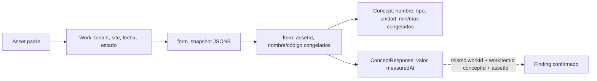

# Analytics fase 1: historial técnico

Esta fase prepara lecturas históricas y métricas en Inspection API. No agrega gráficos, tarjetas ni endpoints públicos de Analytics. El dashboard visual queda para la siguiente fase.

## Modelo y decisión de persistencia

Ya existía un historial por ejecución. Cada inspección crea un `Work` nuevo; su `form_snapshot` JSONB contiene secciones e ítems propios de esa ejecución. `concept_responses.form_item_id` apunta al **ID de la instancia de ítem** dentro de ese snapshot (aunque la columna se llame `form_item_id`). No hay una tabla física `work_items` ni se reutiliza una respuesta entre trabajos. El índice único `(tenant_id, work_id, form_item_id)` impide dos respuestas para el mismo ítem de un trabajo.



No se creó `MeasurementHistory`: duplicaría `Work → snapshot de ítem → ConceptResponse`. `MeasurementRecord` es un DTO de lectura derivado por `AnalyticsHistoryService`.

## Fecha y snapshots

Se añadió `concept_responses.measured_at` como **`date`**, porque `Work.executionDate` también tiene precisión de día. Por defecto se toma `executionDate`, tanto al guardar online como al recibir una respuesta de sincronización offline; una fecha explícita `YYYY-MM-DD` puede enviarse en la respuesta. Si se vuelve a guardar un borrador sin otra fecha explícita, se conserva la fecha de medición previa. `created_at` sigue indicando cuándo se creó el registro en el servidor y puede ser días posterior al trabajo offline. La migración asigna `execution_date` a las respuestas anteriores: es la mejor fecha histórica disponible, pero no recupera la hora exacta de una medición antigua.

Los snapshots ya contenían `item.assetId`, `assetNameSnapshot`, `assetCodeSnapshot`, `assetTypeIdSnapshot` y, dentro de `item.concept`, `id`, `name`, `type`, `unit`, `minValue` y `maxValue`. El servicio usa esos valores congelados, no la configuración actual de `assets` o `concepts`. Para snapshots antiguos sin `assetId`/nombre, usa el activo principal del Work y el nombre actual del catálogo como alternativa; esa información histórica ausente no puede reconstruirse retroactivamente. Si un snapshot antiguo no contiene límites, la medición queda **sin clasificación de rango**, aunque el concepto actual tenga límites.

Ejemplo: un Work guardó `85 °C` con máximo `80 °C`; si luego el catálogo cambia a `90 °C`, `MeasurementRecord.isInRange` permanece `false` porque consulta `maxValue` del snapshot de ese Work.

## Lecturas y métricas

`AnalyticsHistoryService` ofrece internamente:

| Método                                                               | Resultado                                                                                       |
| -------------------------------------------------------------------- | ----------------------------------------------------------------------------------------------- |
| `getAssetMeasurements(tenantId, assetId, filters)`                   | Mediciones analógicas históricas del activo, incluidos ítems de trabajos iniciados en un padre. |
| `getConceptMeasurements(tenantId, conceptId, filters)`               | Mediciones de un concepto en los activos del tenant.                                            |
| `getAssetConceptMeasurements(tenantId, assetId, conceptId, filters)` | Serie cronológica de activo y concepto.                                                         |
| `getBaseMetrics(tenantId, filters)`                                  | Trabajos, activos únicos, hallazgos definitivos por severidad y porcentajes de rango.           |

Los filtros admiten `siteId`, `from`, `to` y `workTypeId`. Todas las consultas obligan a pasar `tenantId` y lo incluyen en el SQL; la futura ruta HTTP debe tomarlo de una sesión autorizada y aplicar el guard de membresía antes de llamar al servicio. **No existe todavía un endpoint de Analytics.** Las lecturas se calculan en PostgreSQL, no descargando todos los Works al frontend.

Solo cuentan Works `FINISHED` y `REVIEWED` (constante `ANALYTICS_WORK_STATUSES`). `DRAFT` e `IN_PROGRESS` quedan fuera porque aún pueden cambiar. No existe estado `FINAL` en `WorkStatus`; `FINAL` corresponde a una versión de informe, no a un Work. Los filtros de fecha de mediciones usan `measured_at`; los conteos de Works, activos y Findings usan `execution_date` del Work. De forma predeterminada coinciden, pero una fecha explícita de medición puede diferir.

`MeasurementRecord` entrega `tenantId`, `siteId`, `workId`, `workItemId`, `responseId`, `workDate`, `measuredAt`, `createdAt`, `updatedAt`, `assetId` y snapshot de nombre/código/tipo de activo, `conceptId`, nombre del concepto, valor numérico, unidad, límites, `isInRange` y `findingId` si existe. `workDate` y `measuredAt` salen como `YYYY-MM-DD`. Para un hijo se usa `item.assetId`, nunca se fuerza `Work.assetId`; este último solo sirve de alternativa para snapshots heredados.

`isInRange` se calcula exclusivamente para mediciones `ANALOG`:

```text
sin min y sin max                    → undefined (no evaluable)
valor < min o valor > max           → false
valor dentro de los límites dados   → true
```

`TEXT` y `DIGITAL` no entran a estas series de mediciones analógicas ni al porcentaje. Los límites son inclusivos. `percentageInRange = 100 × medicionesEnRango / (medicionesEnRango + medicionesFueraDeRango)`; si no hay mediciones evaluables, queda `undefined`, no 0 %. El conteo de activos usa IDs distintos del activo principal y de los ítems incluidos en Works válidos; no cuenta ítems. Los hallazgos usan solo `findings`, nunca `finding_candidates` pendientes o descartados. `findingId` se une por tenant, Work, ítem, activo y concepto con fuente `ANALOG`; los hallazgos manuales/digitales siguen contando en `totalFindings` y `findingsBySeverity`.

## Migración e índices

`1799102000000-PrepareAnalyticsHistory` agrega `measured_at`, lo rellena desde `works.execution_date` y luego exige `NOT NULL`. Añade tres índices ligados a las consultas implementadas:

- `IDX_works_analytics_scope (tenant_id, status, execution_date)`: Works válidos en un período.
- `IDX_concept_responses_analytics_date (tenant_id, measured_at, work_id) WHERE value_number IS NOT NULL`: período de mediciones analógicas.
- `IDX_concept_responses_analytics_concept (tenant_id, concept_id, work_id) WHERE value_number IS NOT NULL`: series por concepto.

Se reutilizan los índices existentes de `works` por site/asset y de `findings` por tenant/Work. `assetId` de ítems vive en JSONB; la consulta lo extrae del snapshot después de acotar tenant/estado/fecha. Si el volumen crece, medir con `EXPLAIN ANALYZE` antes de considerar una proyección indexada; esta fase no duplica datos por anticipación.

## Archivos modificados

| Archivo                                                                                                                                | Cambio                                                                                                       |
| -------------------------------------------------------------------------------------------------------------------------------------- | ------------------------------------------------------------------------------------------------------------ |
| `apps/inspection-api/src/app/analytics/analytics-history.service.ts`                                                                   | DTO de lectura, tres consultas de series, agregados y reglas de rango/estado.                                |
| `apps/inspection-api/src/app/analytics/analytics.module.ts`, `apps/inspection-api/src/app/app.module.ts`                               | Registra el servicio interno.                                                                                |
| `apps/inspection-api/src/app/works/entities/concept-response.entity.ts`                                                                | Campo `measuredAt` de tipo `date`.                                                                           |
| `apps/inspection-api/src/app/works/dto/save-work-responses.dto.ts`, `works.service.ts`                                                 | Acepta fecha opcional y usa `executionDate` por defecto. Mantiene el bloqueo de edición para Works cerrados. |
| `apps/inspection-api/src/app/sync/sync.types.ts`, `sync-change.parser.ts`, `sync-work.processor.ts`                                    | Conserva o deduce la fecha al sincronizar respuestas offline.                                                |
| `apps/inspection-web/src/features/works/models.ts`, `work-api.ts`, `repositories/local-work-repository.ts`                             | Tipo compartido y fecha de ejecución en la respuesta local. No cambia el formulario visual.                  |
| `apps/inspection-api/src/migrations/1799102000000-PrepareAnalyticsHistory.ts`, `apps/inspection-api/src/app/config/database.config.ts` | Migración y registro.                                                                                        |
| `apps/inspection-api/src/app/analytics/analytics-history.service.spec.ts`, `works.service.spec.ts`, `sync-change.parser.spec.ts`       | Casos de historial, cinco mediciones, activo hijo, Finding y fecha online/offline.                           |

## Verificación

Las pruebas unitarias cubren 65, 70, 75, 79 y 84 °C con rango 0–80: cuatro dentro, una fuera, 80 %. Se comprueba que 85 °C siga fuera cuando su snapshot tiene máximo 80, independientemente de un límite actual de 90. También se comprueba `assetId` del hijo y la relación con el Finding confirmado.

Además se ejecutó una prueba SQL real en PostgreSQL local con tablas **temporales dentro de una transacción revertida**: cinco Works válidos, un segundo tenant para comprobar aislamiento, activo padre e hijo, y un Finding. La consulta devolvió cinco puntos ordenados, 4/1, 80 %, dos activos únicos y un Finding. La migración se probó del mismo modo: una respuesta creada en septiembre recibió `measured_at` de la ejecución de enero, conservando su `created_at`.

La próxima fase puede exponer rutas de lectura protegidas por `JwtAuthGuard` y `InspectionTenantAccessGuard` y construir el dashboard sobre estos métodos. No se desplegó esta fase a QA en este cambio.
