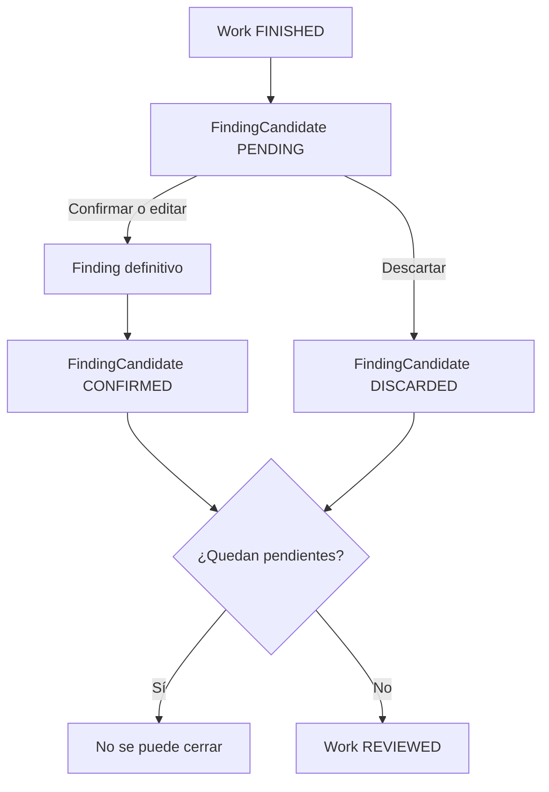

# Hallazgos, fase 2: revisión humana

Esta fase continúa [la generación de candidatos de la fase 1](./FINDING_CANDIDATES_MODELO_Y_ARCHIVOS.md). Un `FindingCandidate` propone una anomalía; solo la decisión de un Supervisor o Administrador crea un `Finding` definitivo. No se genera aún un informe PDF/Word ni un flujo de reparación.

## Modelo y reglas

- `finding_candidates` conserva el origen (`DIGITAL`, `ANALOG` o `MANUAL`), la medición, los límites, la criticidad **sugerida**, el estado y un motivo opcional de descarte. No se elimina al revisar.
- La nueva tabla `findings` guarda `work_id`, `work_item_id`, `asset_id`, `concept_id`, `source_candidate_id`, origen, título, descripción, medición y límites, criticidad **final**, `man_hours` decimal, `materials` libre, orden y snapshots de nombre de activo, nombre de concepto y unidad. Los datos de la medición provienen del candidato; los nombres provienen del snapshot congelado del trabajo.
- `source_candidate_id` es único y tiene una clave foránea compuesta con `tenant_id` y `work_id`. Una confirmación repetida actualiza el mismo Finding. La confirmación y el cambio del candidato a `CONFIRMED` ocurren en una transacción.
- `Finding.asset_id` es el activo del ítem que produjo el candidato. Si un Work del Transformador T1 detectó la temperatura del Radiador R2, el Finding apunta a R2. El Work sigue apuntando a T1.
- La criticidad sugerida del candidato no cambia cuando el revisor elige una criticidad final distinta. Las HH aceptan decimales no negativos. Los materiales son texto sin catálogo, cantidades ni costos.
- La tabla y el resumen se ordenan por posición del ítem en el snapshot del formulario y luego por origen. La numeración visible se calcula desde ese orden; no depende de la fecha del cliente.
- Solo un Work `FINISHED` admite decisiones. La finalización toma un bloqueo del Work y cuenta candidatos `PENDING` dentro del mismo tenant y trabajo. Con al menos uno pendiente, responde un error; con cero, cambia a `REVIEWED`. Después no se puede editar la revisión.

## API y permisos

Las rutas se exponen en el BFF bajo `/api/inspection/tenants/:tenantId` y se reenvían a Inspection API bajo `/tenants/:tenantId`:

| Método y ruta relativa | Efecto |
| --- | --- |
| `GET /works` y `GET /works/:workId` | Devuelven también `findingCandidates` y `findings`. |
| `PUT /works/:workId/finding-candidates/:candidateId/confirm` | Crea o edita el Finding. Recibe título, descripción, severidad final, HH y materiales. |
| `PUT /works/:workId/finding-candidates/:candidateId/discard` | Cambia el candidato a `DISCARDED` y acepta un motivo opcional. |
| `POST /works/:workId/review/finalize` | Exige cero pendientes y cambia el Work a `REVIEWED`. |

El BFF exige pertenencia al tenant. `TENANT_ADMIN` y `SUPERVISOR` pueden decidir y cerrar la revisión; el administrador global también. `INSPECTOR` puede ejecutar el Work y crear observaciones manuales, pero no revisar. La pantalla refleja esos permisos y bloquea las acciones en modo local. La validación autoritativa permanece en el BFF y en las reglas de estado de Inspection API.

## IndexedDB y sincronización

La revisión se realiza online. La migración PostgreSQL agrega un trigger `record_server_change('FINDING', 'work')`; el trigger previo de `FINDING_CANDIDATE` publica el cambio de estado. Pull trae ambos por tenant y sitio. IndexedDB sube de versión 4 a 5 y agrega la tabla `findings`. La descarga inicial de un sitio conserva sus Findings, y el repositorio local los presenta en modo sin conexión. No se añadió un tipo de Push para revisar offline ni resolución avanzada de conflictos.

## Archivos de esta fase

**Inspection API y PostgreSQL**

- `apps/inspection-api/src/migrations/1799101800000-CreateFindings.ts`: tabla, restricciones, índice, motivo de descarte y trigger de Pull.
- `apps/inspection-api/src/app/config/database.config.ts`: registra entidad y migración.
- `apps/inspection-api/src/app/config/database.config.spec.ts`: valida los metadatos PostgreSQL sin conexión y detecta tipos opcionales mal inferidos.
- `apps/inspection-api/src/app/works/entities/finding.entity.ts`: modelo persistido de Finding.
- `apps/inspection-api/src/app/works/entities/finding-candidate.entity.ts`: motivo opcional de descarte.
- `apps/inspection-api/src/app/works/dto/review-finding.dto.ts`: validación de confirmación y descarte.
- `apps/inspection-api/src/app/works/finding-review.service.ts`: transacciones, idempotencia, orden y cierre.
- `apps/inspection-api/src/app/works/works.controller.ts`: endpoints de revisión.
- `apps/inspection-api/src/app/works/works.module.ts`: registra entidad y servicio.
- `apps/inspection-api/src/app/works/works.service.ts`: incluye Findings en las lecturas de Works.
- `apps/inspection-api/src/app/works/finding-review.service.spec.ts`: pruebas de idempotencia, activo hijo, criticidad separada, tres candidatos, descarte y cierre.

**BFF**

- `apps/bff-api/src/app/inspection-api/inspection-api.controller.ts`: rutas con `TenantRoles` para Supervisor y Administrador.
- `apps/bff-api/src/app/inspection-api/inspection-api.client.ts`: reenvío a Inspection API.
- `apps/bff-api/src/app/inspection-api/inspection-api.controller.spec.ts`: comprueba permisos.

**Frontend y modo local**

- `apps/inspection-web/src/features/works/models.ts`: tipos de Finding y motivo de descarte.
- `apps/inspection-web/src/features/works/work-api.ts`: lectura y mutaciones HTTP.
- `apps/inspection-web/src/features/works/work-catalog-context.tsx`: estado y recarga tras cada decisión.
- `apps/inspection-web/src/features/works/use-work-catalog.ts`: expone Findings y acciones por tenant.
- `apps/inspection-web/src/features/tenants/tenant-access-context.tsx`: capacidad `canReviewTenant`.
- `apps/inspection-web/src/features/works/components/finding-review.tsx`: revisión, contexto, edición, conteos y resumen final.
- `apps/inspection-web/src/pages/work-detail-page.tsx`: incorpora la sección de revisión al Work.
- `apps/inspection-web/src/db/inspection-db.ts`: tabla Dexie `findings`, versión 5.
- `apps/inspection-web/src/features/offline/models.ts`: tipos de Pull y descarga de Findings.
- `apps/inspection-web/src/services/apply-remote-changes.ts`: aplica `FINDING` del Pull.
- `apps/inspection-web/src/services/cache-site-for-offline.ts`: descarga Findings del sitio.
- `apps/inspection-web/src/repositories/local-work-repository.ts`: consulta Findings locales.
- `apps/inspection-web/src/services/apply-remote-changes.test.ts`: comprueba Pull de Finding y decisión.
- `apps/inspection-web/src/features/works/components/finding-review.test.tsx`: comprueba la vista del activo hijo, diferencia, bloqueo y resumen.

## Verificación y siguiente paso

Pasaron las suites de Inspection API (53 pruebas), BFF (53) e Inspection Web (26), las tres comprobaciones TypeScript y la compilación de producción del frontend. Se validó la inicialización de TypeORM contra PostgreSQL (23 entidades) y la migración nueva dentro de una transacción que se revirtió. La migración aún no se ha aplicado de forma permanente y esta fase no está desplegada en QA. En un despliegue se deben actualizar Inspection API, BFF y frontend, ejecutar la migración y probar el flujo con datos reales.

Los Findings ya contienen las columnas y snapshots necesarios para construir el resumen del futuro informe: Nº, activo, hallazgo, criticidad final, HH y materiales, además del origen y la medición. La generación del documento queda para otra fase.
