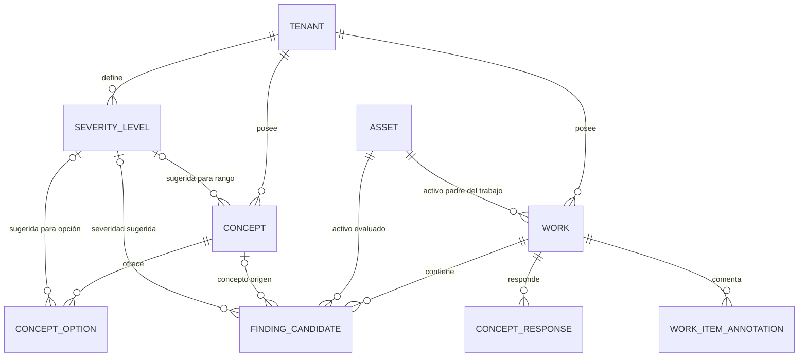
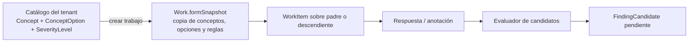
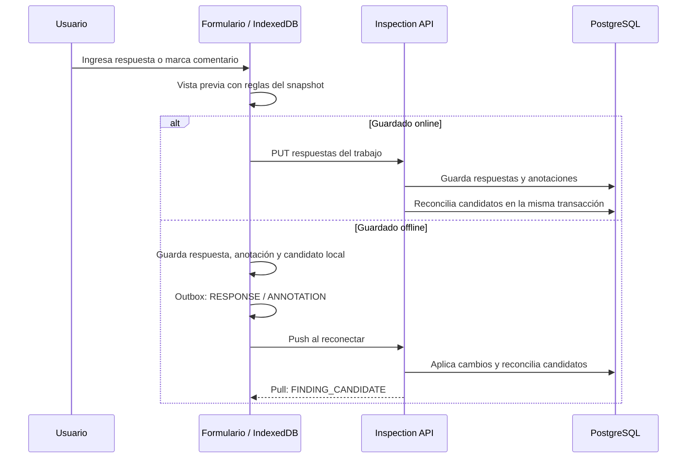

# Criterios y candidatos de hallazgo — modelo de datos y archivos

Este documento explica la implementación de la fase 1 de hallazgos y los **48 archivos** que estaban modificados o creados al cerrar esa implementación. Complementa la [guía funcional y de prueba](finding-candidates-fase-1.md). El estado descrito corresponde al código local de esta fase; el documento no implica que la migración ya se haya ejecutado en QA.

## Qué cambió

Antes, un concepto definía cómo capturar una respuesta (analógica, digital, texto, etc.), pero el sistema no tenía criterios estructurados para advertir que una respuesta podía representar una anomalía. Ahora una empresa puede definir niveles de severidad y reglas por concepto:

| Entrada | Configuración | Resultado al responder |
| --- | --- | --- |
| Concepto analógico | Mínimo y/o máximo, severidad sugerida | Un valor estrictamente fuera del rango crea un candidato `ANALOG`. |
| Opción de concepto digital | Marca «genera hallazgo», severidad sugerida | Elegir esa opción crea un candidato `DIGITAL`. |
| Comentario de cualquier ítem | Marca manual «posible hallazgo» | Un comentario marcado y no vacío crea un candidato `MANUAL`. |

Un **candidato** es una señal preliminar dentro del trabajo. No es un hallazgo confirmado, no decide la criticidad final y no incorpora aún un proceso de revisión.

## Relaciones del modelo

`Work` guarda `asset_id`: el activo padre al que pertenece el trabajo. El snapshot del formulario guarda, en cada ítem, `assetId`: el activo concreto que se está evaluando. Ese activo puede ser un descendiente. `finding_candidates.asset_id` se toma del ítem; si falta, se usa el activo del trabajo. Por ejemplo, un trabajo del **Motor presurizado** puede producir tres candidatos distintos en **Posición 1**, **Posición 2** y **Posición 3**, sin crear tres trabajos ni cambiar el dueño del trabajo.

`work_item_id` identifica la instancia del ítem dentro del snapshot, incluso cuando el mismo concepto aparece varias veces para activos diferentes. No es una tabla nueva de ítems: es la identidad estable del ítem del formulario conservado en el JSON del trabajo.

### Tablas y columnas nuevas

| Tabla | Campos agregados | Significado |
| --- | --- | --- |
| `severity_levels` (nueva) | `id`, `tenant_id`, `code`, `name`, `sort_order`, `active` | Catálogo de niveles propio de cada empresa. `(tenant_id, code)` es único; no hay severidades globales predefinidas. |
| `concepts` | `min_value`, `max_value`, `out_of_range_severity_id` | Regla de un concepto `ANALOG`. Se permite dejar un extremo sin límite. |
| `concept_options` | `generates_finding`, `suggested_severity_id` | Regla de cada opción de un concepto `DIGITAL`. El valor inicial de la marca es `false`. |
| `work_item_annotations` | `is_finding` | Distingue un comentario ordinario de una marca manual. El valor inicial es `false`. |
| `finding_candidates` (nueva) | `id`, `tenant_id`, `work_id`, `work_item_id`, `asset_id`, `concept_id`, `source`, `title`, `description`, `measured_value`, `min_value`, `max_value`, `suggested_severity_id`, `status`, `created_at`, `updated_at` | Resultado derivado de las respuestas y anotaciones de un trabajo. |
| `assets` | Restricción única sobre `(id, tenant_id)` | Permite que la referencia del candidato al activo incluya el tenant en la clave foránea. |

`finding_candidates.source` puede ser `ANALOG`, `DIGITAL` o `MANUAL`. Su `status` comienza en `PENDING`; el esquema admite `CONFIRMED` y `DISCARDED` para la siguiente fase, pero **esta entrega no implementa acciones para confirmar o descartar**. Una restricción única sobre `(tenant_id, work_id, work_item_id, source)` impide duplicar la misma señal por origen. Por eso un ítem podría tener, por ejemplo, un candidato analógico y otro manual, cada uno con su propia identidad.

Las referencias a severidad usan también `tenant_id`: un concepto, opción o candidato de una empresa no puede apuntar al nivel de otra. La migración añade restricciones para `min_value <= max_value`, para que solo conceptos analógicos almacenen límites, y para que una opción sin la marca activa no conserve una severidad sugerida. La aplicación valida adicionalmente que una severidad analógica tenga al menos un límite y que el comentario manual marcado tenga texto.

### Catálogo frente al snapshot del trabajo

Al crear el trabajo se copian al `formSnapshot` los límites del concepto y las marcas de sus opciones. La evaluación posterior lee **esa copia**, no el catálogo vigente. Si mañana se cambia el máximo de 40 a 45, el trabajo que ya tenía 40 mantiene su regla. Los trabajos anteriores a esta fase carecen de estos campos en su snapshot; para probar reglas recién configuradas se crea un trabajo nuevo. La severidad sugerida se guarda como ID y se resuelve contra el catálogo del tenant para mostrar su nombre.

Ejemplo: la plantilla de **Mantención mensual presurizado** permite el concepto **Anemómetro 1 antes** en una posición de medición. Se configura `max_value = 40` y severidad sugerida **Alta**. Al crear el trabajo, ese criterio se copia al ítem de **Posición 1**. Una respuesta de `51 m/s` genera un candidato vinculado al trabajo del activo padre, al ítem de Posición 1 y al activo Posición 1. Una respuesta de `40 m/s` no lo genera porque el límite es inclusivo.

## Cuándo aparece y desaparece un candidato

El evaluador vuelve a recorrer los ítems del snapshot con sus respuestas actuales. Si la anomalía persiste, actualiza el mismo candidato `PENDING`; su ID estable se calcula a partir del trabajo, el ítem y el origen. Si el valor vuelve al rango, la opción deja de ser anómala o se desmarca el comentario, elimina únicamente el candidato `PENDING`. La implementación preserva uno que ya tenga estado `CONFIRMED` o `DISCARDED`, preparando la futura revisión humana.

El navegador muestra una vista previa al editar, antes de guardar. Esa vista puede cambiar mientras se escribe; la persistencia ocurre al guardar. En offline, IndexedDB guarda el candidato local junto a las respuestas. **El candidato no es una operación del outbox**: se envían las respuestas y anotaciones, el servidor vuelve a derivarlo y Pull distribuye el resultado autoritativo. Los triggers de PostgreSQL escriben `SEVERITY_LEVEL` y `FINDING_CANDIDATE` en `server_changes`; el Pull existente filtra por empresa y, para candidatos de trabajo, por sitio.

## APIs implicadas

Las rutas públicas pasan por el BFF bajo `/api/inspection`; la API interna expone las mismas rutas relativas bajo `/tenants/...`. El BFF aplica la autorización por tenant y exige `TENANT_ADMIN` para mutar severidades y conceptos.

| Método y ruta relativa | Propósito |
| --- | --- |
| `GET /tenants/:tenantId/severity-levels` | Lee los niveles de esa empresa. |
| `POST /tenants/:tenantId/severity-levels` | Crea un nivel con código, nombre y orden. |
| `PATCH /tenants/:tenantId/severity-levels/:severityId` | Edita o activa/desactiva un nivel de esa empresa. |
| `GET/POST/PATCH /tenants/:tenantId/concepts...` | Lee y configura límites analógicos, opciones digitales y severidades sugeridas. |
| `GET /tenants/:tenantId/works` y `GET /tenants/:tenantId/works/:workId` | Devuelven candidatos del tenant o trabajo; el listado incluye niveles de severidad. |
| `PUT /tenants/:tenantId/works/:workId/responses` | Guarda respuestas y `annotations[].isFinding`; reconcilia candidatos. |
| Endpoints de Push/Pull ya existentes | Push recibe respuestas/anotaciones; Pull entrega los cambios derivados y niveles. No hay endpoint de creación directa de candidatos. |

## Los 48 archivos de esta implementación

Los caminos son relativos a la raíz del repositorio. «Nuevo» significa que el archivo se creó en esta fase. Se incluye el resumen `docs/finding-candidates-fase-1.md` entre los 48. **Este documento de desglose es un archivo adicional.**

### BFF (2)

| # | Archivo | Cambio |
| ---: | --- | --- |
| 1 | `apps/bff-api/src/app/inspection-api/inspection-api.client.ts` | Amplía los tipos de conceptos y respuestas con criterios y `isFinding`; añade llamadas a listar, crear y editar severidades en la API interna. |
| 2 | `apps/bff-api/src/app/inspection-api/inspection-api.controller.ts` | Publica las tres rutas de severidades; protege sus mutaciones con `TENANT_ADMIN`. |

### Inspection API: catálogo y persistencia (10)

| # | Archivo | Cambio |
| ---: | --- | --- |
| 3 | `apps/inspection-api/src/app/catalog/catalog.controller.ts` | Expone GET/POST/PATCH de severidades con parámetros UUID. |
| 4 | `apps/inspection-api/src/app/catalog/catalog.module.ts` | Registra `SeverityLevelEntity` en TypeORM para el módulo de catálogo. |
| 5 | `apps/inspection-api/src/app/catalog/catalog.service.spec.ts` | Adapta el constructor de la prueba de aislamiento de tenant al nuevo repositorio. |
| 6 | `apps/inspection-api/src/app/catalog/catalog.service.ts` | Implementa CRUD por tenant; normaliza reglas analógicas y opciones; valida rangos, códigos únicos y referencias de severidad del mismo tenant. Al editar, conserva los criterios no enviados. |
| 7 | `apps/inspection-api/src/app/catalog/dto/create-concept.dto.ts` | Permite límites y severidad en conceptos, y marca/severidad en cada opción digital. |
| 8 | `apps/inspection-api/src/app/catalog/dto/severity-level.dto.ts` **(nuevo)** | Valida los datos de creación/edición de un nivel: código, nombre, orden y estado activo. |
| 9 | `apps/inspection-api/src/app/catalog/entities/concept-option.entity.ts` | Mapea `generates_finding` y `suggested_severity_id`. |
| 10 | `apps/inspection-api/src/app/catalog/entities/concept.entity.ts` | Mapea `min_value`, `max_value` y `out_of_range_severity_id`. |
| 11 | `apps/inspection-api/src/app/catalog/entities/severity-level.entity.ts` **(nuevo)** | Representa la tabla de niveles por tenant y su unicidad de código. |
| 12 | `apps/inspection-api/src/app/config/database.config.ts` | Registra las dos entidades nuevas y la migración; no activa `synchronize`. |

### Inspection API: trabajos y sincronización (13)

| # | Archivo | Cambio |
| ---: | --- | --- |
| 13 | `apps/inspection-api/src/app/sync/sync-change.parser.ts` | Lee `isFinding` de anotaciones entrantes en Push. |
| 14 | `apps/inspection-api/src/app/sync/sync-work.processor.ts` | Guarda la marca manual y reconcilia candidatos tras aplicar el grupo de cambios de un trabajo en la transacción de Push. |
| 15 | `apps/inspection-api/src/app/sync/sync.types.ts` | Extiende el contrato interno de anotación del Push con `isFinding`. |
| 16 | `apps/inspection-api/src/app/works/dto/save-work-responses.dto.ts` | Valida `annotations[].isFinding` en el guardado directo. |
| 17 | `apps/inspection-api/src/app/works/entities/finding-candidate.entity.ts` **(nuevo)** | Mapea candidato, origen, estado, vínculos, valores, límites y severidad sugerida. |
| 18 | `apps/inspection-api/src/app/works/entities/work-item-annotation.entity.ts` | Mapea la marca manual `is_finding` en el comentario de un ítem. |
| 19 | `apps/inspection-api/src/app/works/finding-candidate.service.spec.ts` **(nuevo)** | Comprueba creación analógica, actualización con el mismo ID, eliminación al normalizar y preservación de un revisado. |
| 20 | `apps/inspection-api/src/app/works/finding-candidate.service.ts` **(nuevo)** | Evalúa reglas del snapshot contra respuestas y anotaciones; inserta, actualiza o elimina candidatos pendientes. |
| 21 | `apps/inspection-api/src/app/works/work-snapshot.ts` | Añade límites, marcas de opción y severidades al contrato inmutable del formulario del trabajo. |
| 22 | `apps/inspection-api/src/app/works/works.module.ts` | Registra entidad y servicio de candidatos; exporta el servicio para Push. |
| 23 | `apps/inspection-api/src/app/works/works.service.spec.ts` | Actualiza las dependencias simuladas del servicio de trabajos. |
| 24 | `apps/inspection-api/src/app/works/works.service.ts` | Copia criterios al crear el snapshot, devuelve candidatos/niveles, valida comentarios manuales y reconcilia tras guardar respuestas. |
| 25 | `apps/inspection-api/src/migrations/1799101700000-CreateFindingCandidates.ts` **(nuevo)** | Crea tablas y columnas, restricciones de tenant, unicidad, índice y triggers para Pull; incluye reversión `down`. |

### Frontend: configuración de conceptos (5)

| # | Archivo | Cambio |
| ---: | --- | --- |
| 26 | `apps/inspection-web/src/features/concepts/components/concept-form.tsx` | Presenta límites/severidad de conceptos analógicos y marca/severidad por opción digital, tanto al crear como al editar. |
| 27 | `apps/inspection-web/src/features/concepts/concept-api.ts` | Llama al BFF para listar, crear y editar severidades. |
| 28 | `apps/inspection-web/src/features/concepts/concept-schema.ts` | Valida rango y severidad, normaliza reglas al cambiar tipo de concepto y prepara el payload de opciones. |
| 29 | `apps/inspection-web/src/features/concepts/models.ts` | Define `SeverityLevel` y los nuevos campos de concepto, opción y formulario. |
| 30 | `apps/inspection-web/src/pages/admin-concepts-page.tsx` | Administra los niveles del tenant (crear, editar, activar/desactivar) y los entrega al editor de conceptos. |

### Frontend: ejecución de trabajos (10)

| # | Archivo | Cambio |
| ---: | --- | --- |
| 31 | `apps/inspection-web/src/features/works/components/work-execution-form.tsx` | Calcula vista previa, resalta ítems anómalos, muestra severidad sugerida y lista preliminar de candidatos por activo. |
| 32 | `apps/inspection-web/src/features/works/components/work-item-additional-info.tsx` | Añade la casilla «Marcar este comentario como posible hallazgo» y advierte si falta texto. |
| 33 | `apps/inspection-web/src/features/works/finding-candidates.test.ts` **(nuevo)** | Prueba respuestas normales/anómalas, activo descendiente, ID estable, marca manual y conservación de revisados. |
| 34 | `apps/inspection-web/src/features/works/finding-candidates.ts` **(nuevo)** | Deriva candidatos en vista previa y offline usando el snapshot, con la misma clave estable que el servidor. |
| 35 | `apps/inspection-web/src/features/works/models.ts` | Define candidato, nuevos campos de snapshot y `isFinding` de anotaciones/valores. |
| 36 | `apps/inspection-web/src/features/works/use-work-catalog.ts` | Devuelve candidatos y niveles filtrados por tenant a la UI. |
| 37 | `apps/inspection-web/src/features/works/work-api.ts` | Amplía respuesta de catálogo y payload de anotaciones; rechaza marca manual sin comentario. |
| 38 | `apps/inspection-web/src/features/works/work-catalog-context.tsx` | Guarda candidatos y severidades en el estado compartido, reemplazándolos por tenant al recargar. |
| 39 | `apps/inspection-web/src/features/works/work-reference-loader.ts` | Incluye criterios analógicos al cargar conceptos de referencia para nuevos trabajos locales. |
| 40 | `apps/inspection-web/src/pages/work-detail-page.tsx` | Entrega candidatos y niveles del catálogo al formulario de ejecución. |

### Frontend: almacenamiento y sincronización (7)

| # | Archivo | Cambio |
| ---: | --- | --- |
| 41 | `apps/inspection-web/src/db/inspection-db.ts` | Sube Dexie a versión 4 y crea tablas locales indexadas de severidades y candidatos. |
| 42 | `apps/inspection-web/src/features/offline/models.ts` | Incorpora las nuevas entidades al bundle offline y a los tipos admitidos por Pull. |
| 43 | `apps/inspection-web/src/repositories/local-work-repository.test.ts` | Comprueba candidato offline estable, normalización y ausencia de comandos de candidato en outbox. |
| 44 | `apps/inspection-web/src/repositories/local-work-repository.ts` | Guarda candidatos derivados en la transacción local de respuestas; conserva reglas en snapshots nuevos; expone datos locales por tenant. |
| 45 | `apps/inspection-web/src/services/apply-remote-changes.test.ts` | Prueba que Pull aplica severidades y candidatos al tenant correspondiente. |
| 46 | `apps/inspection-web/src/services/apply-remote-changes.ts` | Resuelve `SEVERITY_LEVEL` y `FINDING_CANDIDATE` hacia sus tablas Dexie durante Pull. |
| 47 | `apps/inspection-web/src/services/cache-site-for-offline.ts` | Descarga criterios, niveles y candidatos de trabajos del sitio y los guarda en IndexedDB. |

### Documento previo (1)

| # | Archivo | Cambio |
| ---: | --- | --- |
| 48 | `docs/finding-candidates-fase-1.md` **(nuevo)** | Resume la funcionalidad, reglas, API y una prueba manual breve; este documento amplía su explicación técnica. |

## Límites y estado de la fase

- La migración modifica el esquema compartido y deja los campos nuevos con valores compatibles para los tenants existentes, pero **no crea severidades ni reglas automáticamente**. Cada empresa configura las suyas.
- La regla se aplica a ítems que el `WorkType`/`FormTemplate` ya incluyó en el trabajo; esta fase no incorpora por sí sola nuevos conceptos descendientes ni cambia los `WorkTypes` de los hijos.
- `finding_candidates` es una tabla de resultados preliminares. La revisión, la severidad final y el hallazgo definitivo quedan para una fase posterior.
- La interfaz puede enseñar una vista previa no guardada. Para comprobar persistencia, se guarda el trabajo y se vuelve a abrir; para comprobar sincronización, se hace Push/Pull y se consulta desde otro dispositivo.
- Este documento describe el código local revisado. La ejecución de la migración y el despliegue deben verificarse por separado antes de probarlo en QA.
