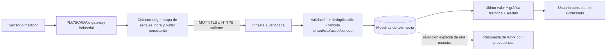

# Investigación: mediciones desde hardware externo en GridAssets

Fecha: 30 de septiembre de 2026. Esta es una propuesta de arquitectura, no una
función implementada ni una cotización de equipos.

## Hallazgo en el producto actual

La medición actual pertenece a una respuesta de concepto dentro de un `Work`.
`concept_responses.measured_at` es una **fecha** (`date`), y Analytics construye
series desde respuestas de trabajos terminados o revisados. El modo offline del
teléfono conserva trabajos en el navegador. Ninguno de estos componentes recibe
lecturas continuas de sensores ni garantiza que un gateway industrial almacene
datos mientras la red está caída.

Por ello, una muestra automática debe guardarse en una serie de telemetría
separada. Más adelante, el operador podría adjuntar una muestra concreta a un
trabajo, conservando su origen, hora y estado de validación; no se debe rellenar
automáticamente una respuesta del formulario ni crear un hallazgo confirmado.

## Caminos de entrada según lo que exista en faena

| Punto de partida | Lectura local | Conexión hacia GridAssets | Ajuste |
| --- | --- | --- | --- |
| PLC/SCADA con OPC UA | Cliente OPC UA en equipo edge autorizado | Publicación saliente por MQTT/TLS o HTTPS | Primera opción si el cliente ya expone señales. Permite suscripciones y modelo de datos; requiere autorización de OT para acceder a los nodos. |
| Medidor con Modbus TCP o RTU/RS-485 | Gateway industrial consulta registros | MQTT/TLS o HTTPS | Adecuado para medidores de energía, temperatura y otras señales lentas. Se necesita mapa de registros, escala y unidad. |
| Transmisor de 4–20 mA o sensor sin red | Módulo de entradas analógicas/PLC y luego gateway | MQTT/TLS o HTTPS | Hace falta hardware de adquisición; un sensor analógico no puede enviar datos directamente a la API. |
| Sensor remoto de bajo consumo | Red LoRaWAN y gateway/network server | Integración del servidor de red | Útil para lecturas periódicas donde instalar cable es difícil; validar cobertura en terreno. No elegirlo para control de baja latencia ni flujos de alta frecuencia. |

OPC UA soporta suscripciones, autenticación y cifrado; Modbus define el
intercambio con dispositivos por serial o TCP; MQTT es un transporte ligero de
publicación/suscripción con QoS 0, 1 y 2. Estos protocolos resuelven etapas
distintas y pueden convivir en una misma instalación.

Fuentes: [OPC Foundation](https://opcfoundation.org/about/opc-technologies/opc-ua/),
[Modbus Organization](https://www.modbus.org/modbus-specifications),
[MQTT](https://mqtt.org/),
[LoRa Alliance](https://lora-alliance.org/resource_hub/ebook-lorawan-empowers-very-low-power-wireless-applications/).

## Arquitectura recomendada para el primer piloto

El colector local debe conservar muestras en disco y reintentarlas después de
una caída de internet. MQTT QoS 1 puede entregar un mensaje más de una vez; la
API igualmente necesita una clave de deduplicación estable (por ejemplo,
`deviceId + channelId + sequence`). La hora de captura del equipo y la hora de
recepción del servidor se almacenan por separado. Un reloj sin sincronizar se
marca como dato de calidad dudosa.

La conexión entre OT y la plataforma debería ser **saliente y de solo lectura**
para este alcance; sin comandos de control a PLCs. Gateway en una red OT
segmentada, credenciales/certificados por dispositivo, TLS, rotación y revocación
de acceso, lista explícita de señales permitidas. NIST recomienda segmentación
e interfaces controladas entre redes OT e IT: [NIST SP 800-82 Rev. 3](https://csrc.nist.gov/pubs/sp/800/82/r3/final).

## Encaje con el modelo de GridAssets

- `tenantId` y `siteId`: mantienen aislamiento por empresa y faena.
- `assetId`: equipo que se está midiendo, incluso si es descendiente del activo
  en el que se abrió un Work.
- `conceptId`: variable semántica existente, por ejemplo temperatura o corriente.
- Vínculo de canal: dispositivo físico + dirección de señal/nodo/registro hacia
  `assetId + conceptId`, con unidad, conversión y estado activo.
- Muestra: identificador externo estable, valor, unidad, `observedAt` con hora
  y zona UTC, `receivedAt`, calidad, origen y versión del mapeo.

Los nombres de tablas propuestos (`telemetry_devices`, `telemetry_channels`,
`telemetry_samples`) son conceptuales. El catálogo `Concept` puede aportar
nombre/unidad y límites, pero la muestra debe conservar la versión de la regla
o límite aplicada para que un cambio de configuración no reescriba el pasado.
Los trabajos e informes actuales siguen mostrando evidencia capturada durante
la ejecución; la telemetría tiene su propia gráfica y su propio estado de
frescura. La interfaz debe distinguir «hace 10 segundos» de «último dato hace
3 horas» para evitar presentar un dato viejo como tiempo real.

Diez canales a una muestra por minuto producen 14.400 muestras al día; por eso
no conviene insertar esa carga en `concept_responses`, que tiene unicidad por
ítem de trabajo. Para historiales largos se definirán retención, agregados por
hora/día e índices según volumen real antes de elegir una base de series.

## Equipos y software a evaluar, sin elección cerrada

- [Moxa AIG-101](https://www.moxa.com/en/products/industrial-computing/iiot-gateways/ready-to-deploy-iiot-gateways/aig-101-series): el fabricante declara Modbus RTU/ASCII/TCP, cliente MQTT genérico y almacenamiento con *store and forward*. Candidato cuando el equipo disponible habla Modbus; verificar modelo, certificaciones, alimentación y soporte local antes de comprar.
- [Siemens Industrial Edge / IIH Essentials](https://www.siemens.com/en-us/products/industrial-edge/iih-essentials/): opción si ya existe ecosistema Siemens/OPC UA; admite estructurar datos en el edge y usar buffer local. Su costo/licencia y compatibilidad concreta requieren cotización.
- [ThingsBoard IoT Gateway](https://thingsboard.io/docs/iot-gateway/config/general/): referencia de software para prototipos con conectores Modbus/OPC UA y buffer local. No sustituye la revisión de seguridad ni la selección de hardware industrial.

No se encontró una tarifa pública homogénea de equipos, instalación,
conectividad y soporte que permita dar un precio responsable para faena sin
conocer los dispositivos existentes. La integración debería cotizarse aparte
del plan SaaS actual: levantamiento/instalación inicial, hardware y
conectividad si aplican, más operación mensual según canales, frecuencia,
retención y soporte; no por el número de usuarios que mira la gráfica.

## Piloto acotado y preguntas de descubrimiento

Propuesta: un tenant, una faena, un activo y 1–3 señales (por ejemplo,
temperatura, corriente y vibración); lectura cada 10–60 segundos según equipo;
gráfica de último valor e histórico; prueba de desconexión y reenvío; comparación
de una lectura automática con un instrumento de referencia. Se valida el
aislamiento por tenant, escala/unidad, hora correcta, duplicados, calidad,
latencia y duración de buffer antes de ampliar.

Para cerrar el diseño hay que conocer: marca/modelo de sensor o PLC, protocolo
realmente habilitado, mapa de señales, acceso permitido por el área OT,
frecuencia necesaria, energía disponible, cobertura/red de la faena, volumen de
canales, retención deseada y si se buscan solo visualización/alertas o también
usar una lectura como evidencia de un Work.
