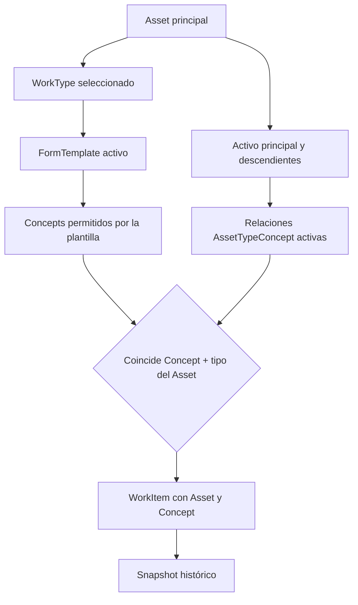
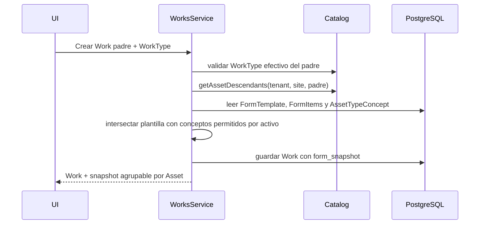

# Work padre con Concepts de activos descendientes

## Objetivo

Un Work sigue perteneciendo exclusivamente a su activo principal, pero su
formulario puede evaluar Concepts de activos ubicados debajo de él. La
expansión está controlada por el WorkType y su FormTemplate.



No se usa `descendiente + todos sus Concepts`. La intersección efectiva es:

```text
Concepts presentes en FormTemplate
∩
Concepts asociados al AssetType del activo evaluado
```

## Propiedad del Work y WorkTypes

`Work.assetId` permanece apuntando al padre. No se crean Works para hijos. La
API solo valida el WorkType contra el activo principal, por lo que ningún hijo
hereda los WorkTypes del padre. Los hijos conservan su configuración propia.

## WorkItem materializado

El sistema ya guardaba los elementos ejecutables en `works.form_snapshot`
(`jsonb`). Esa estrategia se conserva y el elemento de snapshot se amplía:

```typescript
interface WorkFormItemSnapshot {
  id: string; // UUID de esta instancia dentro del Work
  formItemId?: string; // FormItem global que la originó
  assetId?: string;
  assetCodeSnapshot?: string;
  assetNameSnapshot?: string;
  assetTypeIdSnapshot?: string;
  assetOrder?: number;
  assetDepth?: number;
  type: 'CONCEPT' | 'TASK';
  order: number;
  required: boolean;
  concept?: WorkConceptSnapshot;
}
```

Los campos nuevos son opcionales en TypeScript para poder leer snapshots
anteriores. Todo Work creado desde esta versión los recibe obligatoriamente.

## Identidad e idempotencia

El UUID del WorkItem es UUID v5 de:

```text
workId + assetId + formItemId
```

Esto evita fusionar dos equipos que usan el mismo Concept y permite que el
frontend offline y la API construyan exactamente el mismo ID.

```text
Work W1 + Radiador R1 + FormItem Temperatura = UUID A
Work W1 + Radiador R2 + FormItem Temperatura = UUID B
```

No existe deduplicación por `conceptId`.

## Recorrido del árbol

`getAssetDescendants` usa recorrido depth-first y devuelve todas las
generaciones. La API consulta previamente Assets por `tenantId + siteId`; la
copia local consulta el mismo sitio en IndexedDB. Un conjunto `visited` evita
recorrer ciclos de datos inválidos.

## Construcción online



Las tareas se asignan solo al padre. Cada FormItem Concept se replica únicamente
para los activos compatibles del subárbol.

## Construcción offline y sincronización

IndexedDB ya contiene Assets, relaciones `AssetTypeConcept`, plantilla,
secciones, FormItems, Concepts y opciones después de descargar el sitio. El
repositorio local ejecuta la misma intersección sin consultar la red.

El snapshot se guarda en `snapshots`. Las respuestas, tareas, comentarios y
fotos continúan apuntando a `item.id`, que ahora identifica una instancia de
Asset concreta. El Pull transporta `formSnapshot` dentro del cambio `WORK`; no
se agregaron nuevos tipos de operación ni se reescribió Outbox.

Durante Push, la API reconstruye y valida el snapshot con el mismo UUID
determinista antes de aceptar respuestas. El aislamiento por tenant y los
checkpoints existentes no cambian.

## Respuestas, comentarios y fotografías

```text
Work
└── WorkItem snapshot (assetId + concept)
    ├── ConceptResponse.formItemId
    ├── TaskCompletion.formItemId
    ├── WorkItemAnnotation.formItemId
    └── File metadata.formItemId
```

Aunque el nombre histórico de la FK lógica sea `formItemId`, su valor es
`WorkFormItemSnapshot.id`, es decir, el ID de la instancia ejecutable. Así dos
temperaturas del mismo Concept producen respuestas independientes.

## UI

La ejecución agrupa primero por activo y conserva dentro de cada grupo las
secciones de la plantilla. Cada grupo muestra nombre y código del snapshot,
profundidad e ítems. Se usa `<details>` para permitir colapsar grupos en móvil;
el activo principal comienza expandido.

Los trabajos históricos sin campos de Asset siguen siendo legibles como un
único grupo de activo principal.

## PostgreSQL

No fue necesaria una migración. `works.form_snapshot` ya es `jsonb`, por lo que
puede almacenar los campos nuevos sin alterar columnas. Las tablas de
respuestas, tareas y anotaciones ya referencian el ID de la instancia mediante
`form_item_id`.

## Archivos principales

| Archivo                                                                     | Responsabilidad                                             |
| --------------------------------------------------------------------------- | ----------------------------------------------------------- |
| `apps/inspection-api/src/app/catalog/asset-descendants.ts`                  | Recorrido recursivo reutilizable del árbol.                 |
| `apps/inspection-api/src/app/catalog/catalog.service.ts`                    | Descendientes acotados por tenant y sitio.                  |
| `apps/inspection-api/src/app/works/work-item-id.ts`                         | UUID v5 determinista en NestJS.                             |
| `apps/inspection-api/src/app/works/work-snapshot.ts`                        | Contrato del WorkItem con snapshot del Asset.               |
| `apps/inspection-api/src/app/works/works.service.ts`                        | Materialización online y validación del WorkType del padre. |
| `apps/inspection-web/src/features/assets/asset-selectors.ts`                | Recorrido equivalente sobre Assets locales.                 |
| `apps/inspection-web/src/features/works/work-item-id.ts`                    | Mismo UUID v5 en navegador.                                 |
| `apps/inspection-web/src/features/works/models.ts`                          | Contrato frontend del snapshot.                             |
| `apps/inspection-web/src/repositories/local-work-repository.ts`             | Materialización offline desde IndexedDB.                    |
| `apps/inspection-web/src/features/works/components/work-execution-form.tsx` | Agrupación visual por Asset.                                |
| `apps/inspection-api/src/app/works/works.service.spec.ts`                   | Caso online: filtro, recursión e identidad.                 |
| `apps/inspection-web/src/repositories/local-work-repository.test.ts`        | Caso offline equivalente y persistencia.                    |

## Alcance excluido

- No se crearon Works hijos.
- No se modificó permanentemente el FormTemplate.
- No se heredaron WorkTypes.
- No se agregaron filtros configurables por AssetType descendiente.
- No se modificó el flujo de hallazgos.
