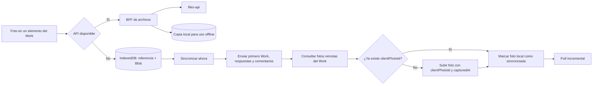

# GridAssets: fotografías offline y cambios incluidos en la iteración

**Estado:** guía de revisión previa a QA y producción.  
**Revisión:** 6 de octubre de 2026.  
**Alcance revisado:** los 26 archivos del diff de trabajo respecto de `03a0f0a`. No todos pertenecen a la función de fotografías.

## Qué se consiguió

Antes, el formulario deshabilitaba las fotos al entrar en modo local. Además, descargar un sitio guardaba referencias de fotos, pero no sus imágenes. Ahora el navegador puede guardar una foto tomada sin red, mostrarla después de cerrar y reabrir la aplicación y enviarla cuando el usuario pulsa **Sincronizar ahora**. Al preparar un sitio también descarga los archivos de las fotos remotas de sus trabajos para poder verlos sin conexión.

En el mismo diff hay dos correcciones independientes: el orden del Pull incremental y el orden de secciones y elementos de formularios locales. También hay dos documentos comerciales y un PDF que no cambian el funcionamiento del producto.

## Modelo de datos

La novedad de almacenamiento está **en IndexedDB del navegador**, no en una migración de PostgreSQL ni en una tabla nueva de `files-api`.

| Pieza              | Contenido                                                                                                               | Para qué sirve                                                                                       |
| ------------------ | ----------------------------------------------------------------------------------------------------------------------- | ---------------------------------------------------------------------------------------------------- |
| `fileReferences`   | `id`, `tenantId`, `workId`, `workItemId`, nombre, MIME, tamaño, estado, `remoteFileId`, fechas, intentos y último error | Identificar la foto, aislarla por empresa y Work, y seguir su sincronización. Ya existía; se amplía. |
| `fileBlobs`        | `id` y `Blob` binario                                                                                                   | Conservar los bytes de la imagen en el dispositivo. Nueva tabla Dexie, versión 6.                    |
| Versión 7 de Dexie | Reparación de `order` en catálogos, snapshots y Works pendientes                                                        | Corrige datos locales que pudieron llegar con `sortOrder`; es un cambio distinto al de fotos.        |
| Metadata remota    | `clientPhotoId` y `capturedAt` dentro de la foto del Work                                                               | Reconocer un envío repetido y conservar la hora declarada de captura offline.                        |

Una foto nacida offline conserva su UUID local como `id` de la referencia. Tras subirla, `remoteFileId` contiene el UUID asignado por `files-api`; el Blob local permanece guardado para verla sin red. Una foto descargada desde el servidor usa inicialmente el ID remoto como ID local. `REMOTE_ONLY` significa **sin envío pendiente**; puede existir una copia binaria en este navegador. Los otros estados son `LOCAL_ONLY`, `PENDING_UPLOAD` y `ERROR`.

IndexedDB pertenece al origen, navegador y perfil. La separación por `tenantId` se aplica en los repositorios y consultas de la aplicación; las fotos no se transfieren automáticamente a otro dispositivo. Borrar los datos locales del navegador también borra fotos todavía no enviadas.

## Recorridos principales

### 1. Preparar un sitio

`cacheSiteForOffline` obtiene el catálogo y los Works del sitio, consulta las fotos de cada Work y guarda el bundle local. Después descarga cada Blob que aún no tenga copia. Solo marca el sitio como `READY` al completar las fotos. Si una consulta, descarga o escritura falla, marca el sitio como `ERROR` y permite reintentar. Esto puede tardar y consumir bastante almacenamiento cuando un sitio tiene muchas evidencias.

### 2. Tomar o agregar una foto

El formulario permite imágenes JPG, PNG y WebP de hasta **10 MB cada una**. Sin API, `localPhotoRepository.save` guarda la referencia y el Blob en una transacción; luego la UI muestra una vista previa y la etiqueta **Pendiente de sincronizar**. Si la API parecía disponible pero falla la conexión durante el envío, se usa el mismo guardado local. Un rechazo HTTP del servidor, como falta de permiso o validación, se muestra como error y no se convierte automáticamente en un pendiente local.

Con API disponible, la foto se sube inmediatamente y se intenta conservar también su Blob local. Si esa segunda escritura falla, la foto remota existe, pero la UI avisa que no quedó disponible offline en ese dispositivo. Quitar una foto aún no enviada elimina referencia y Blob locales; quitar una ya enviada requiere conexión y borra tanto el archivo remoto como la copia local conocida.

### 3. Sincronizar

`SyncService.sync` envía primero el outbox normal: Work, respuestas, tareas y comentarios. Luego busca las referencias de foto pendientes de la empresa seleccionada. Por cada Work consulta las fotos existentes; si encuentra el mismo `clientPhotoId`, confirma el envío anterior sin volver a subir el archivo. En caso contrario, reconstruye un `File` desde el Blob y lo sube. Después ejecuta el Pull incremental. Si alguna foto falla, conserva su referencia como `ERROR`, la muestra en pendientes y no inicia el Pull en esa ejecución. El siguiente intento vuelve a procesarla.

El BFF valida pertenencia al tenant, rol con escritura, Work y elemento del formulario. En un Work `FINISHED`, admite una foto offline cuyo `capturedAt` declarado sea anterior al cierre, con cinco minutos de tolerancia; un Work `REVIEWED` sigue cerrado para nuevas fotos. Antes de devolver una foto ya existente, repite la autorización. El identificador ayuda a recuperar una subida cuya respuesta se perdió, pero no existe una restricción única en la base de archivos que garantice exclusión ante dos subidas simultáneas con el mismo `clientPhotoId`.

### 4. Corregir el Pull y el orden del formulario

La consulta del Pull convertía `sequence` a texto para serializarla y después ordenaba por el alias textual: `1, 2, 22, ..., 3`. El cliente rechazaba correctamente ese lote. Ahora la consulta ordena por la columna numérica `server_changes.sequence`. Es un cambio de API independiente de las fotos, pero necesario para que la sincronización avance.

Además, algunas filas de catálogo tenían `sort_order` en PostgreSQL y llegaban como `sortOrder`, mientras los modelos del formulario usan `order`. La API transforma ese campo para entidades de catálogo concretas; el cliente también normaliza respuestas anteriores. La versión 7 de IndexedDB repara los datos locales ya descargados y completa posiciones faltantes en snapshots de la misma plantilla y versión, sin sustituir respuestas ni reconstruir formularios históricos.

## Los 26 archivos del diff

### Fotos: almacenamiento, pantalla y sincronización

| Archivo                                                                           | Cambio y motivo                                                                                                                                  |
| --------------------------------------------------------------------------------- | ------------------------------------------------------------------------------------------------------------------------------------------------ |
| `apps/inspection-web/src/db/inspection-db.ts`                                     | Declara `fileBlobs` y la versión 6 de Dexie; registra además la reparación de orden de la versión 7.                                             |
| `apps/inspection-web/src/features/offline/models.ts`                              | Amplía `LocalFileReference`, define `LocalFileBlob` e incorpora fotos en el resumen de pendientes.                                               |
| `apps/inspection-web/src/repositories/local-photo-repository.ts`                  | Guarda, consulta y elimina referencias y Blobs; controla estados, errores, reintentos y adaptación a la vista del Work.                          |
| `apps/inspection-web/src/repositories/local-photo-repository.test.ts`             | Prueba persistencia tras reabrir IndexedDB, aislamiento por tenant, borrado, confirmación y caché de fotos remotas.                              |
| `apps/inspection-web/src/features/works/components/work-execution-form.tsx`       | Carga fotos locales y remotas, crea vistas previas, guarda fotos sin red o ante fallo de conexión, y separa borrado local del remoto.            |
| `apps/inspection-web/src/features/works/components/work-item-additional-info.tsx` | Habilita el selector de fotos en modo local y muestra cuáles siguen pendientes; controla si se pueden borrar.                                    |
| `apps/inspection-web/src/features/works/models.ts`                                | Agrega `clientPhotoId` y `capturedAt` a la metadata tipada de una foto del Work.                                                                 |
| `apps/inspection-web/src/features/works/work-photo-api.ts`                        | Añade la metadata del envío offline, permite obtener el Blob y distingue un fallo de red de un rechazo HTTP.                                     |
| `apps/inspection-web/src/services/cache-site-for-offline.ts`                      | Descarga los bytes de las fotos del sitio y evita duplicar una copia local que ya representa el mismo archivo remoto.                            |
| `apps/inspection-web/src/services/sync-service.ts`                                | Inserta la fase de subida de fotos después del outbox normal y antes del Pull; recupera envíos previos mediante `clientPhotoId`.                 |
| `apps/inspection-web/src/services/sync-service.test.ts`                           | Verifica orden de envío, aislamiento por tenant y recuperación cuando se pierde la respuesta de una subida.                                      |
| `apps/inspection-web/src/repositories/offline-repository.ts`                      | Suma fotos no confirmadas al listado y contador de cambios pendientes.                                                                           |
| `apps/inspection-web/src/repositories/offline-repository.test.ts`                 | Comprueba que el contador solo incluya fotos de la empresa seleccionada.                                                                         |
| `apps/inspection-web/src/features/offline/offline-context.tsx`                    | Inicializa el nuevo contador `photos` en el estado global.                                                                                       |
| `apps/inspection-web/src/pages/sync-page.tsx`                                     | Presenta el contador y la etiqueta «Fotografía» en la pantalla de sincronización.                                                                |
| `apps/bff-api/src/app/files-api/files-api.service.ts`                             | Autoriza fotos capturadas offline antes del cierre, valida metadata y busca un `clientPhotoId` ya subido antes de repetir el POST a `files-api`. |
| `apps/bff-api/src/app/files-api/files-api.service.spec.ts`                        | Prueba carga anterior/posterior al cierre, reintento idempotente y rechazo de un usuario de solo lectura.                                        |

### Correcciones de Pull y orden de formularios

| Archivo                                                              | Cambio y motivo                                                                                                 |
| -------------------------------------------------------------------- | --------------------------------------------------------------------------------------------------------------- |
| `apps/inspection-api/src/app/sync/sync.service.ts`                   | Ordena el Pull por la secuencia numérica y transforma `sortOrder` a `order` solo en catálogos que lo necesitan. |
| `apps/inspection-api/src/app/sync/sync.service.spec.ts`              | Cubre el SQL del orden numérico y la transformación selectiva del payload.                                      |
| `apps/inspection-web/src/db/repair-local-form-order.ts`              | Normaliza catálogos y repara snapshots y CREATE de Work pendientes al actualizar IndexedDB.                     |
| `apps/inspection-web/src/db/repair-local-form-order.test.ts`         | Simula el paso de versión 6 a 7 y comprueba que no se pierdan Work, comentarios, fotos ni datos históricos.     |
| `apps/inspection-web/src/repositories/local-work-repository.test.ts` | Verifica que un nuevo Work local materialice sus secciones en el orden de la pauta.                             |
| `apps/inspection-web/src/services/apply-remote-changes.ts`           | Normaliza también los catálogos recibidos por Pull antes de guardarlos en IndexedDB.                            |

### Archivos comerciales presentes en el mismo diff

| Archivo                                                    | Cambio y motivo                                                                                                                        |
| ---------------------------------------------------------- | -------------------------------------------------------------------------------------------------------------------------------------- |
| `docs/GRIDASSETS_COTIZACION_MODELO_OCT_2026.md`            | Reescribe una propuesta SaaS para un cliente concreto, con planes, alcance y condiciones; no participa en el runtime.                  |
| `docs/GRIDASSETS_ESTRATEGIA_COMERCIAL_OCT_2026.md`         | Actualiza el fundamento interno de precios y dimensionamiento; indica que las cuotas por tenant todavía no se aplican automáticamente. |
| `output/pdf/GridAssets_Propuesta_Comercial_2026-10-06.pdf` | Versión PDF de la propuesta comercial; artefacto independiente de la función offline.                                                  |

## Validación realizada y comprobaciones antes del despliegue

Al revisar este diff pasaron **19 pruebas del frontend** relacionadas con fotos, sync y reparación del orden; **19 del BFF** sobre archivos y permisos; y **5 de `inspection-api`** sobre Push/Pull. TypeScript pasó para las tres aplicaciones y `git diff --check` no encontró errores de formato. Estas pruebas no sustituyen una prueba completa en un navegador real con modo avión, reinicio de la PWA y reintento de conexión.

En QA conviene verificar, en este orden:

1. Actualizar una instalación con datos IndexedDB v5/v6 y comprobar que se abre como v7 sin perder Works, respuestas, fotos pendientes ni orden histórico.
2. Preparar un sitio con fotos remotas, desconectar la red, cerrar y reabrir la aplicación, y confirmar que las imágenes siguen visibles.
3. Capturar una foto sin red, cerrar y reabrir, comprobar el contador de pendientes y volver a conectar.
4. Sincronizar el Work y su foto, repetir la sincronización y confirmar una sola foto remota y cero fotos pendientes.
5. Interrumpir la red después de que el servidor reciba la foto pero antes de que llegue la respuesta; al reintentar debe reconocer `clientPhotoId`.
6. Confirmar permisos y cierre: un `VIEWER` no sube; una foto offline anterior al cierre de un Work `FINISHED` sí; una posterior o en un Work `REVIEWED` no.
7. Probar un sitio con muchas fotos y poco espacio libre para observar el mensaje de cuota y el estado de descarga; volver a intentar después de liberar espacio.
8. Probar el Pull con secuencias de dos dígitos para confirmar que el checkpoint avanza sin el error de orden.

El orden recomendado de despliegue técnico es `inspection-api`, después `bff-api` y finalmente `inspection-web`; así el frontend nuevo encuentra los contratos de backend que necesita. `files-api` no tiene cambios en este diff. Los tres archivos comerciales pueden revisarse y versionarse por separado del cambio técnico.

## Límites que conviene entender

- La foto y su copia descargada ocupan espacio **del navegador**; no hay todavía medidor ni expulsión automática de Blobs por antigüedad o por tenant. Una foto subida continúa almacenada localmente hasta que se limpien los datos o se elimine la foto.
- La descarga de un sitio intenta traer **todas** las fotos de sus Works. No existe una selección parcial de evidencias ni una promesa de capacidad offline fija por dispositivo.
- `capturedAt` proviene del reloj del dispositivo. La tolerancia de cinco minutos resuelve el caso operativo de un Work cerrado mientras se sube evidencia previa, pero no es una prueba criptográfica de cuándo se tomó la imagen. Debe aceptarse conscientemente esa regla antes de producción.
- La detección de duplicados es eficaz para el reintento secuencial previsto, pero no reemplaza una restricción única transaccional si dos clientes suben al mismo tiempo el mismo `clientPhotoId`.
- El navegador solo ofrece esta copia offline en el mismo origen/perfil. Un usuario debe **sincronizar sus fotos pendientes antes de limpiar datos locales, cerrar sesión en un equipo compartido o cambiar de dispositivo**.
- Los documentos antiguos `INSPECTION_OFFLINE_FIRST.md` y `INSPECTION_PWA_AIRPLANE_MODE.md` describen fases anteriores y todavía dicen que las fotos offline están pendientes. Para el estado de esta iteración prevalece esta guía; esos documentos históricos no se modificaron en el diff revisado.
