# GridAssets: primera fase offline-first

> Este documento conserva la primera fase como referencia. La selección
> automática, la PWA y el modo avión se describen en
> [INSPECTION_PWA_AIRPLANE_MODE.md](./INSPECTION_PWA_AIRPLANE_MODE.md), que
> reemplaza las notas históricas sobre Service Worker y cambio manual de modo.
> El Push manual implementado después se documenta en
> [INSPECTION_SYNC_PUSH.md](./INSPECTION_SYNC_PUSH.md).

> **Si estás aprendiendo esta implementación:** comienza en
> [Guía explicada de la implementación](#guía-explicada-de-la-implementación).
> Las primeras secciones sirven como referencia técnica rápida; la guía parte
> desde el problema y explica cada recorrido y archivo.

## Evolución del módulo offline

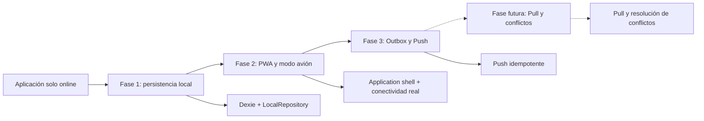

| Capacidad                   | Antes de la fase 1  | Fase 1                                 | Estado actual, fase 3                              |
| --------------------------- | ------------------- | -------------------------------------- | -------------------------------------------------- |
| Datos persistentes locales  | No                  | Sí, mediante Dexie                     | Sí                                                 |
| Descarga por sitio          | No                  | Sí                                     | Sí                                                 |
| Elección del repositorio    | Solo remoto         | Manual                                 | Automática cuando la API no responde               |
| Apertura sin servidor web   | No                  | Service Worker manual inicial          | PWA generada por Vite y Workbox                    |
| Detección del backend       | No                  | Solo `navigator.onLine` como indicador | `navigator.onLine` + `GET /api/health`             |
| Trabajos offline            | No                  | Crear, responder y comentar            | Igual, con transición automática y mensajes claros |
| Cambios pendientes          | Estado en cada fila | Visible en diagnóstico                 | Conteo global y pantalla `/sync`                   |
| Actualización del frontend  | Recarga normal      | Sin estrategia controlada              | Aviso **Actualizar ahora**                         |
| Sincronización con servidor | No                  | No                                     | Push manual disponible; Pull todavía pendiente     |

La fase 1 sigue siendo la base de datos y dominio local. La fase 2 no la
reemplaza: agrega el mecanismo que permite arrancar React sin red, detectar la
disponibilidad real de la API y activar esos repositorios locales.

La analogía más cercana es una libreta de terreno:

```text
PostgreSQL/API = archivo central de la oficina
Descargar sitio = copiar la información necesaria a la libreta
IndexedDB      = libreta guardada en el dispositivo
Trabajo local  = nueva anotación que aún no llegó a la oficina
Sync futuro    = entregar y conciliar la libreta con el archivo central
```

## Alcance implementado

Esta fase permite descargar un sitio desde el backend, abrir su copia local y
crear o completar trabajos usando IndexedDB. No existe todavía sincronización
de regreso al servidor, resolución de conflictos ni carga offline de fotos.

```text
UI React
   │
   ├── modo REMOTE ── RemoteWorkRepository ── API/BFF
   │
   └── modo LOCAL  ── LocalWorkRepository  ── Dexie/IndexedDB
```

La elección del origen se realiza en `OfflineProvider`. Los componentes de
Activos y Trabajos consumen hooks/repositorios y no conocen la API ni Dexie.

## Contenido de IndexedDB

La base `gridassets-inspection` guarda:

- tenant actual y sitios descargados;
- activos y tipos de activo;
- tipos de trabajo y su configuración efectiva por activo;
- conceptos y opciones;
- asociaciones entre tipos de activo y conceptos;
- plantillas, secciones y elementos de formulario;
- trabajos, snapshots, respuestas, tareas completadas y comentarios;
- referencias de fotografías remotas, sin descargar blobs;
- estado y fecha de cada descarga offline.

Las tablas de dominio conservan `tenantId`. Los índices principales permiten
consultar por combinaciones como `[tenantId+siteId]`, `[tenantId+assetId]` y
`[tenantId+workId]`. Los repositorios también exigen `tenantId` en sus métodos,
incluso cuando el identificador principal es un UUID global.

## Descarga de un sitio

`cacheSiteForOffline(tenantId, siteId)` realiza estas operaciones:

1. marca el sitio como `DOWNLOADING`;
2. obtiene sitio, activos y catálogos desde la API actual;
3. obtiene la configuración efectiva de trabajos por cada activo;
4. obtiene plantillas, conceptos, trabajos y snapshots;
5. consulta metadata de fotos, sin guardar su contenido;
6. guarda el conjunto en una transacción Dexie;
7. marca el sitio como `READY` con `downloadedAt`.

Una descarga posterior no sobreescribe registros marcados `LOCAL_ONLY` o
`MODIFIED`. El botón está en Activos y permite abrir explícitamente la copia
local. Desde la segunda fase, una API inaccesible activa esa copia de forma
automática.

## Escritura local

Un trabajo creado en modo local usa `crypto.randomUUID()` y se guarda con
`syncStatus: 'LOCAL_ONLY'`. Un trabajo que provenía del servidor y se edita
localmente cambia a `MODIFIED`. Las respuestas, tareas completadas y
anotaciones usan el mismo criterio.

```text
SYNCED      copia idéntica a la última descarga
LOCAL_ONLY  todavía no existe en PostgreSQL
MODIFIED    existe en servidor, pero cambió en este navegador
```

Los estados permiten identificar qué deberá procesar un futuro Sync Engine.
Un trabajo finalizado o revisado sigue siendo de solo lectura en modo local.

## Pantalla de diagnóstico

`/offline-debug` muestra los sitios descargados, cantidades locales, registros
`LOCAL_ONLY`, registros `MODIFIED`, referencias de archivos y uso aproximado
del almacenamiento. También permite cambiar entre origen remoto/local y
limpiar IndexedDB en el navegador.

El layout combina `navigator.onLine` con un health check del BFF. El Service
Worker generado por `vite-plugin-pwa` conserva el application shell para poder
reabrir la aplicación; no implementa background sync ni cachea la API.

## Archivos principales

- `apps/inspection-web/src/db/inspection-db.ts`: esquema y tablas Dexie.
- `apps/inspection-web/src/features/offline/models.ts`: modelos locales y estados.
- `apps/inspection-web/src/repositories/work-repository.ts`: contrato usado por la UI.
- `apps/inspection-web/src/repositories/remote-work-repository.ts`: adaptación de la API actual.
- `apps/inspection-web/src/repositories/local-work-repository.ts`: lectura y escritura en IndexedDB.
- `apps/inspection-web/src/repositories/local-catalog-repository.ts`: catálogos locales.
- `apps/inspection-web/src/repositories/offline-repository.ts`: diagnóstico y limpieza.
- `apps/inspection-web/src/services/cache-site-for-offline.ts`: descarga y persistencia por sitio.
- `apps/inspection-web/src/features/offline/offline-context.tsx`: selección automática del origen.
- `apps/inspection-web/src/features/connectivity/connectivity-context.tsx`: estado de red y API.
- `apps/inspection-web/src/pages/offline-debug-page.tsx`: inspección de la base local.
- `apps/inspection-web/vite.config.ts`: generación del manifest y Service Worker.

## Dependencias que siguen conectadas al backend

La administración de tenants, sitios, activos, catálogos, conceptos y
plantillas continúa siendo online. El login inicial y la validación normal de
la sesión siguen dependiendo del backend; al reabrir en modo avión se admite
el JWT vigente ya guardado para acceder a la copia local. Las fotografías
existentes se guardan como referencias, pero su imagen requiere servidor y no
se permite agregar fotos en modo local.

## TODO para sincronización real

- diseñar `/sync/push` y `/sync/pull` con operaciones idempotentes;
- agregar versión de servidor, cursor de descarga y borrados lógicos;
- crear una cola de cambios por tenant y orden de dependencias;
- definir tombstones para representar eliminaciones locales de respuestas;
- subir primero trabajos locales y remapear relaciones si fuera necesario;
- sincronizar respuestas, comentarios y tareas completadas;
- persistir blobs locales y subir fotografías pendientes;
- detectar y resolver conflictos con una política explícita;
- revalidar membresía y permisos antes de aceptar cambios offline;
- agregar pruebas de integración en navegador para cierre y reapertura real.

---

## Guía explicada de la implementación

### 1. El problema que resolvimos

Antes de este cambio, las pantallas obtenían los datos de la API y guardaban
los trabajos en PostgreSQL a través del backend:

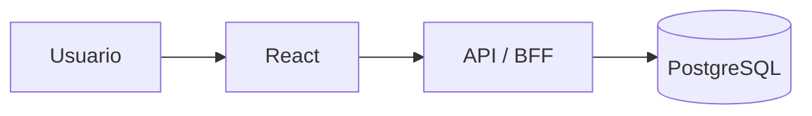

Si el equipo perdía la conexión, React podía seguir dibujando lo que ya tenía
en memoria, pero al refrescar la página esa memoria desaparecía. Tampoco era
posible crear un trabajo porque la operación necesitaba llegar al servidor.

Ahora existe una segunda fuente de datos dentro del navegador:

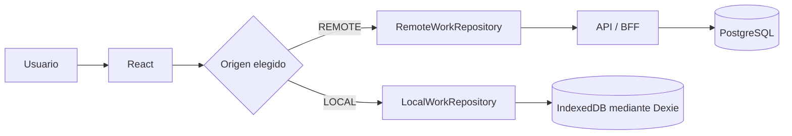

La segunda fase cambia automáticamente a IndexedDB cuando el navegador o la
API no están disponibles. El usuario también puede abrir la copia local de
forma explícita para diagnosticarla.

### 2. Cuatro ideas que conviene separar

#### Estado de React

Es la información que una pantalla mantiene mientras está abierta. Desaparece
al refrescar. Se usa para estados visuales como `isLoading`, el activo
seleccionado o un formulario que todavía no se ha guardado.

#### IndexedDB

Es una base de datos perteneciente al navegador. Permanece después de refrescar
o cerrar la aplicación. Los datos pertenecen a la combinación de navegador,
perfil y dominio desde el que se abrió GridAssets.

#### Caché offline

Es una copia explícita de datos del backend guardada en IndexedDB. Descargar un
sitio no sincroniza nada hacia PostgreSQL. Solamente trae una fotografía del
estado remoto al navegador.

#### Sincronización

Será el proceso futuro que compare la base local con el servidor y envíe los
cambios pendientes. En esta etapa no existe. Los estados locales dejan la
información preparada para construirla después.

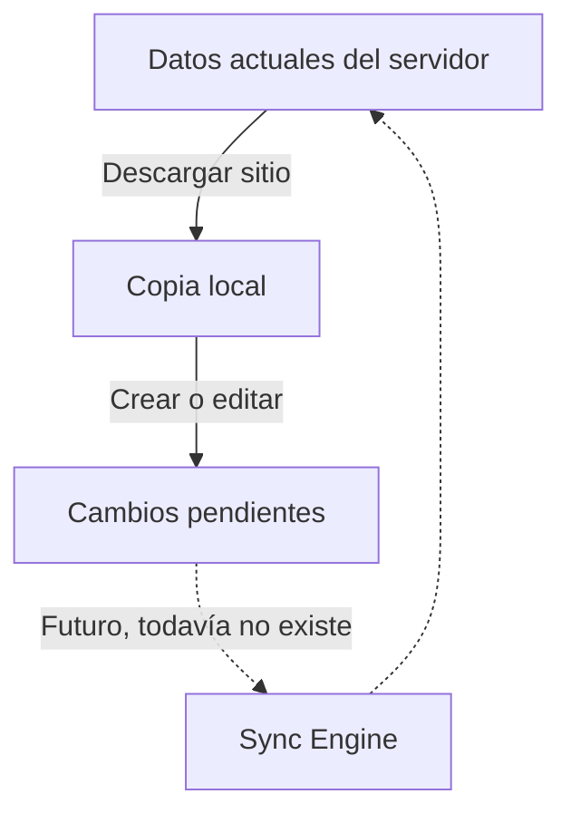

### 3. Arquitectura por capas

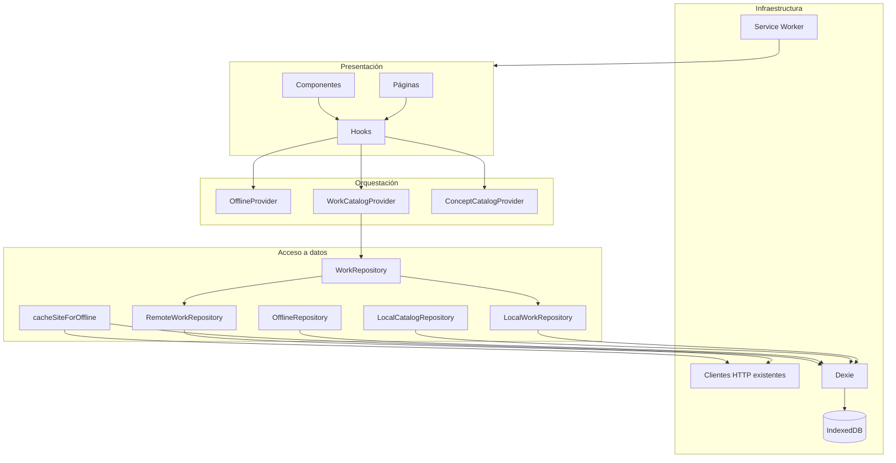

La regla principal es que una página o componente React no importa Dexie. La
UI pide una operación a un hook, contexto, repositorio o servicio. Esa capa
decide si usa HTTP o IndexedDB.

### 4. Árbol de providers

`OfflineProvider` se encuentra antes de los providers que necesitan decidir el
origen. Por eso el orden en `app.tsx` es relevante:

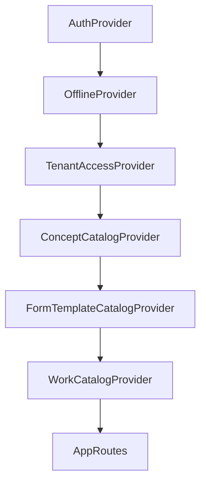

- `AuthProvider` identifica al usuario.
- `OfflineProvider` indica `REMOTE` o `LOCAL`.
- `TenantAccessProvider` carga tenants desde la fuente seleccionada.
- `ConceptCatalogProvider` hace lo mismo con conceptos.
- `WorkCatalogProvider` elige la implementación de `WorkRepository`.
- Las rutas y pantallas reciben todos estos contextos ya preparados.

Si `OfflineProvider` estuviera debajo de `WorkCatalogProvider`, este último no
podría saber qué repositorio debe utilizar.

### 5. Modelo local de datos

La base se llama `gridassets-inspection` y contiene 19 tablas.

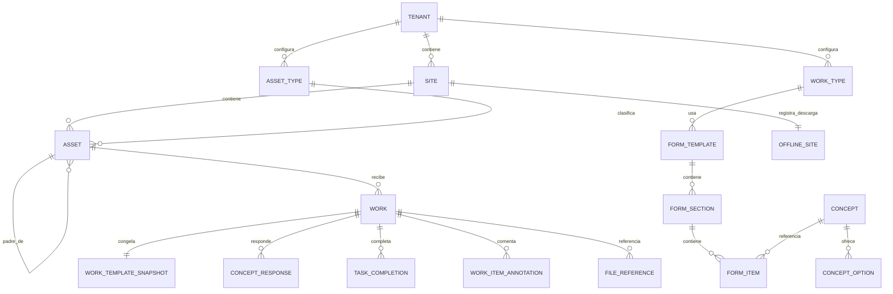

#### Tablas organizacionales y catálogos

| Tabla                    | Qué guarda                                                 | Índices relevantes                                                   |
| ------------------------ | ---------------------------------------------------------- | -------------------------------------------------------------------- |
| `tenants`                | Empresa a la que tuvo acceso el usuario al descargar       | `id`                                                                 |
| `sites`                  | Minas, plantas o sitios descargados                        | `tenantId`, `[tenantId+id]`                                          |
| `assets`                 | Subestaciones y activos hijos                              | `[tenantId+siteId]`, `[tenantId+assetTypeId]`, `[tenantId+parentId]` |
| `assetTypes`             | Tipos de activo                                            | `tenantId`, `[tenantId+active]`                                      |
| `workTypes`              | Tipos de trabajo                                           | `tenantId`, `[tenantId+active]`                                      |
| `workTypeConfigurations` | Resultado efectivo de trabajos permitidos para cada activo | `[tenantId+assetId]`, `[tenantId+id]`                                |
| `concepts`               | Definiciones de parámetros                                 | `tenantId`, `[tenantId+active]`                                      |
| `conceptOptions`         | Opciones de conceptos digitales                            | `[tenantId+conceptId]`                                               |
| `assetTypeConcepts`      | Asociación entre tipo de activo y concepto                 | `[tenantId+assetTypeId]`                                             |
| `formTemplates`          | Plantillas disponibles                                     | `[tenantId+workTypeId]`                                              |
| `formSections`           | Secciones ordenadas                                        | `[tenantId+formTemplateId]`                                          |
| `formItems`              | Tareas o conceptos de cada sección                         | `[tenantId+sectionId]`                                               |

#### Tablas de ejecución

| Tabla              | Qué guarda                                          | Índices relevantes                                                 |
| ------------------ | --------------------------------------------------- | ------------------------------------------------------------------ |
| `works`            | Trabajos remotos descargados y trabajos locales     | `[tenantId+siteId]`, `[tenantId+assetId]`, `[tenantId+syncStatus]` |
| `conceptResponses` | Valores analógicos, digitales o de texto            | `[tenantId+workId]`, `[tenantId+syncStatus]`                       |
| `taskCompletions`  | Confirmación de tareas                              | `[tenantId+workId]`, `[tenantId+syncStatus]`                       |
| `annotations`      | Comentarios opcionales por elemento                 | `[tenantId+workId]`, `[tenantId+syncStatus]`                       |
| `snapshots`        | Copia inmutable del formulario usado por un trabajo | `[tenantId+workId]`                                                |
| `fileReferences`   | Metadata de fotos, sin el archivo pesado            | `[tenantId+workId]`, `[tenantId+status]`                           |
| `offlineSites`     | Estado y fecha de descarga                          | `[tenantId+siteId]`, `[tenantId+status]`                           |

El snapshot es necesario porque una plantilla puede cambiar después de crear
un trabajo. El trabajo debe continuar mostrando la versión con la que comenzó.

### 6. Aislamiento entre tenants

Aunque los UUID deberían ser globalmente únicos, la implementación nunca toma
eso como única protección. Los métodos reciben `tenantId` y las consultas usan
índices compuestos.

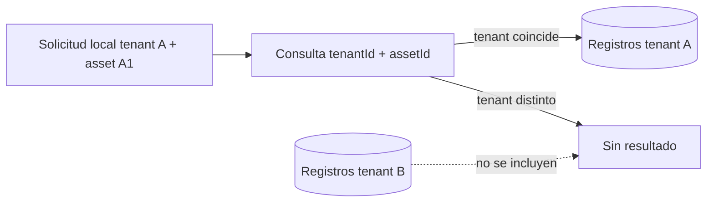

Ejemplos:

```typescript
listByAsset(tenantId, assetId);
listBySite(tenantId, siteId);
getById(tenantId, workId);
```

Incluso `getById` lee por UUID y luego comprueba que `work.tenantId` coincida.
La prueba automatizada intenta leer el trabajo con otro tenant y espera
`undefined`.

La membresía guardada localmente representa el último acceso conocido. El
backend deberá revalidar esa membresía cuando en el futuro reciba cambios. Un
usuario sin conexión no puede obtener cambios de permisos ocurridos después de
su última descarga.

### 7. Descarga de un sitio paso a paso

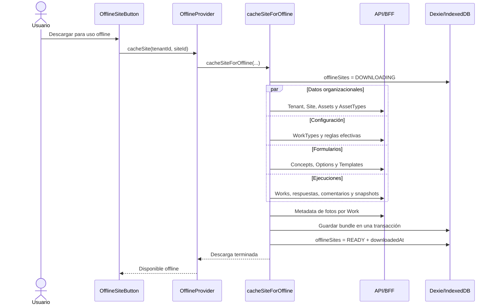

Usamos `tenantId` y `siteId`, aunque el ejemplo inicial mostraba solamente
`cacheSiteForOffline(siteId)`. El parámetro adicional evita depender de un
tenant global implícito y hace explícito el aislamiento.

La transacción significa que las tablas se actualizan como una sola unidad. Si
falla una escritura dentro de ella, Dexie revierte esa unidad en lugar de dejar
la descarga a medias. El estado `ERROR` conserva el mensaje para la UI.

Al actualizar una descarga:

- las reglas efectivas del sitio se reemplazan por la configuración actual;
- las relaciones de conceptos del tenant se reemplazan por las actuales;
- un Work, respuesta o comentario `LOCAL_ONLY` o `MODIFIED` no se sobrescribe
  con su copia remota;
- las fotos se guardan como referencias, sin Blob.

Esto todavía no equivale a reconciliación completa: los borrados remotos y los
conflictos pertenecen al futuro Sync Engine.

### 8. Selección entre remoto y local

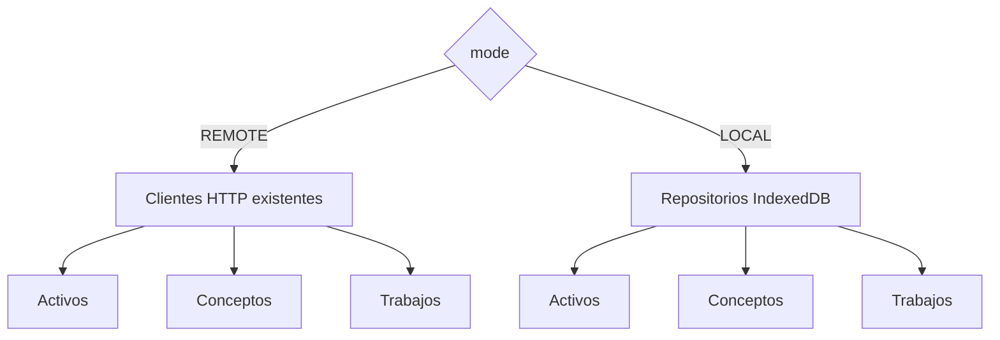

La preferencia de interfaz se guarda en `localStorage` bajo la clave
`inspection-data-source`. Los datos importantes no se guardan allí; se guardan
en IndexedDB. Desde la fase 2, el modo efectivo se calcula así:

```typescript
mode = apiReachable ? preferredMode : 'LOCAL';
```

Cuando la API deja de responder se selecciona `LOCAL` aunque la preferencia sea
`REMOTE`. `WorkCatalogProvider` conserva temporalmente el estado React durante
el cambio para no desmontar un formulario abierto; a continuación recarga el
tenant desde IndexedDB. Conceptos, activos y configuraciones también cambian a
sus repositorios locales y no realizan peticiones de negocio offline.

### 9. Creación de un trabajo local

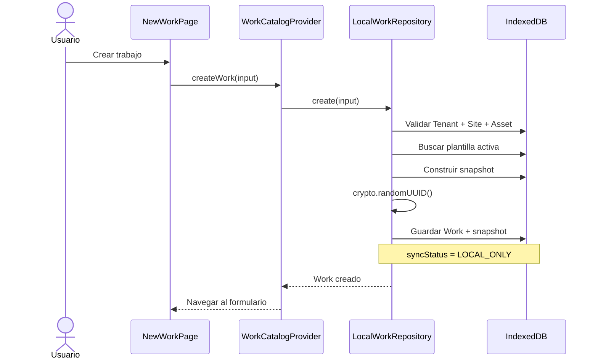

El repositorio valida que el sitio y el activo pertenezcan al `tenantId`. No
basta con que los identificadores existan. Luego busca una plantilla activa y
construye el mismo tipo de snapshot que espera la pantalla de ejecución.

### 10. Guardado de respuestas y comentarios

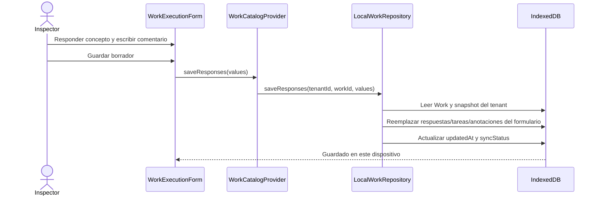

Al volver a guardar, se conserva el `id` de una respuesta existente para que
una sincronización futura pueda reconocerla. También se conserva `createdAt` y
se actualiza `updatedAt`.

Las reglas de formulario siguen funcionando localmente:

- un campo requerido debe tener respuesta antes de finalizar;
- una tarea requerida debe estar marcada;
- un Work `FINISHED` o `REVIEWED` permanece de solo lectura;
- los comentarios se pueden editar mientras el Work sea editable;
- las fotos se deshabilitan en modo local durante esta fase.

### 11. Estados de sincronización

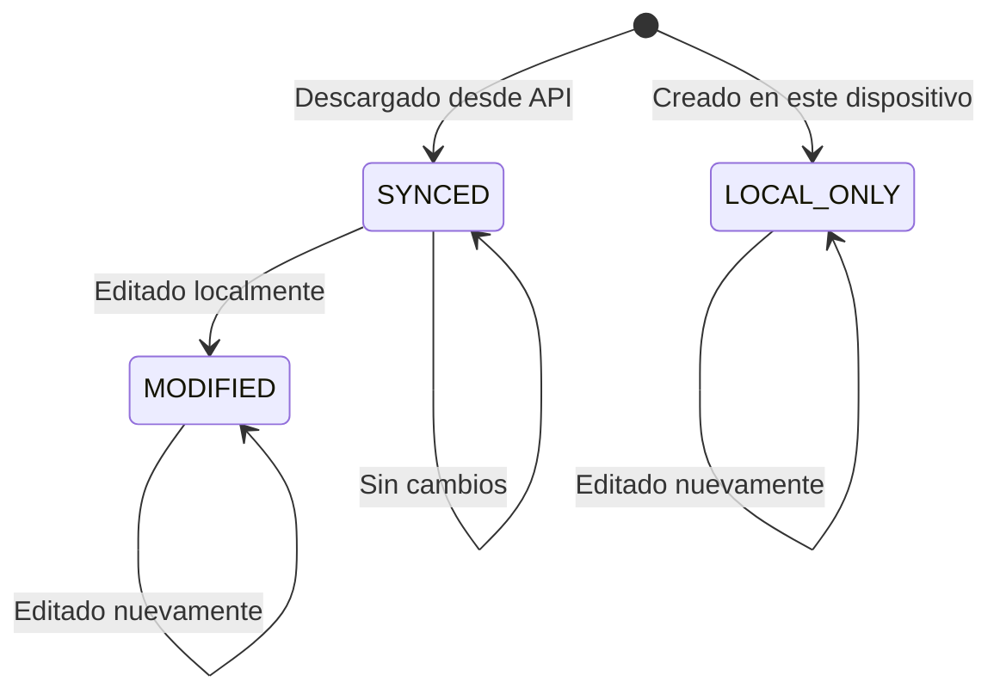

| Estado       | Significado actual                      | Acción futura          |
| ------------ | --------------------------------------- | ---------------------- |
| `SYNCED`     | Coincide con la última copia descargada | No enviar              |
| `LOCAL_ONLY` | Solo existe en IndexedDB                | Crear en servidor      |
| `MODIFIED`   | Vino del servidor y cambió localmente   | Actualizar en servidor |

El cambio de estado aplica a Work, respuestas, tareas completadas y
anotaciones. No se creó una cola de sincronización todavía.

### 12. Fotografías en esta fase

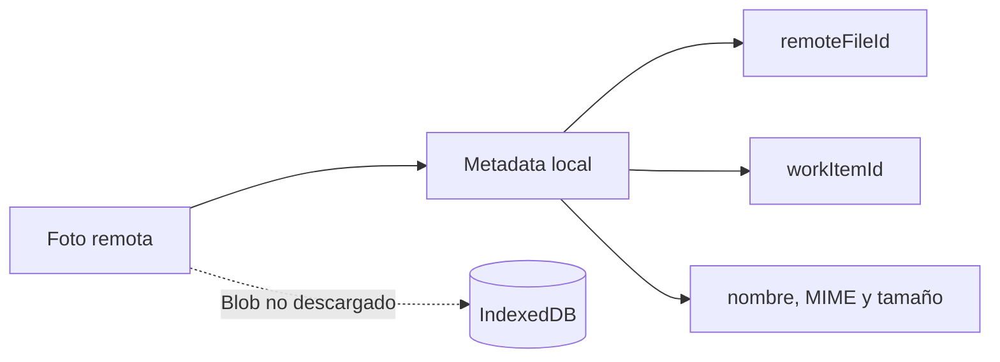

Se conoce que la foto existe y a qué elemento pertenece, pero el archivo no se
almacena. Por eso la galería remota funciona en modo remoto y la carga/eliminación
se oculta en modo local. Guardar blobs, crear previews locales y subirlos
después queda pendiente.

### 13. Service Worker e IndexedDB hacen trabajos distintos

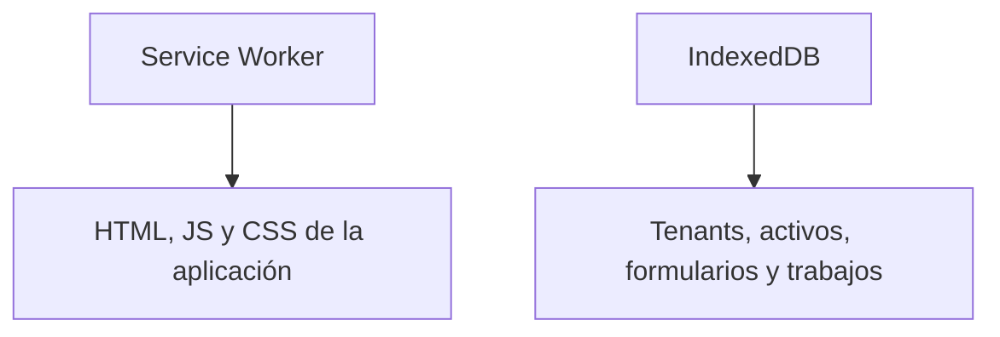

El Service Worker permite abrir el shell de React sin red después de una visita
online. IndexedDB permite que React tenga datos que mostrar y editar. Tener uno
sin el otro no resolvería el caso completo.

Desde la fase 2, el Service Worker se genera con `vite-plugin-pwa` y Workbox:

- se registra solamente en build de producción;
- precachea HTML, bundles JavaScript/CSS, iconos, fuentes y assets estáticos;
- excluye rutas `/api/`;
- usa `index.html` como fallback de React Router;
- espera la acción **Actualizar ahora** antes de activar una versión nueva;
- no implementa background sync.

### 14. Sesión al reabrir en modo avión

Al iniciar normalmente, `AuthProvider` valida el token con `/auth/profile`. Si
el servidor responde `401`, la sesión se elimina. Si `apiReachable` es falso y
existe un JWT local vigente, se permite abrir la copia offline con el usuario
decodificado desde ese token. La contraseña nunca se persiste.

Esto habilita el trabajo en terreno, pero no transforma al frontend en la
autoridad de seguridad. Al volver online y, especialmente, al implementar
push, el backend debe volver a comprobar usuario, tenant, rol y permisos.

`useConnectivity()` comprueba además `/api/health`. Un navegador puede decir
“online” aunque la API específica esté caída; en ese caso la aplicación muestra
**Servidor no disponible** y selecciona IndexedDB.

### 15. Recorrido manual para entenderlo

1. Levantar backend y frontend.
2. Entrar a **Activos**.
3. Seleccionar un tenant y un sitio.
4. Presionar **Descargar para uso offline**.
5. Esperar **Disponible offline**.
6. Abrir **Datos locales** en desarrollo para revisar contadores.
7. Presionar **Abrir copia local** o desconectar la red.
8. Volver a **Activos** y verificar el árbol.
9. Seleccionar un activo y crear un Work.
10. Completar conceptos, tareas y comentarios.
11. Guardar el borrador.
12. Refrescar: el Work debe continuar visible.
13. En DevTools, abrir `Application > IndexedDB > gridassets-inspection`.
14. Activar modo avión y volver a abrir una ruta ya usada.
15. Observar **Pendiente de sincronización** o **Cambios pendientes**.

Para volver al comportamiento anterior, seleccionar **Datos remotos**. Esto no
elimina los datos locales.

### 16. Inventario de la primera fase

La primera fase cerró con **39 archivos de implementación**: 21 modificados y
18 nuevos. El conteo inicial de 38 cambió al modificar también
`concept-catalog-context.tsx`, porque durante la revisión final se detectó que
la ficha del activo todavía cargaba conceptos desde la API en modo local.

Este inventario es una fotografía histórica de aquella entrega. La fase 2
eliminó el manifest y Service Worker manuales y agregó los archivos enumerados
en
[INSPECTION_PWA_AIRPLANE_MODE.md](./INSPECTION_PWA_AIRPLANE_MODE.md#8-inventario-exacto-de-la-segunda-fase).

#### Archivos modificados

| N.º | Archivo                                                                           | Qué se modificó y por qué                                                                                                                                                                       |
| --: | --------------------------------------------------------------------------------- | ----------------------------------------------------------------------------------------------------------------------------------------------------------------------------------------------- |
|   1 | `apps/inspection-web/index.html`                                                  | Declara el color de tema y enlaza `manifest.webmanifest`, permitiendo que el navegador reconozca la aplicación instalable.                                                                      |
|   2 | `apps/inspection-web/src/app/app.tsx`                                             | Agrega `OfflineProvider` y lo coloca antes de los providers que necesitan conocer el origen de datos.                                                                                           |
|   3 | `apps/inspection-web/src/features/assets/use-asset-catalog.ts`                    | Selecciona entre `assetCatalogApi` y `localCatalogRepository` para tenants, sitios, tipos y activos. Recarga al cambiar de modo.                                                                |
|   4 | `apps/inspection-web/src/features/auth/auth-context.tsx`                          | Permite reutilizar un JWT local todavía vigente cuando no hay red. Un `401` real continúa cerrando la sesión.                                                                                   |
|   5 | `apps/inspection-web/src/features/concepts/concept-catalog-context.tsx`           | Carga conceptos, opciones y asociaciones desde IndexedDB en modo local; limpia el estado al cambiar de origen para evitar mezclas. Este es el archivo adicional que llevó el conteo de 38 a 39. |
|   6 | `apps/inspection-web/src/features/tenants/tenant-access-context.tsx`              | Obtiene tenants desde el catálogo local cuando corresponde. Deshabilita la administración en modo local, ya que sus mutaciones siguen siendo remotas.                                           |
|   7 | `apps/inspection-web/src/features/work-types/use-effective-work-types.ts`         | Consulta localmente los tipos de trabajo efectivos del activo en modo local y conserva la API en modo remoto.                                                                                   |
|   8 | `apps/inspection-web/src/features/works/components/asset-work-list.tsx`           | Muestra el estado local de cada Work dentro de la ficha del activo.                                                                                                                             |
|   9 | `apps/inspection-web/src/features/works/components/work-execution-form.tsx`       | Guarda respuestas mediante el repositorio elegido, cambia el mensaje de guardado local y evita llamadas de fotos cuando se trabaja offline.                                                     |
|  10 | `apps/inspection-web/src/features/works/components/work-item-additional-info.tsx` | Separa el bloqueo de fotos del modo de solo lectura general. El comentario sigue editable localmente, mientras las fotos muestran la limitación de esta fase.                                   |
|  11 | `apps/inspection-web/src/features/works/work-catalog-context.tsx`                 | Deja de invocar directamente `workApi` y selecciona `RemoteWorkRepository` o `LocalWorkRepository`. Reinicia el catálogo en memoria al cambiar de modo.                                         |
|  12 | `apps/inspection-web/src/layouts/app-layout.tsx`                                  | Agrega el indicador de conectividad y la navegación hacia **Datos locales**.                                                                                                                    |
|  13 | `apps/inspection-web/src/main.tsx`                                                | Registra `sw.js` después de cargar la aplicación y solamente en producción.                                                                                                                     |
|  14 | `apps/inspection-web/src/pages/assets-page.tsx`                                   | Agrega el control para descargar, actualizar y abrir la copia offline del sitio seleccionado.                                                                                                   |
|  15 | `apps/inspection-web/src/pages/new-work-page.tsx`                                 | Reconoce el modo local y explica que el nuevo Work queda en el dispositivo pendiente de sincronización. La creación sigue entrando por `useWorkCatalog`.                                        |
|  16 | `apps/inspection-web/src/pages/work-detail-page.tsx`                              | Muestra junto al estado del negocio la etiqueta `SYNCED`, `LOCAL_ONLY` o `MODIFIED`.                                                                                                            |
|  17 | `apps/inspection-web/src/pages/works-page.tsx`                                    | Muestra el estado local en el listado general de Works.                                                                                                                                         |
|  18 | `apps/inspection-web/src/routes/app-routes.tsx`                                   | Registra la ruta protegida `/offline-debug`.                                                                                                                                                    |
|  19 | `docs/INSPECTION_RULES.md`                                                        | Marca la persistencia local como implementada y reemplaza el TODO general por tareas concretas de sincronización.                                                                               |
|  20 | `package.json`                                                                    | Agrega `dexie` como dependencia y `fake-indexeddb` como dependencia de desarrollo.                                                                                                              |
|  21 | `package-lock.json`                                                               | Fija exactamente las versiones e integridades instaladas para builds reproducibles. No contiene lógica de negocio.                                                                              |

#### Archivos nuevos

| N.º | Archivo                                                                       | Responsabilidad                                                                                                             |
| --: | ----------------------------------------------------------------------------- | --------------------------------------------------------------------------------------------------------------------------- |
|  22 | `apps/inspection-web/public/manifest.webmanifest`                             | Metadata PWA: nombre, inicio, modo standalone y colores.                                                                    |
|  23 | `apps/inspection-web/public/sw.js`                                            | Service Worker básico que conserva el shell y excluye la API.                                                               |
|  24 | `apps/inspection-web/src/db/inspection-db.ts`                                 | Declara la base Dexie, sus 19 tablas, claves e índices compuestos. Exporta una única instancia de infraestructura.          |
|  25 | `apps/inspection-web/src/features/offline/components/connectivity-status.tsx` | Presenta **Online**, **Sin conexión** o **Modo local** en el layout.                                                        |
|  26 | `apps/inspection-web/src/features/offline/components/offline-site-button.tsx` | Controla visualmente la descarga, los estados `DOWNLOADING/READY/ERROR` y el cambio a la copia local.                       |
|  27 | `apps/inspection-web/src/features/offline/components/sync-status-badge.tsx`   | Traduce los estados técnicos de sincronización a etiquetas entendibles.                                                     |
|  28 | `apps/inspection-web/src/features/offline/models.ts`                          | Define `LocalSyncStatus`, `OfflineSiteRecord`, referencias de archivos y el bundle completo de descarga.                    |
|  29 | `apps/inspection-web/src/features/offline/offline-context.tsx`                | Mantiene el modo remoto/local, orquesta descargas, refresca estados y permite limpiar la base mediante un repositorio.      |
|  30 | `apps/inspection-web/src/hooks/use-connectivity.ts`                           | Escucha los eventos `online` y `offline`; se usa solo como indicador visual.                                                |
|  31 | `apps/inspection-web/src/pages/offline-debug-page.tsx`                        | Muestra sitios, conteos, estados pendientes, almacenamiento estimado, selector de origen y limpieza de datos.               |
|  32 | `apps/inspection-web/src/repositories/local-catalog-repository.ts`            | Lee tenants, sitios, activos, tipos, conceptos y configuraciones efectivas desde IndexedDB con filtros de tenant.           |
|  33 | `apps/inspection-web/src/repositories/local-work-repository.test.ts`          | Simula IndexedDB, crea y reabre un Work, comprueba persistencia, aislamiento y transición a `MODIFIED`.                     |
|  34 | `apps/inspection-web/src/repositories/local-work-repository.ts`               | Implementa creación, lectura, inicio, guardado y finalización local; construye snapshots y valida obligatorios.             |
|  35 | `apps/inspection-web/src/repositories/offline-repository.ts`                  | Encapsula estadísticas, listado de sitios descargados y limpieza de IndexedDB para la pantalla de diagnóstico.              |
|  36 | `apps/inspection-web/src/repositories/remote-work-repository.ts`              | Adapta `workApi` al mismo contrato usado por la UI y conserva snapshots remotos necesarios para guardar.                    |
|  37 | `apps/inspection-web/src/repositories/work-repository.ts`                     | Contrato común para consultar, crear, guardar, iniciar y finalizar Works sin que la UI conozca la tecnología usada.         |
|  38 | `apps/inspection-web/src/services/cache-site-for-offline.ts`                  | Obtiene el bundle desde el backend, guarda metadata de fotos y persiste todo transaccionalmente respetando cambios locales. |
|  39 | `docs/INSPECTION_OFFLINE_FIRST.md`                                            | Esta documentación: arquitectura, modelo, diagramas, recorrido, inventario y trabajo pendiente.                             |

### 17. Diferencia entre los repositorios

| Operación       | Remoto                                         | Local                                                   |
| --------------- | ---------------------------------------------- | ------------------------------------------------------- |
| `getById`       | Obtiene Works desde la API y filtra por tenant | Lee IndexedDB y confirma `tenantId`                     |
| `listBySite`    | Consulta la API del tenant                     | Usa `[tenantId+siteId]`                                 |
| `listByAsset`   | Consulta la API del tenant                     | Usa `[tenantId+assetId]`                                |
| `create`        | POST al backend; PostgreSQL asigna/persiste    | Genera UUID y guarda Work + snapshot en una transacción |
| `saveResponses` | PUT con respuestas transformadas               | Reemplaza el conjunto local conservando IDs conocidos   |
| `start`         | PATCH de estado                                | Actualiza estado, fecha y `syncStatus` local            |
| `finish`        | POST al endpoint de finalización               | Valida obligatorios, guarda valores y cierra localmente |

El contrato permite que `WorkCatalogProvider` invoque las mismas operaciones
sin preguntar cómo se implementan.

### 18. Qué continúa conectado directamente al backend

- login online y validación normal de `/auth/profile`;
- administración de tenants y membresías;
- creación y edición de Sites, Assets, AssetTypes y WorkTypes;
- administración de conceptos y plantillas;
- contenido binario, carga y eliminación de fotografías;
- toda operación cuando el origen elegido es `REMOTE`.

La administración se oculta en modo local para evitar presentar formularios
que no pueden persistir sin servidor.

### 19. Qué probaron las validaciones automáticas

La prueba de `LocalWorkRepository` realiza este escenario:

```mermaid
flowchart LR
    CREATE[Crear Work local] --> SAVE[Guardar respuesta y comentario]
    SAVE --> CLOSE[Cerrar Dexie]
    CLOSE --> OPEN[Reabrir Dexie]
    OPEN --> ASSERT1[Datos continúan]
    ASSERT1 --> FOREIGN[Leer con otro tenant]
    FOREIGN --> ASSERT2[Resultado undefined]
    ASSERT2 --> SYNCED[Simular copia SYNCED]
    SYNCED --> EDIT[Editar respuesta]
    EDIT --> MODIFIED[Work y respuesta MODIFIED]
```

Además se ejecutaron:

```text
npx vitest run apps/inspection-web/src/repositories/local-work-repository.test.ts
npx tsc -p apps/inspection-web/tsconfig.app.json --noEmit
npx eslint <archivos de la fase offline> --max-warnings=0
npx vite build --config apps/inspection-web/vite.config.ts
```

El build termina correctamente. Vite informa que el bundle principal supera
500 kB; es una advertencia de optimización y no un error funcional.

### 20. Qué falta para una sincronización real

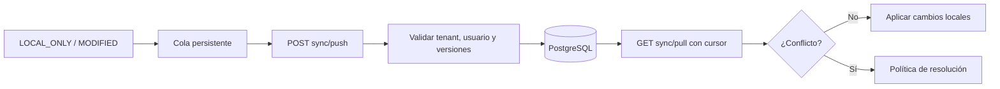

Faltan decisiones e implementación para:

1. contrato idempotente de push y pull;
2. cola de operaciones por tenant;
3. cursor de cambios del servidor;
4. `serverVersion` o mecanismo equivalente;
5. borrados locales mediante tombstones;
6. conflictos y política de resolución;
7. orden de dependencias entre Work, respuestas y archivos;
8. persistencia y subida de blobs de fotos;
9. revalidación de membresías y permisos;
10. reintentos, errores permanentes y observabilidad;
11. pruebas E2E automatizadas con navegador cerrado y conectividad real
    interrumpida.

La implementación actual no intenta resolver estos puntos de forma parcial.
Su responsabilidad termina al conservar los datos locales y clasificarlos para
que el futuro motor sepa cuáles deberá procesar.
