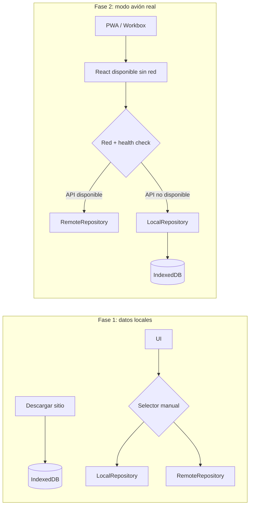
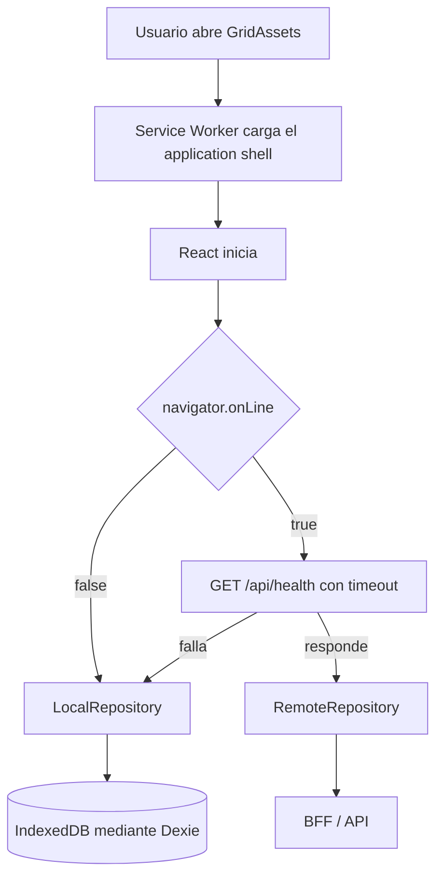
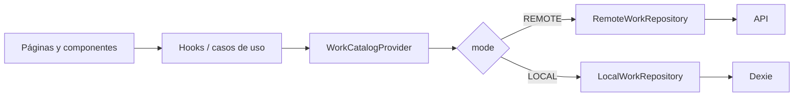

# GridAssets: PWA y operación en modo avión

Este documento describe la segunda fase offline del MVP. La primera fase creó
la base Dexie y los repositorios locales; esta fase permite cargar la propia
aplicación sin internet y elegir automáticamente la fuente de datos correcta.

## Evolución desde la primera fase

La primera implementación resolvió la persistencia del dominio, pero todavía
dependía de que el navegador pudiera cargar React y de que el usuario eligiera
la copia local. Esta entrega conecta las piezas que ya existían:



| Pieza                     | Fase 1                                      | Cambio de la fase 2                                  |
| ------------------------- | ------------------------------------------- | ---------------------------------------------------- |
| Manifest y Service Worker | Archivos manuales dentro de `public`        | Generados para cada build mediante `vite-plugin-pwa` |
| Inicio sin internet       | Parcial                                     | Application shell completo precacheado               |
| Estado de conectividad    | `navigator.onLine`                          | Red del navegador y disponibilidad real del BFF      |
| Repositorio efectivo      | Selección manual                            | Fallback automático a IndexedDB                      |
| Sesión                    | Fallback cuando el navegador estaba offline | Fallback cuando la API completa no está disponible   |
| Estado de cambios         | Visible en cada registro y en diagnóstico   | Conteo global enlazado a `/sync`                     |
| Actualización PWA         | Sin control de activación                   | Nueva versión espera confirmación del usuario        |
| Contenido no descargado   | Podía terminar en mensajes técnicos         | Estado vacío explicativo                             |

La base Dexie, el contrato `WorkRepository`, los snapshots y las reglas
`LOCAL_ONLY/MODIFIED` de la fase 1 se mantienen. Esta fase no crea otro modelo
de datos ni duplica la lógica de Work.

## Vista general



La decisión efectiva se expresa así:

```typescript
mode = apiReachable ? preferredMode : 'LOCAL';
```

`preferredMode` conserva el selector manual de diagnóstico. Aunque la
preferencia sea `REMOTE`, una API inaccesible fuerza `LOCAL`. Al volver la API,
se recupera la preferencia anterior. Esto solo cambia el origen de lectura y
escritura; no inicia sincronización.

## 1. Cómo funciona el Service Worker

`vite-plugin-pwa` genera el Service Worker durante el build de producción. El
navegador lo instala para el origen de GridAssets y Workbox precachea el
application shell. En una apertura posterior, el navegador puede obtener esos
archivos desde Cache Storage aunque no exista conexión.

La navegación de React Router usa `index.html` como fallback. La regla excluye
expresamente `/api/*`, por lo que el Service Worker no convierte respuestas de
negocio en una caché opaca.

```text
Solicitud de HTML/JS/CSS/icono → precache del Service Worker
Solicitud /api/...             → red normal, nunca precache de negocio
Lectura de activos y Works     → repositorio elegido por conectividad
```

## 2. Service Worker frente a IndexedDB

| Almacenamiento                    | Responsabilidad                                                                     |
| --------------------------------- | ----------------------------------------------------------------------------------- |
| Service Worker / Cache Storage    | `index.html`, bundles JS/CSS, iconos, fuentes empaquetadas y otros assets estáticos |
| IndexedDB `gridassets-inspection` | tenants, sitios descargados, activos, catálogos, plantillas, Works y respuestas     |
| Estado React                      | selección y valores aún no guardados de la pantalla abierta                         |
| `localStorage`                    | JWT vigente y preferencia de origen; nunca la contraseña                            |

El Service Worker permite arrancar React. IndexedDB permite que React muestre y
modifique el dominio.

## 3. Cómo se elige LocalRepository o RemoteRepository

`ConnectivityProvider` concentra `browserOnline` y `apiReachable`.
`OfflineProvider` transforma ese estado en `mode`. Los providers y hooks de
Activos, Conceptos, tipos de trabajo y Works consultan `mode` y seleccionan su
adaptador:



Cuando cambia la conectividad, no se borra de inmediato el catálogo que React
ya tenía en memoria. Esto evita desmontar un formulario abierto y perder
respuestas todavía no guardadas. El siguiente acceso y toda mutación usan el
repositorio efectivo nuevo.

## 4. Qué funciona completamente offline

Después de descargar un sitio y mientras el JWT local siga vigente se puede:

- abrir la PWA desde una ruta de React Router;
- ver los sitios descargados, subestaciones, activos y su detalle;
- consultar tipos de trabajo y formularios descargados;
- listar y abrir Works descargados;
- crear un Work con `crypto.randomUUID()`;
- iniciar un Work;
- responder conceptos `ANALOG`, `DIGITAL` y `TEXT`;
- completar tareas;
- agregar o editar comentarios por elemento;
- guardar borradores y finalizar respetando los campos obligatorios;
- cerrar y reabrir la aplicación conservando lo guardado;
- consultar los cambios pendientes en `/sync`.

Un Work `FINISHED` o `REVIEWED` sigue siendo de solo lectura offline.

## 5. Qué requiere conexión

- iniciar una sesión nueva o renovar un JWT vencido;
- descargar o actualizar la copia de una Mina, Faena o Sitio;
- administración de clientes, sitios, activos y catálogos;
- listar, cargar, descargar o eliminar fotografías;
- consultar un sitio que nunca se descargó;
- enviar cambios locales al servidor.

Las fotos se deshabilitan en modo local y la interfaz explica que se
incorporarán con el motor de sincronización. No se hacen reintentos HTTP.

## 6. Cómo se comprueba el backend

`navigator.onLine` solo indica que el navegador cree tener red. Cuando su valor
es `true`, `connectivity-service.ts` ejecuta `GET /api/health` con un
`AbortController` y timeout de tres segundos. En producción esa ruta llega al
health check liviano del BFF; internamente también existe `GET /health`.

La comprobación se ejecuta al iniciar, con eventos `online`/`offline`, al volver
a una pestaña visible y cada 30 segundos mientras esté visible.

| Navegador | API | Estado visual                | Fuente efectiva |
| --------- | --- | ---------------------------- | --------------- |
| online    | sí  | verde: En línea              | preferencia     |
| offline   | no  | ámbar: Modo sin conexión     | IndexedDB       |
| online    | no  | rojo: Servidor no disponible | IndexedDB       |

## 7. Actualización de la PWA

La estrategia es `prompt`. Una versión nueva queda esperando y se muestra:

```text
Nueva versión disponible
Actualiza cuando termines de guardar lo que estás revisando.

[Actualizar ahora]
```

Solo el usuario activa el nuevo Service Worker. No existe recarga automática
durante una inspección.

## 8. Inventario exacto de la segunda fase

Esta fase afecta **43 archivos**: 27 modificados, 14 creados y 2 eliminados.
Los archivos eliminados eran la versión manual del manifest y Service Worker;
sus reemplazos se generan ahora dentro de `dist` durante cada build.

### Infraestructura PWA

- `apps/inspection-web/vite.config.ts`: plugin PWA, manifest, Workbox,
  precache y exclusión de `/api/*`.
- `apps/inspection-web/index.html`: color de tema e icono para dispositivos.
- `apps/inspection-web/public/gridassets-icon.svg`: icono vectorial.
- `apps/inspection-web/public/gridassets-maskable.svg`: fuente del icono
  maskable.
- `apps/inspection-web/public/pwa-192x192.png`: icono PWA pequeño.
- `apps/inspection-web/public/pwa-512x512.png`: icono PWA grande.
- `apps/inspection-web/public/pwa-maskable-512x512.png`: icono con zona segura.
- `apps/inspection-web/src/vite-env.d.ts`: tipos de Vite y del registro PWA.
- `apps/inspection-web/src/features/pwa/pwa-update-prompt.tsx`: aviso de
  instalación offline lista y de nueva versión.
- `apps/inspection-web/src/main.tsx`: elimina el registro manual anterior.
- Se eliminan `public/sw.js` y `public/manifest.webmanifest`: ahora los genera
  Vite para que las revisiones coincidan con cada build.

### Conectividad y selección del repositorio

- `features/connectivity/models.ts`: contrato de conectividad.
- `features/connectivity/connectivity-context.tsx`: estado central, eventos y
  health check periódico.
- `services/connectivity-service.ts`: comprobación HTTP con timeout.
- `hooks/use-connectivity.ts`: acceso al contexto.
- `features/offline/offline-context.tsx`: modo efectivo automático y conteo
  pendiente.
- `features/offline/models.ts`: resumen y elementos pendientes.
- `features/offline/models.test.ts`: regla automática `REMOTE/LOCAL`.
- `app/app.tsx`: instala los providers y el aviso PWA en el orden correcto.
- `features/auth/auth-context.tsx` y `pages/login-page.tsx`: restauración de una
  sesión previamente validada y bloqueo de login nuevo offline.

### Interfaz y operación local

- `features/offline/components/connectivity-status.tsx`: estados verde, ámbar
  y rojo; enlaza el conteo a `/sync`.
- `features/offline/components/offline-content-unavailable.tsx`: mensaje para
  contenido que no se descargó.
- `features/offline/components/offline-site-button.tsx`: explica el uso
  automático de la copia local.
- `features/offline/components/sync-status-badge.tsx`: usa “Pendiente de
  sincronización” y evita afirmar que existe sync.
- `pages/sync-page.tsx`: resumen informativo calculado desde IndexedDB.
- `repositories/offline-repository.ts`: calcula registros `LOCAL_ONLY` y
  `MODIFIED`.
- `features/works/work-catalog-context.tsx`: refresca pendientes tras cada
  mutación local y conserva la pantalla durante cambios de conexión.
- `features/works/components/work-execution-form.tsx`: mensajes “Guardado
  localmente”.
- `pages/assets-page.tsx`, `pages/works-page.tsx`, `pages/new-work-page.tsx` y
  `pages/work-detail-page.tsx`: estados amistosos cuando falta contenido local.
- `layouts/app-layout.tsx` y `routes/app-routes.tsx`: navegación `/sync`,
  indicador global y bloqueo de áreas solo online.
- `pages/offline-debug-page.tsx`: diagnóstico actualizado; solo aparece en
  desarrollo.
- `repositories/local-work-repository.test.ts`: comprueba persistencia y
  conteo pendiente.
- `package.json` y `package-lock.json`: agregan `vite-plugin-pwa`.
- `docs/INSPECTION_PWA_AIRPLANE_MODE.md`: documenta esta segunda fase y su
  prueba manual.
- `docs/INSPECTION_OFFLINE_FIRST.md`: enlaza la nueva fase y actualiza las
  referencias que habían quedado históricas.
- `docs/INSPECTION_RULES.md`: registra las reglas vigentes de operación y PWA
  offline.

### Inventario archivo por archivo

| Acción | Archivo                                                                               | Cambio                                                                         |
| ------ | ------------------------------------------------------------------------------------- | ------------------------------------------------------------------------------ |
| M      | `apps/inspection-web/index.html`                                                      | Agrega el icono para dispositivos y deja el manifest bajo control del plugin.  |
| A      | `apps/inspection-web/public/gridassets-icon.svg`                                      | Fuente vectorial del icono normal.                                             |
| A      | `apps/inspection-web/public/gridassets-maskable.svg`                                  | Fuente vectorial con zona segura maskable.                                     |
| D      | `apps/inspection-web/public/manifest.webmanifest`                                     | Se elimina la versión mantenida manualmente.                                   |
| A      | `apps/inspection-web/public/pwa-192x192.png`                                          | Icono requerido para instalación.                                              |
| A      | `apps/inspection-web/public/pwa-512x512.png`                                          | Icono grande requerido para instalación.                                       |
| A      | `apps/inspection-web/public/pwa-maskable-512x512.png`                                 | Icono adaptable para launchers móviles.                                        |
| D      | `apps/inspection-web/public/sw.js`                                                    | Se elimina el worker manual reemplazado por Workbox.                           |
| M      | `apps/inspection-web/src/app/app.tsx`                                                 | Instala `ConnectivityProvider` y el aviso global de actualización PWA.         |
| M      | `apps/inspection-web/src/features/auth/auth-context.tsx`                              | Restaura un JWT vigente sin llamar `/profile` cuando la API no está accesible. |
| A      | `apps/inspection-web/src/features/connectivity/connectivity-context.tsx`              | Centraliza eventos de red, health checks y sondeo periódico.                   |
| A      | `apps/inspection-web/src/features/connectivity/models.ts`                             | Define `browserOnline` y `apiReachable`.                                       |
| M      | `apps/inspection-web/src/features/offline/components/connectivity-status.tsx`         | Muestra los tres estados y enlaza cambios pendientes con `/sync`.              |
| A      | `apps/inspection-web/src/features/offline/components/offline-content-unavailable.tsx` | Presenta un estado amistoso para contenido no descargado.                      |
| M      | `apps/inspection-web/src/features/offline/components/offline-site-button.tsx`         | Explica cuándo la copia local fue activada automáticamente.                    |
| M      | `apps/inspection-web/src/features/offline/components/sync-status-badge.tsx`           | Reemplaza mensajes que afirmaban una sincronización inexistente.               |
| A      | `apps/inspection-web/src/features/offline/models.test.ts`                             | Prueba la regla que fuerza `LOCAL` cuando falla la API.                        |
| M      | `apps/inspection-web/src/features/offline/models.ts`                                  | Agrega resolución de modo y modelos del resumen pendiente.                     |
| M      | `apps/inspection-web/src/features/offline/offline-context.tsx`                        | Calcula el modo efectivo y expone el resumen de IndexedDB.                     |
| A      | `apps/inspection-web/src/features/pwa/pwa-update-prompt.tsx`                          | Permite activar una versión nueva solamente por decisión del usuario.          |
| M      | `apps/inspection-web/src/features/works/components/work-execution-form.tsx`           | Informa guardado/inicio/finalización local sin decir “sincronizado”.           |
| M      | `apps/inspection-web/src/features/works/work-catalog-context.tsx`                     | Refresca pendientes y conserva un formulario durante el cambio de conexión.    |
| M      | `apps/inspection-web/src/hooks/use-connectivity.ts`                                   | Convierte el hook anterior en acceso al contexto central.                      |
| M      | `apps/inspection-web/src/layouts/app-layout.tsx`                                      | Agrega `/sync`, estado responsive y oculta áreas online cuando corresponde.    |
| M      | `apps/inspection-web/src/main.tsx`                                                    | Retira el registro manual del Service Worker.                                  |
| M      | `apps/inspection-web/src/pages/assets-page.tsx`                                       | Muestra el estado no disponible cuando el sitio no fue descargado.             |
| M      | `apps/inspection-web/src/pages/login-page.tsx`                                        | Explica que un login nuevo requiere API y evita intentos offline.              |
| M      | `apps/inspection-web/src/pages/new-work-page.tsx`                                     | Distingue creación local y errores por contenido no descargado.                |
| M      | `apps/inspection-web/src/pages/offline-debug-page.tsx`                                | Refleja el fallback forzado; queda accesible solo en desarrollo.               |
| A      | `apps/inspection-web/src/pages/sync-page.tsx`                                         | Lista y resume pendientes sin intentar enviarlos.                              |
| M      | `apps/inspection-web/src/pages/work-detail-page.tsx`                                  | Explica si un Work o snapshot no existe en la copia local.                     |
| M      | `apps/inspection-web/src/pages/works-page.tsx`                                        | Diferencia una lista vacía de un catálogo no descargado.                       |
| M      | `apps/inspection-web/src/repositories/local-work-repository.test.ts`                  | Añade verificación del conteo pendiente persistido.                            |
| M      | `apps/inspection-web/src/repositories/offline-repository.ts`                          | Agrupa Works, respuestas, tareas y comentarios pendientes.                     |
| M      | `apps/inspection-web/src/routes/app-routes.tsx`                                       | Registra `/sync` y protege rutas que requieren servidor.                       |
| A      | `apps/inspection-web/src/services/connectivity-service.ts`                            | Ejecuta `/api/health` con timeout corto y sin caché HTTP.                      |
| A      | `apps/inspection-web/src/vite-env.d.ts`                                               | Declara los tipos virtuales usados por el plugin PWA.                          |
| M      | `apps/inspection-web/vite.config.ts`                                                  | Genera manifest, Service Worker, precache y fallback de navegación.            |
| M      | `docs/INSPECTION_OFFLINE_FIRST.md`                                                    | Conserva la fase 1 y explica cómo evoluciona hacia la fase 2.                  |
| A      | `docs/INSPECTION_PWA_AIRPLANE_MODE.md`                                                | Documenta esta fase, sus diagramas, archivos y prueba.                         |
| M      | `docs/INSPECTION_RULES.md`                                                            | Agrega reglas de negocio y programación offline vigentes.                      |
| M      | `package-lock.json`                                                                   | Fija el árbol reproducible de la nueva dependencia.                            |
| M      | `package.json`                                                                        | Declara `vite-plugin-pwa`.                                                     |

### Validaciones realizadas en esta entrega

| Validación          | Resultado                                                                                        |
| ------------------- | ------------------------------------------------------------------------------------------------ |
| Pruebas Vitest      | 3 pruebas aprobadas: resolución de modo, persistencia, aislamiento por tenant y conteo pendiente |
| TypeScript          | `tsc --noEmit` aprobado                                                                          |
| Calidad             | ESLint, Prettier y `git diff --check` aprobados                                                  |
| Build real          | `nx build inspection-web --configuration=production` aprobado                                    |
| Artefacto PWA       | Manifest, `sw.js` y Workbox generados; 14 entradas en precache                                   |
| Servidor de preview | Manifest con MIME correcto, fallback de rutas SPA y Service Worker disponibles                   |
| Separación de datos | Ninguna URL `/api/*` aparece dentro del precache generado                                        |

## 9. Problemas detectados

1. El Service Worker manual dependía de mantener a mano una lista de bundles y
   no podía asociar con seguridad una revisión a cada build. Workbox ahora
   genera esa lista.
2. `navigator.onLine` podía ser `true` con el BFF caído. El health check separa
   ambos casos.
3. Cambiar de repositorio reiniciaba el estado React y podía desmontar un
   formulario abierto. El catálogo se conserva durante la transición.
4. Las etiquetas anteriores decían “Sincronizado” aunque todavía no existe un
   motor de sync. Ahora describen la copia y los cambios pendientes.
5. El bundle principal supera 500 kB minificado. Es una oportunidad de dividir
   rutas en chunks futuros; no impide instalación ni operación offline.
6. La construcción de Nx local quedó esperando workers aislados que ya estaban
   abiertos por otras herramientas del monorepo. La validación se completó con
   `NX_ISOLATE_PLUGINS=false`; el build de Vite y el artefacto PWA no dependen de
   ese ajuste en producción.

## 10. Qué falta para sincronización

- contrato idempotente `push/pull`;
- outbox persistente y orden de dependencias;
- versión de servidor, cursor y borrados lógicos;
- revalidación de tenant, membresía y permisos al hacer push;
- política de conflictos;
- actualización de estados a `SYNCED` después de confirmación real;
- cola local y upload de blobs fotográficos;
- reintentos controlados, errores permanentes y observabilidad.

La pantalla `/sync` no llama endpoints y su botón permanece deshabilitado.

## 11. Prueba manual completa

El Service Worker solo existe en un build de producción. Para una prueba local:

```bash
NX_NO_CLOUD=true NX_DAEMON=false NX_ISOLATE_PLUGINS=false \
  npx nx build inspection-web --configuration=production --skip-nx-cache

npx vite preview --config apps/inspection-web/vite.config.ts
```

Usa siempre `http://localhost:4300`. No alternes entre `localhost` y
`127.0.0.1`, porque cada uno tiene un Service Worker e IndexedDB distintos.

Antes de la primera prueba, elimina el Service Worker manual anterior desde
`Application > Storage > Clear site data`. Hazlo antes de descargar el sitio,
porque también elimina IndexedDB.

Después:

1. abre `http://localhost:4300` con backend y BFF activos;
2. inicia sesión;
3. abre **Activos** y descarga una Mina/Faena/Sitio;
4. confirma **Disponible offline**;
5. recarga una vez y confirma que `sw.js` aparece **Activated and running**;
6. instala la app desde Chrome;
7. detén `vite preview` con `Ctrl+C`; esto simula que ni el frontend ni su
   proxy hacia `/api` están disponibles;
8. cierra por completo la ventana instalada y vuelve a abrirla;
9. comprueba **Servidor no disponible** y navega por el sitio descargado;
10. crea un Work, inícialo, responde los tres tipos de concepto, agrega un
    comentario y guarda;
11. comprueba el mensaje **Guardado localmente**;
12. cierra y abre la PWA; confirma que el Work y sus respuestas continúan;
13. abre **Sincronización** y revisa `LOCAL_ONLY` y `MODIFIED`;
14. vuelve a iniciar `vite preview` y espera el estado verde;
15. confirma que no existe envío automático: el Work continúa pendiente en
    IndexedDB.

Para probar específicamente el estado ámbar, activa **Offline** desde
`DevTools > Network` con la PWA abierta. Detener `vite preview` es una prueba
más fuerte del application shell en localhost, porque el modo avión físico no
siempre bloquea la interfaz loopback del equipo.

En DevTools se puede verificar:

- `Application > Manifest`: instalación e iconos;
- `Application > Service Workers`: worker activo;
- `Application > Cache Storage`: solo application shell;
- `Application > IndexedDB > gridassets-inspection`: dominio local;
- `Network`: ninguna llamada `/api/*` mientras la API está inaccesible en las
  pantallas soportadas.

## Limitaciones de sesión offline

No se almacena la contraseña. Se reutiliza únicamente el JWT ya existente y se
verifica su expiración local. Si expiró, se exige conexión para iniciar sesión
de nuevo. La revocación de una membresía ocurrida mientras el dispositivo está
offline no puede conocerse hasta recuperar conexión; por eso el futuro push
debe revalidar usuario, tenant, rol y propiedad de cada registro en el backend.

Los datos de IndexedDB pertenecen al perfil del navegador y al origen web. En
equipos compartidos, cerrar sesión no borra automáticamente la descarga local;
la política de borrado/cifrado del dispositivo debe definirse antes de una
salida productiva de terreno.
