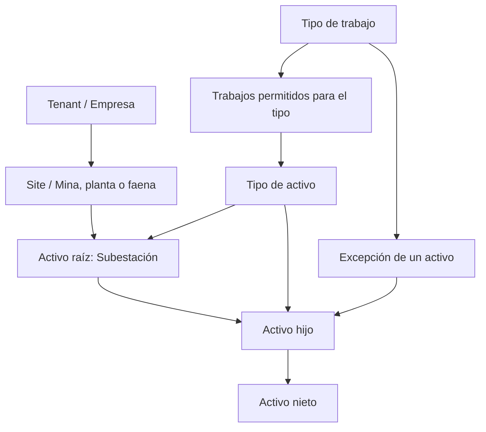

# GridAssets: reglas de negocio y programación

Este documento reúne las reglas vigentes del módulo de inspecciones y activos.
Debe actualizarse junto con el código cuando una iteración agregue, cambie o
elimine una regla.

## Cómo leer este documento

- **Regla de negocio:** define qué puede ocurrir en el sistema y por qué.
- **Regla de programación:** define cómo el software garantiza una regla de
  negocio.
- **Vigente:** ya está implementada.
- **Pendiente:** es una decisión acordada, pero todavía no está implementada.

Cada regla tiene un identificador estable para poder mencionarla en issues,
commits, pruebas y revisiones de código.

## Modelo actual



Un `Site` organiza geográficamente los activos. No es un activo. El árbol de
activos comienza en una subestación y puede tener tantos niveles como sean
necesarios.

## Reglas de negocio vigentes

### Tenants y aislamiento de datos

#### RN-TEN-001 — Todo dato tiene un tenant propietario

Todo sitio, activo, tipo de activo, tipo de trabajo y relación entre ellos debe
pertenecer a un `tenantId`.

#### RN-TEN-002 — No se mezclan datos entre empresas

Una operación realizada dentro de un tenant solo puede consultar o modificar
datos de ese mismo tenant. Conocer el UUID de un dato perteneciente a otra
empresa no permite acceder a él.

#### RN-TEN-003 — El aislamiento todavía no es autenticación

Actualmente el tenant se selecciona en la interfaz. Esto permite probar el
modelo, pero todavía no demuestra que el usuario tenga acceso a esa empresa.
La autenticación y autorización multi-tenant están pendientes.

### Sitios

#### RN-SIT-001 — Un sitio pertenece a una sola empresa

Cada mina, planta o faena tiene un `tenantId` y solo puede contener activos de
ese tenant.

#### RN-SIT-002 — Un sitio es un contenedor organizacional

Una mina, planta o faena no forma parte del árbol de activos. El sitio aporta
el contexto geográfico mediante `siteId`; las subestaciones son las raíces del
árbol técnico.

### Activos y jerarquía

#### RN-ACT-001 — Todo activo pertenece a un tenant y un sitio

Cada activo contiene `tenantId` y `siteId`. Su tipo, padre y descendientes deben
ser compatibles con ese contexto.

#### RN-ACT-002 — Solo una subestación puede ser raíz

Un activo con `parentId = null` debe utilizar el tipo cuyo código es
`SUBSTATION`.

#### RN-ACT-003 — Un hijo permanece en el contexto de su padre

El activo indicado por `parentId` debe pertenecer al mismo `tenantId` y
`siteId` que el hijo.

#### RN-ACT-004 — La jerarquía no admite ciclos

Un activo no puede ser su propio padre ni quedar dentro de su propia cadena de
descendientes.

Ejemplo inválido:

```text
Transformador T1 → Radiadores → Transformador T1
```

#### RN-ACT-005 — El código identifica al activo dentro del sitio

No pueden existir dos activos con el mismo `code` dentro del mismo tenant y
sitio. El mismo código sí puede aparecer en otro sitio.

#### RN-ACT-006 — Un activo con hijos no se elimina

Antes de eliminar un activo deben eliminarse o reubicarse sus hijos. Esta regla
evita dejar nodos huérfanos.

#### RN-ACT-007 — Un activo nuevo requiere un tipo activo

El `assetTypeId` seleccionado debe pertenecer al mismo tenant y su tipo de
activo debe estar activo.

### Catálogo de tipos de activo

#### RN-CTA-001 — El código es único por tenant

Dos tipos de activo del mismo tenant no pueden compartir el mismo código.

#### RN-CTA-002 — Los códigos se normalizan

Al crear o editar un tipo, el backend elimina espacios exteriores, convierte
el código a mayúsculas y reemplaza espacios o guiones por guiones bajos.

Ejemplo:

```text
"transformador de poder" → "TRANSFORMADOR_DE_PODER"
```

#### RN-CTA-003 — Los tipos se desactivan y conservan sus referencias

Retirar un tipo del catálogo cambia `active` a `false`. No se elimina
físicamente, porque puede estar referenciado por activos existentes.

#### RN-CTA-004 — `SUBSTATION` es un tipo protegido

El tipo con código `SUBSTATION` no puede cambiar de código ni desactivarse,
porque identifica las raíces válidas del árbol.

### Catálogo de tipos de trabajo

#### RN-CTT-001 — El código es único por tenant

Dos tipos de trabajo del mismo tenant no pueden compartir el mismo código.

#### RN-CTT-002 — Los códigos se normalizan

Se aplica la misma normalización utilizada por los tipos de activo: mayúsculas
y guiones bajos.

#### RN-CTT-003 — Los tipos de trabajo se desactivan

Retirar un tipo de trabajo cambia `active` a `false` y conserva sus relaciones
históricas. Un tipo de trabajo inactivo nunca aparece como trabajo efectivo
disponible.

### Trabajos permitidos y herencia

#### RN-TRA-001 — El tipo de activo define la regla general

La relación `AssetTypeWorkType` indica qué tipos de trabajo se permiten, por
defecto, para todos los activos de un tipo.

Ejemplo:

```text
Tipo Transformador
├── Inspección visual: permitida
└── Termografía: permitida
```

#### RN-TRA-002 — Un activo puede tener una excepción

La relación `AssetWorkType` permite cambiar la regla para un equipo concreto:

- `enabled = true`: permite el trabajo en ese activo.
- `enabled = false`: bloquea el trabajo en ese activo.
- sin registro: hereda la configuración de su tipo de activo.

En la interfaz, **Heredar** significa que no existe una excepción almacenada
para ese activo. No significa heredar desde el activo padre del árbol.

#### RN-TRA-003 — La excepción del activo tiene prioridad

La lista efectiva se calcula en este orden:

```text
1. ¿Existe una regla para el activo y el tipo de trabajo?
   Sí  → usar ALLOW o BLOCK de esa regla.
   No  → usar la regla general del tipo de activo.

2. ¿El tipo de trabajo está inactivo?
   Sí  → el resultado final siempre es no disponible.
```

Expresado como una fórmula:

```text
efectivo = workType.active AND (reglaDelActivo ?? reglaDelTipo ?? false)
```

Ejemplo:

```text
Tipo Transformador permite: Inspección visual y Termografía

Transformador T1
├── Inspección visual: Heredar → habilitada
└── Termografía: Bloquear → deshabilitada

Transformador T2
├── Inspección visual: Heredar → habilitada
└── Termografía: Heredar → habilitada
```

#### RN-TRA-004 — Volver a heredar elimina la excepción

Elegir **Heredar** elimina la fila `AssetWorkType`. Desde ese momento, cualquier
cambio futuro en la configuración del tipo de activo afecta automáticamente al
activo.

#### RN-TRA-005 — Las relaciones no cruzan tenants

El activo, el tipo de activo, el tipo de trabajo y sus relaciones deben
pertenecer al mismo `tenantId`.

## Reglas de programación vigentes

### RP-API-001 — La API aplica las reglas de negocio

La interfaz puede orientar al usuario, pero NestJS vuelve a validar tenant,
sitio, jerarquía, estado y relaciones. El frontend no es la autoridad final.

### RP-API-002 — El BFF es la entrada del frontend

El frontend consume rutas bajo `/api/inspection`. El BFF reenvía las
operaciones a `inspection-api`; la UI no se conecta directamente a PostgreSQL.

### RP-API-003 — Las consultas de activos llevan tenant y sitio

Los endpoints de activos incluyen `tenantId` y `siteId`. Las búsquedas en la API
usan ambos valores junto con el UUID del activo.

### RP-DB-001 — Los identificadores son UUID

Las entidades principales y las relaciones usan UUID como clave primaria.

### RP-DB-002 — PostgreSQL refuerza el aislamiento

Índices únicos y claves foráneas compuestas evitan códigos duplicados y
relaciones entre registros de tenants diferentes, incluso si una validación de
la aplicación falla.

### RP-DB-003 — El esquema cambia mediante migraciones

`synchronize` permanece desactivado. Los cambios de tablas, restricciones y
datos iniciales se realizan con migraciones versionadas.

### RP-FE-001 — El cálculo efectivo viene del backend

La ficha del activo solicita a la API la configuración calculada. El frontend
presenta `typeEnabled`, `override`, `effectiveEnabled` y `source`, pero no
inventa una regla distinta.

### RP-FE-002 — La selección administrativa no autoriza acceso

Cambiar el tenant en un selector solo cambia el contexto visual actual. Cuando
exista autenticación, el BFF obtendrá los tenants permitidos desde la sesión.

## Decisiones pendientes

Estas ideas todavía no son reglas implementadas:

- Obtener el tenant autorizado desde una sesión autenticada.
- Definir roles y permisos para administrar catálogos y activos.
- Registrar quién creó, modificó, activó o desactivó un registro.
- Definir si los activos se eliminan físicamente o se retiran mediante estado
  cuando ya existan trabajos e historial.
- Definir qué ocurre con trabajos existentes al desactivar su tipo.
- Crear trabajos reales, pautas, hallazgos, mediciones y adjuntos.
- Diseñar persistencia local, funcionamiento offline y sincronización.

## Plantilla para agregar una regla

```markdown
#### RN-MOD-000 — Nombre breve

**Estado:** vigente | pendiente

Descripción de la regla en lenguaje de negocio.

Ejemplo válido o inválido, si ayuda a entenderla.

**Aplicación técnica:** servicio, restricción o pantalla que la garantiza.
**Prueba:** caso que demuestra que la regla funciona.
```

## Historial

| Fecha      | Cambio                                                                                                 |
| ---------- | ------------------------------------------------------------------------------------------------------ |
| 2026-09-07 | Documento inicial con tenants, sitios, jerarquía de activos, catálogos y herencia de tipos de trabajo. |
