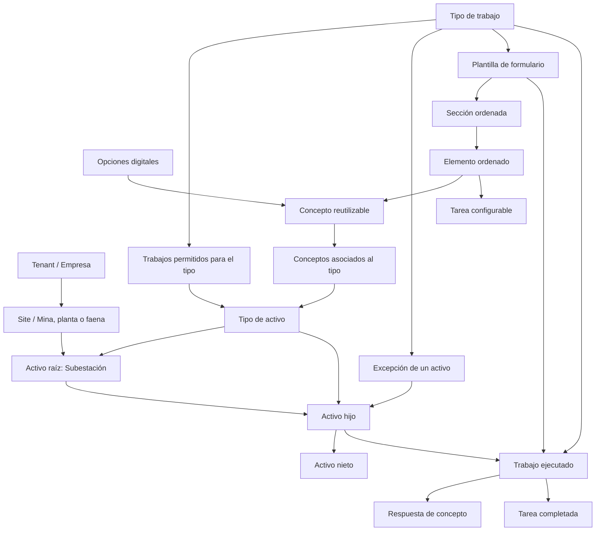

# GridAssets: reglas de negocio y programación

Este documento reúne las reglas vigentes del módulo de inspecciones y activos.
Debe actualizarse junto con el código cuando una iteración agregue, cambie o
elimine una regla.

## Cómo leer este documento

- **Regla de negocio:** define qué puede ocurrir en el sistema y por qué.
- **Regla de programación:** define cómo el software garantiza una regla de
  negocio.
- **Vigente:** ya está implementada.
- **Pendiente:** es una decisión acordada, pero todavía no está implementada.

Cada regla tiene un identificador estable para poder mencionarla en issues,
commits, pruebas y revisiones de código.

## Modelo actual



Un `Site` organiza geográficamente los activos. No es un activo. El árbol de
activos comienza en una subestación y puede tener tantos niveles como sean
necesarios.

## Reglas de negocio vigentes

### Tenants y aislamiento de datos

#### RN-TEN-001 — Todo dato tiene un tenant propietario

Todo sitio, activo, tipo de activo, tipo de trabajo y relación entre ellos debe
pertenecer a un `tenantId`.

#### RN-TEN-002 — No se mezclan datos entre empresas

Una operación realizada dentro de un tenant solo puede consultar o modificar
datos de ese mismo tenant. Conocer el UUID de un dato perteneciente a otra
empresa no permite acceder a él.

#### RN-TEN-003 — El aislamiento todavía no es autenticación

Actualmente el tenant se selecciona en la interfaz. Esto permite probar el
modelo, pero todavía no demuestra que el usuario tenga acceso a esa empresa.
La autenticación y autorización multi-tenant están pendientes.

### Sitios

#### RN-SIT-001 — Un sitio pertenece a una sola empresa

Cada mina, planta o faena tiene un `tenantId` y solo puede contener activos de
ese tenant.

#### RN-SIT-002 — Un sitio es un contenedor organizacional

Una mina, planta o faena no forma parte del árbol de activos. El sitio aporta
el contexto geográfico mediante `siteId`; las subestaciones son las raíces del
árbol técnico.

### Activos y jerarquía

#### RN-ACT-001 — Todo activo pertenece a un tenant y un sitio

Cada activo contiene `tenantId` y `siteId`. Su tipo, padre y descendientes deben
ser compatibles con ese contexto.

#### RN-ACT-002 — Solo una subestación puede ser raíz

Un activo con `parentId = null` debe utilizar el tipo cuyo código es
`SUBSTATION`.

#### RN-ACT-003 — Un hijo permanece en el contexto de su padre

El activo indicado por `parentId` debe pertenecer al mismo `tenantId` y
`siteId` que el hijo.

#### RN-ACT-004 — La jerarquía no admite ciclos

Un activo no puede ser su propio padre ni quedar dentro de su propia cadena de
descendientes.

Ejemplo inválido:

```text
Transformador T1 → Radiadores → Transformador T1
```

#### RN-ACT-005 — El código identifica al activo dentro del sitio

No pueden existir dos activos con el mismo `code` dentro del mismo tenant y
sitio. El mismo código sí puede aparecer en otro sitio.

#### RN-ACT-006 — Un activo con hijos no se elimina

Antes de eliminar un activo deben eliminarse o reubicarse sus hijos. Esta regla
evita dejar nodos huérfanos.

#### RN-ACT-007 — Un activo nuevo requiere un tipo activo

El `assetTypeId` seleccionado debe pertenecer al mismo tenant y su tipo de
activo debe estar activo.

### Catálogo de tipos de activo

#### RN-CTA-001 — El código es único por tenant

Dos tipos de activo del mismo tenant no pueden compartir el mismo código.

#### RN-CTA-002 — Los códigos se normalizan

Al crear o editar un tipo, el backend elimina espacios exteriores, convierte
el código a mayúsculas y reemplaza espacios o guiones por guiones bajos.

Ejemplo:

```text
"transformador de poder" → "TRANSFORMADOR_DE_PODER"
```

#### RN-CTA-003 — Los tipos se desactivan y conservan sus referencias

Retirar un tipo del catálogo cambia `active` a `false`. No se elimina
físicamente, porque puede estar referenciado por activos existentes.

#### RN-CTA-004 — `SUBSTATION` es un tipo protegido

El tipo con código `SUBSTATION` no puede cambiar de código ni desactivarse,
porque identifica las raíces válidas del árbol.

### Catálogo de tipos de trabajo

#### RN-CTT-001 — El código es único por tenant

Dos tipos de trabajo del mismo tenant no pueden compartir el mismo código.

#### RN-CTT-002 — Los códigos se normalizan

Se aplica la misma normalización utilizada por los tipos de activo: mayúsculas
y guiones bajos.

#### RN-CTT-003 — Los tipos de trabajo se desactivan

Retirar un tipo de trabajo cambia `active` a `false` y conserva sus relaciones
históricas. Un tipo de trabajo inactivo nunca aparece como trabajo efectivo
disponible.

### Conceptos

#### RN-CON-001 — Un concepto es una definición reutilizable

Un concepto describe un dato, variable, estado o característica que podrá
utilizarse posteriormente. No representa una respuesta, medición ni inspección
ejecutada.

#### RN-CON-002 — Cada concepto tiene un tipo

- `ANALOG` representa un valor numérico y puede indicar una unidad.
- `DIGITAL` representa una lista cerrada de opciones.
- `TEXT` representa texto libre futuro.
- `HIDDEN` queda disponible para configuración futura, sin comportamiento
  especial en esta etapa.

#### RN-CON-003 — Las opciones pertenecen a conceptos digitales

Un concepto `DIGITAL` necesita al menos una opción. Cada `ConceptOption` define
un valor interno, una etiqueta visible, un orden y un estado. Los conceptos de
otros tipos no conservan opciones.

#### RN-CON-004 — Conceptos y tipos de activo tienen una relación N:M

Un tipo de activo puede utilizar muchos conceptos y un concepto puede
reutilizarse en muchos tipos de activo. `AssetTypeConcept` representa cada
asociación sin duplicar la definición del concepto.

#### RN-CON-005 — El activo obtiene los conceptos desde su tipo

Un activo no se relaciona directamente con conceptos. La lista disponible se
resuelve mediante `Asset.assetTypeId → AssetTypeConcept → Concept` y solo
incluye conceptos y relaciones activas.

#### RN-CON-006 — Los conceptos se retiran mediante estado

Un concepto no se elimina físicamente desde la interfaz. Cambiar `active` a
`false` lo retira de las listas disponibles y conserva su configuración en la
base de datos.

#### RN-CON-007 — El código es único por tenant

Dos conceptos de la misma empresa no pueden compartir código. Los códigos se
normalizan a mayúsculas y guiones bajos.

#### RN-CON-008 — Las relaciones no cruzan tenants

`Concept`, `ConceptOption`, `AssetType` y `AssetTypeConcept` deben pertenecer al
mismo `tenantId` para poder relacionarse.

### Trabajos permitidos y herencia

#### RN-TRA-001 — El tipo de activo define la regla general

La relación `AssetTypeWorkType` indica qué tipos de trabajo se permiten, por
defecto, para todos los activos de un tipo.

Ejemplo:

```text
Tipo Transformador
├── Inspección visual: permitida
└── Termografía: permitida
```

#### RN-TRA-002 — Un activo puede tener una excepción

La relación `AssetWorkType` permite cambiar la regla para un equipo concreto:

- `enabled = true`: permite el trabajo en ese activo.
- `enabled = false`: bloquea el trabajo en ese activo.
- sin registro: hereda la configuración de su tipo de activo.

En la interfaz, **Heredar** significa que no existe una excepción almacenada
para ese activo. No significa heredar desde el activo padre del árbol.

#### RN-TRA-003 — La excepción del activo tiene prioridad

La lista efectiva se calcula en este orden:

```text
1. ¿Existe una regla para el activo y el tipo de trabajo?
   Sí  → usar ALLOW o BLOCK de esa regla.
   No  → usar la regla general del tipo de activo.

2. ¿El tipo de trabajo está inactivo?
   Sí  → el resultado final siempre es no disponible.
```

Expresado como una fórmula:

```text
efectivo = workType.active AND (reglaDelActivo ?? reglaDelTipo ?? false)
```

Ejemplo:

```text
Tipo Transformador permite: Inspección visual y Termografía

Transformador T1
├── Inspección visual: Heredar → habilitada
└── Termografía: Bloquear → deshabilitada

Transformador T2
├── Inspección visual: Heredar → habilitada
└── Termografía: Heredar → habilitada
```

#### RN-TRA-004 — Volver a heredar elimina la excepción

Elegir **Heredar** elimina la fila `AssetWorkType`. Desde ese momento, cualquier
cambio futuro en la configuración del tipo de activo afecta automáticamente al
activo.

#### RN-TRA-005 — Las relaciones no cruzan tenants

El activo, el tipo de activo, el tipo de trabajo y sus relaciones deben
pertenecer al mismo `tenantId`.

### Plantillas de formulario

#### RN-FOR-001 — La plantilla configura un tipo de trabajo

Un `FormTemplate` describe la estructura que se usará en una ejecución futura
de un `WorkType`. La plantilla no es un trabajo realizado y no contiene
respuestas. En esta etapa cada tipo de trabajo admite una sola plantilla.

#### RN-FOR-002 — La versión queda registrada sin automatización

Toda plantilla contiene `version`. Los datos iniciales y las plantillas nuevas
usan la versión 1. Todavía no se clonan versiones ni se conserva un historial
cuando se edita.

#### RN-FOR-003 — El formulario se organiza mediante órdenes explícitos

Las secciones se ordenan por `FormSection.order`. Dentro de cada sección, los
elementos se ordenan por `FormItem.order`. Subir, bajar o eliminar un registro
mantiene órdenes consecutivos dentro de su grupo.

#### RN-FOR-004 — Un elemento es una tarea o una referencia a concepto

Un elemento `TASK` guarda el título de una actividad configurable. Un elemento
`CONCEPT` guarda el `conceptId` de una definición ya existente. No se copia el
nombre, tipo, unidad ni las opciones del concepto dentro del formulario.

#### RN-FOR-005 — Los conceptos se renderizan según su definición

La vista previa representa un concepto `ANALOG` con un campo numérico y su
unidad, un `DIGITAL` con sus opciones activas, y un `TEXT` con un área de texto.
Los conceptos `HIDDEN` no aparecen en la vista previa normal. Ningún control
guarda respuestas en esta etapa.

#### RN-FOR-006 — El selector recomienda conceptos compatibles

Para un tipo de trabajo se buscan los tipos de activo que lo tienen asociado.
El selector muestra primero los conceptos activos relacionados con esos tipos
de activo. Si no existe una compatibilidad suficiente, muestra como alternativa
el catálogo activo del tenant. Esta preferencia ayuda a elegir; no crea una
restricción de dominio nueva.

#### RN-FOR-007 — La configuración no cruza empresas

La plantilla, sus secciones, sus elementos, el tipo de trabajo y cualquier
concepto referenciado deben compartir el mismo `tenantId`.

### Ejecución de trabajos

#### RN-EJE-001 — Un trabajo ejecuta un tipo sobre un activo

Un `Work` registra la ejecución real de un `WorkType` sobre un `Asset`. El
activo, sitio, tipo de trabajo y plantilla deben estar activos, habilitados y
pertenecer al mismo `tenantId`.

#### RN-EJE-002 — La plantilla queda congelada al crear el trabajo

Al crear un trabajo se guardan `formTemplateId`, `formTemplateVersion` y una
copia completa de sus secciones, elementos, conceptos y opciones en
`formSnapshot`. Los cambios posteriores del catálogo no modifican el
formulario histórico del trabajo.

#### RN-EJE-003 — Cada tipo de concepto usa un solo campo de respuesta

Una `ConceptResponse` guarda exactamente uno de estos valores: `valueNumber`
para conceptos `ANALOG`, `selectedOptionId` para conceptos `DIGITAL` o
`valueText` para conceptos `TEXT`. Los conceptos `HIDDEN` no admiten captura.

#### RN-EJE-004 — El borrador puede quedar incompleto

Guardar respuestas no exige completar los elementos obligatorios. Esto permite
continuar posteriormente un trabajo en estado `DRAFT` o `IN_PROGRESS`.

#### RN-EJE-005 — Los estados avanzan en un orden definido

Las transiciones implementadas son `DRAFT → IN_PROGRESS → FINISHED`.
`REVIEWED` existe en el modelo, pero su transición y las reglas de supervisión
siguen pendientes.

#### RN-EJE-006 — Finalizar exige completar los elementos obligatorios

Un trabajo solo puede finalizarse desde `IN_PROGRESS`. Antes de cambiar a
`FINISHED`, la API comprueba las respuestas de concepto y tareas obligatorias
contra el snapshot e informa las etiquetas que faltan. Las respuestas parciales
recibidas se conservan aunque la finalización sea rechazada.

#### RN-EJE-007 — Las respuestas pertenecen al contexto del trabajo

El cliente identifica el elemento del snapshot y envía su valor. La API deriva
el `conceptId`, valida el tipo y las opciones desde ese snapshot, y nunca acepta
que el cliente asocie una respuesta con un concepto arbitrario.

## Reglas de programación vigentes

### RP-API-001 — La API aplica las reglas de negocio

La interfaz puede orientar al usuario, pero NestJS vuelve a validar tenant,
sitio, jerarquía, estado y relaciones. El frontend no es la autoridad final.

### RP-API-002 — El BFF es la entrada del frontend

El frontend consume rutas bajo `/api/inspection`. El BFF reenvía las
operaciones a `inspection-api`; la UI no se conecta directamente a PostgreSQL.

### RP-API-003 — Las consultas de activos llevan tenant y sitio

Los endpoints de activos incluyen `tenantId` y `siteId`. Las búsquedas en la API
usan ambos valores junto con el UUID del activo.

### RP-DB-001 — Los identificadores son UUID

Las entidades principales y las relaciones usan UUID como clave primaria.

### RP-DB-002 — PostgreSQL refuerza el aislamiento

Índices únicos y claves foráneas compuestas evitan códigos duplicados y
relaciones entre registros de tenants diferentes, incluso si una validación de
la aplicación falla.

### RP-DB-003 — El esquema cambia mediante migraciones

`synchronize` permanece desactivado. Los cambios de tablas, restricciones y
datos iniciales se realizan con migraciones versionadas.

### RP-FE-001 — El cálculo efectivo viene del backend

La ficha del activo solicita a la API la configuración calculada. El frontend
presenta `typeEnabled`, `override`, `effectiveEnabled` y `source`, pero no
inventa una regla distinta.

### RP-FE-002 — La selección administrativa no autoriza acceso

Cambiar el tenant en un selector solo cambia el contexto visual actual. Cuando
exista autenticación, el BFF obtendrá los tenants permitidos desde la sesión.

### RP-FE-003 — Conceptos utiliza el backend como fuente de verdad

El contexto React mantiene una caché de los conceptos, opciones y asociaciones
que necesita la interfaz. Los datos se cargan y modifican mediante el BFF; la
fuente de verdad es PostgreSQL. Recargar la aplicación vuelve a consultar el
servidor y conserva los cambios.

### RP-API-004 — Conceptos se escriben de forma transaccional

Crear o editar un concepto y sus opciones digitales ocurre dentro de una sola
transacción. Si una opción no puede guardarse, tampoco queda guardado un cambio
parcial del concepto.

### RP-FE-004 — PostgreSQL es la fuente de verdad de las plantillas

`FormTemplateCatalogProvider` mantiene una caché de interfaz separada por
tenant. Toda lectura o modificación pasa por el BFF y `inspection-api`; después
de una mutación, el frontend vuelve a consultar PostgreSQL. Recargar la
aplicación conserva los cambios.

### RP-FE-005 — El orden pertenece a su contenedor

El orden de una sección solo se compara con secciones de la misma plantilla.
El orden de un elemento solo se compara con elementos de la misma sección.
Mover o eliminar datos de un tenant no modifica los registros de otro.

### RP-API-005 — Plantillas usa un módulo de dominio separado

`FormTemplatesModule` contiene los DTOs, el servicio y las entidades de
plantillas. El servicio valida que WorkType, Concept, plantilla, sección e ítem
pertenezcan al tenant recibido antes de modificarlos.

### RP-API-006 — El orden se modifica de forma transaccional

Las operaciones de reordenamiento reciben todos los UUID del mismo contenedor,
validan que no falte ni se repita ninguno y actualizan sus posiciones dentro de
una transacción. Eliminar una sección elimina sus elementos y normaliza los
órdenes restantes.

### RP-DB-004 — La base refuerza las relaciones del formulario

Claves foráneas compuestas impiden referenciar un WorkType, Concept, plantilla
o sección de otro tenant. Restricciones únicas evitan repetir versiones y
posiciones, y una restricción `CHECK` garantiza que una tarea tenga título y un
elemento de concepto tenga `conceptId`.

### RP-API-007 — Works es un módulo de dominio separado

`WorksModule` concentra los DTOs, entidades, controlador y servicio de
ejecución. El servicio consulta el catálogo para validar el activo, el trabajo
permitido y la plantilla antes de crear un registro.

### RP-DB-005 — Los trabajos y respuestas se persisten en PostgreSQL

`works` contiene la cabecera y el snapshot JSONB; `concept_responses` contiene
los valores capturados; `task_completions` contiene el estado de las tareas.
Las claves foráneas compuestas de `works` refuerzan el aislamiento por tenant y
sitio. Una respuesta solo puede pertenecer a un trabajo del mismo tenant.

### RP-API-008 — Reemplazar respuestas es transaccional

Cada guardado compara el conjunto recibido con lo almacenado y crea, actualiza
o elimina respuestas y tareas dentro de una transacción. El formulario no queda
parcialmente reemplazado si una escritura falla.

### RP-FE-006 — La interfaz de trabajos usa el BFF

El contexto React mantiene una caché temporal para renderizar la pantalla, pero
las lecturas y mutaciones se realizan mediante `/api/inspection`. Después de
crear, guardar, iniciar o finalizar, la interfaz vuelve a consultar PostgreSQL.

## Decisiones pendientes

Estas ideas todavía no son reglas implementadas:

- Obtener el tenant autorizado desde una sesión autenticada.
- Definir roles y permisos para administrar catálogos y activos.
- Registrar quién creó, modificó, activó o desactivó un registro.
- Definir si los activos se eliminan físicamente o se retiran mediante estado
  cuando ya existan trabajos e historial.
- Definir qué operaciones se permiten sobre trabajos existentes al desactivar
  su tipo.
- Crear pautas, hallazgos, mediciones y adjuntos.
- Implementar creación automática de nuevas versiones inmutables de una
  plantilla.
- Diseñar persistencia local, funcionamiento offline y sincronización.

## Plantilla para agregar una regla

```markdown
#### RN-MOD-000 — Nombre breve

**Estado:** vigente | pendiente

Descripción de la regla en lenguaje de negocio.

Ejemplo válido o inválido, si ayuda a entenderla.

**Aplicación técnica:** servicio, restricción o pantalla que la garantiza.
**Prueba:** caso que demuestra que la regla funciona.
```

## Historial

| Fecha      | Cambio                                                                                                 |
| ---------- | ------------------------------------------------------------------------------------------------------ |
| 2026-09-07 | Documento inicial con tenants, sitios, jerarquía de activos, catálogos y herencia de tipos de trabajo. |
| 2026-09-09 | Se agregan conceptos, opciones digitales y su asociación N:M con tipos de activo.                      |
| 2026-09-09 | Conceptos y asociaciones se conectan al BFF, inspection-api y PostgreSQL.                              |
| 2026-09-09 | Se agrega el constructor mock de plantillas, secciones, tareas, conceptos y vista previa.              |
| 2026-09-09 | Plantillas, secciones, elementos y su orden se conectan al BFF, inspection-api y PostgreSQL.           |
| 2026-09-10 | Trabajos, snapshots, respuestas y tareas completadas se conectan al BFF, API y PostgreSQL.             |
