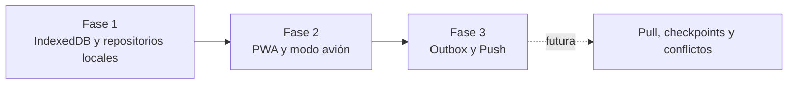
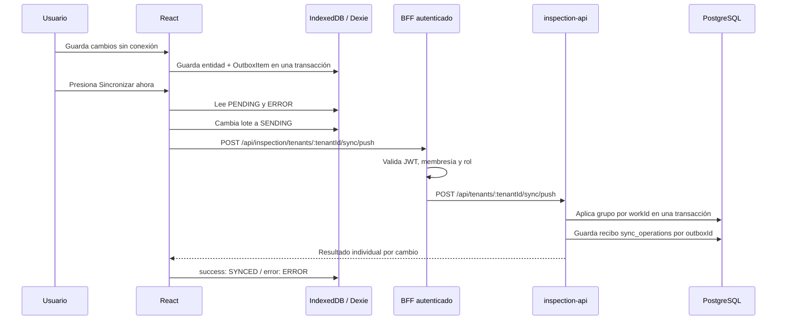

# GridAssets: Sync v1 con Outbox y Push

Esta es la tercera fase offline del MVP. Permite enviar a PostgreSQL los
trabajos, respuestas, tareas y comentarios creados o modificados en IndexedDB.
El envío es manual desde `/sync` y solo se inicia cuando el health check indica
que la API está disponible.

Esta fase implementa exclusivamente el recorrido de escritura local hacia el
servidor. Todavía no descarga cambios remotos, compara versiones ni resuelve
conflictos.

## Evolución



## Flujo completo



## La Outbox

`outbox` es una tabla Dexie que funciona como una bandeja de salida durable.
La escritura del dominio y su mensaje se hacen dentro de la misma transacción
local. Por eso no puede quedar una respuesta guardada sin que exista un cambio
pendiente que la represente.

```typescript
interface OutboxItem {
  id: string; // outboxId idempotente
  tenantId: string;
  entityType: 'WORK' | 'RESPONSE' | 'TASK_COMPLETION' | 'ANNOTATION';
  entityId: string;
  operation: 'CREATE' | 'UPDATE' | 'DELETE';
  payload: Record<string, unknown>;
  createdAt: string;
  updatedAt: string;
  status: 'PENDING' | 'SENDING' | 'SYNCED' | 'ERROR';
  attempts: number;
  lastError?: string;
}
```

Los elementos exitosos se conservan como `SYNCED` para facilitar diagnóstico.
No se borran en esta versión.

## Consolidación de cambios

La cola mantiene el estado más reciente de una entidad mientras el mensaje aún
no se está enviando:

| Secuencia local                          | Outbox resultante             |
| ---------------------------------------- | ----------------------------- |
| `CREATE`, `UPDATE`, `UPDATE`             | un `CREATE` con payload final |
| `UPDATE`, `UPDATE`                       | un `UPDATE` con payload final |
| `UPDATE`, `DELETE`                       | un `DELETE`                   |
| `CREATE`, `DELETE` antes del primer push | se cancela el mensaje         |

Un registro `SENDING` no se modifica. Si el usuario vuelve a editar mientras
se envía, se crea otro `PENDING`. Así el ACK del primer envío no puede borrar
un cambio más nuevo.

## Identidad e idempotencia

Hay dos UUID distintos:

- `entityId`: identifica el Work, respuesta, tarea o comentario. Se crea en el
  navegador y PostgreSQL conserva exactamente ese UUID.
- `outboxId`: identifica el intento lógico de aplicar un cambio. La restricción
  única `(tenant_id, outbox_id)` de `sync_operations` evita procesarlo dos veces.

El recibo `PROCESSED` se guarda en la misma transacción PostgreSQL que los datos
de dominio. Si el servidor confirma internamente pero la respuesta HTTP se
pierde, el cliente reenvía el mismo `outboxId`; el servidor encuentra el recibo
y responde `success` sin insertar otra entidad.

Los recibos con estado `ERROR` conservan el mensaje y el número de intentos,
pero permiten un reintento manual. Solo `PROCESSED` bloquea una segunda
aplicación.

## Dependencias y transacciones

Los cambios se agrupan por `workId`. Cada grupo respeta este orden:

```text
1. WORK, guardado inicialmente como DRAFT
2. RESPONSE
3. TASK_COMPLETION
4. ANNOTATION
5. estado final de WORK: DRAFT, IN_PROGRESS o FINISHED
```

El estado final se aplica al final para que un Work `FINISHED` no se cierre
antes de guardar sus campos obligatorios. El grupo completo se ejecuta en una
transacción PostgreSQL. Si una respuesta es inválida, falta el Work padre o el
servidor ya cerró el Work, se revierte ese grupo y todos sus cambios reciben un
error explícito.

Un grupo de Work no se divide entre lotes. El límite actual es
`SYNC_BATCH_SIZE = 50`. Esta decisión cubre el MVP y evita estados intermedios;
si un formulario genera más de 50 cambios se informa el límite en vez de
enviarlo parcialmente.

## Seguridad y reglas validadas por el servidor

El BFF aplica `JwtAuthGuard`, `InspectionTenantAccessGuard` y
`TenantRolesGuard`. Solo `TENANT_ADMIN`, `SUPERVISOR` e `INSPECTOR` pueden hacer
push. Además:

- el `tenantId` de la ruta, body y cada payload debe coincidir;
- activo, sitio, tipo de trabajo y plantilla deben pertenecer al tenant;
- el tipo de trabajo debe seguir habilitado para el activo;
- la plantilla y su versión deben continuar activas;
- cada elemento debe existir en el snapshot autorizado por el servidor;
- el tipo del valor y las opciones digitales se vuelven a validar;
- un Work `FINISHED` o `REVIEWED` en PostgreSQL no acepta cambios offline;
- el servidor reconstruye el snapshot y no confía en el enviado por el cliente.

El frontend sigue mostrando permisos para mejorar la experiencia, pero la
autoridad permanece en el BFF y `inspection-api`.

## Interrupciones y errores

- **Se pierde la red antes del ACK:** el lote queda `ERROR`; el reintento usa el
  mismo `outboxId`, por lo que el servidor puede responder idempotentemente.
- **La aplicación se cierra en `SENDING`:** al siguiente intento esos registros
  se recuperan como `ERROR` y vuelven a ser reintentables.
- **El backend rechaza una regla:** se guarda `lastError`, aumenta `attempts` y
  el registro permanece visible en `/sync`.
- **Un lote falla por red:** se detiene esa ejecución manual. Los lotes que no
  alcanzaron a enviarse permanecen `PENDING`.
- **Un cambio se confirma:** Outbox y entidad local pasan a `SYNCED`, salvo que
  exista un cambio posterior todavía pendiente sobre la misma entidad.

## Base de datos del navegador

La versión 2 de `gridassets-inspection` agrega:

- `outbox`: mensajes, estado, intentos y último error;
- `deviceMetadata`: un `deviceId` generado una vez con `crypto.randomUUID()`.

La migración Dexie convierte registros antiguos `LOCAL_ONLY` o `MODIFIED` en
mensajes de Outbox para no perder trabajos creados antes de esta fase.

## Base de datos del servidor

La migración `1799101500000-CreateSyncOperations.ts` agrega
`sync_operations` con:

- tenant, dispositivo, outbox y entidad;
- operación y resultado;
- timestamp del cliente, recepción y procesamiento;
- intentos y último error;
- unicidad de `(tenant_id, outbox_id)`;
- índices de consulta por dispositivo y entidad.

## Archivos de esta fase

### inspection-api

- `app/sync/dto/sync-push.dto.ts`: contrato validado del batch.
- `app/sync/entities/sync-operation.entity.ts`: recibo idempotente.
- `app/sync/sync.controller.ts`: endpoint interno de push.
- `app/sync/sync.service.ts`: coordina grupos, transacciones e idempotencia.
- `app/sync/sync-change.parser.ts`: valida y normaliza cada payload.
- `app/sync/sync-change.parser.spec.ts`: prueba UUID cliente y aislamiento.
- `app/sync/sync-work.processor.ts`: aplica Work e hijos en orden de dominio.
- `app/sync/sync.types.ts`: tipos internos del procesador.
- `app/sync/sync.service.spec.ts`: tenant e idempotencia del reintento.
- `app/sync/sync.module.ts`: composición del módulo; importa directamente
  `CatalogModule` y registra `TenantEntity` para que `ActiveTenantGuard` pueda
  inyectar `TenantEntityRepository` dentro del contexto de Sync.
- `app/app.module.ts`: registra `SyncModule`.
- `app/config/database.config.ts`: registra entidad y migración.
- `app/works/works.module.ts`: exporta `WorksService`.
- `app/works/works.service.ts`: prepara un snapshot confiable para UUID offline.
- `migrations/1799101500000-CreateSyncOperations.ts`: tabla de recibos.

### BFF

- `inspection-api.client.ts`: contrato y proxy hacia `inspection-api`.
- `inspection-api.controller.ts`: ruta pública protegida.
- `inspection-api.client.spec.ts`: prueba del proxy HTTP.
- `inspection-api.controller.spec.ts`: prueba de roles permitidos.

### inspection-web

- `db/inspection-db.ts`: Dexie v2, Outbox, dispositivo y backfill.
- `features/offline/models.ts`: modelos de cola, progreso y resultado.
- `features/offline/sync-api.ts`: request HTTP del push.
- `repositories/outbox-repository.ts`: consolidación y lectura reintentable.
- `repositories/outbox-repository.test.ts`: reglas de consolidación.
- `repositories/local-work-repository.ts`: genera Outbox en cada mutación.
- `repositories/offline-repository.ts`: calcula pendientes desde Outbox.
- `services/sync-service.ts`: batches, estados y actualización del dominio.
- `services/sync-service.test.ts`: ACK, interrupción y reutilización de outboxId.
- `features/offline/offline-context.tsx`: estado de sync para toda la UI.
- `pages/sync-page.tsx`: botón, progreso, resultado, intentos y errores.

### Documentación

- `docs/INSPECTION_SYNC_PUSH.md`: diseño, recorrido, seguridad y pruebas de
  esta fase.
- `docs/INSPECTION_OFFLINE_FIRST.md`: actualiza la evolución hasta Sync v1.
- `apps/inspection-api/README.md`: registra el endpoint interno utilizado por
  el Push v1.
- `docs/INSPECTION_PWA_AIRPLANE_MODE.md`: enlaza la nueva fase desde PWA.
- `docs/INSPECTION_RULES.md`: registra las nuevas reglas `RN/RP-OFF`.

## Cómo probar manualmente

1. Levantar PostgreSQL, `inspection-api`, `bff-api` e `inspection-web`.
2. Entrar online y descargar un sitio para uso offline.
3. Activar modo avión y crear un Work.
4. Completar respuestas, tareas y comentarios; cerrar y reabrir la PWA.
5. Confirmar en `/sync` que los cambios continúan pendientes.
6. Recuperar internet y esperar el estado **En línea**.
7. Presionar **Sincronizar ahora**.
8. Confirmar el progreso y que el conteo termina en cero.
9. Consultar el Work desde el modo remoto o directamente en PostgreSQL.
10. Verificar que los UUID de IndexedDB coinciden con PostgreSQL.

Para probar idempotencia de manera controlada, reenviar el mismo request con
el mismo `outboxId`: debe responder `success` y existir una sola fila de dominio
y un solo recibo lógico en `sync_operations`.

## Siguiente fase: Pull

Pull necesitará versiones o secuencias de cambio del servidor, un checkpoint
por dispositivo y tenant, representación de eliminaciones, descarga incremental
y una política de conflictos. También deberá decidir cómo conciliar un cambio
remoto con un Outbox local pendiente. Ninguna de esas piezas forma parte de
Sync v1.

Las fotografías siguen fuera de `/sync/push`; tendrán una cola y endpoint de
upload propios.

## Diagnóstico de arranque de SyncModule

`SyncController` usa `ActiveTenantGuard`. Ese guard consulta la tabla de
tenants mediante `Repository<TenantEntity>`, por lo que `SyncModule` debe tener
disponibles tanto el guard exportado por `CatalogModule` como el repositorio
registrado por `TypeOrmModule.forFeature`.

```text
SyncController
      ↓
ActiveTenantGuard
      ↓
TenantEntityRepository
      ↓
PostgreSQL: tenants
```

Si falta `TenantEntity` en el contexto del módulo, Nest inicia la conexión,
ejecuta las migraciones y luego falla al construir el guard. La configuración
vigente en `sync.module.ts` registra ambas dependencias. El warning de Nx Cloud
y un puerto `9229` ocupado corresponden al cache remoto y al debugger;
respectivamente, no causan este error de inyección.
