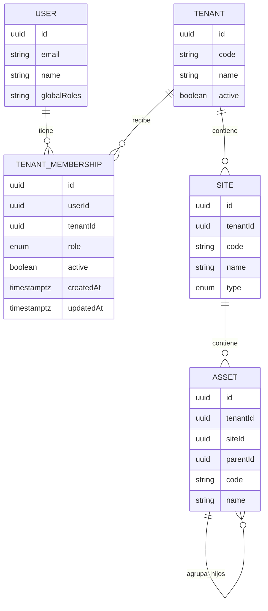
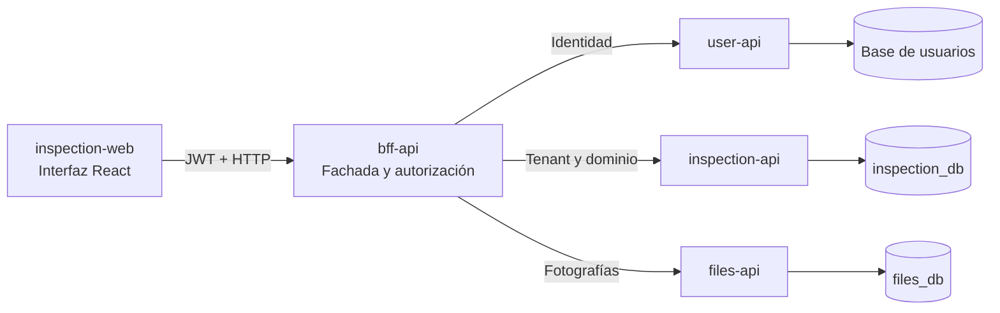
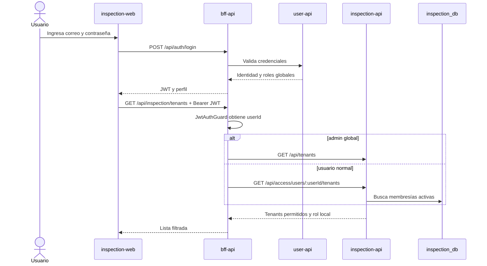
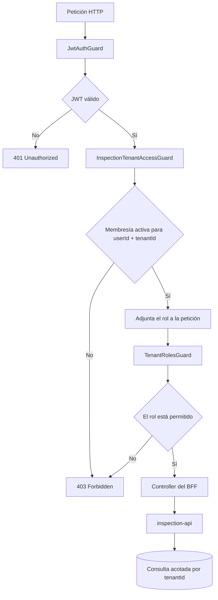

# GridAssets: usuarios, tenants y autorización

Esta guía explica cómo GridAssets identifica a un usuario, determina qué
empresas puede ver y autoriza sus acciones dentro de cada empresa. Describe la
implementación vigente en `inspection-web`, `bff-api`, `user-api`,
`inspection-api` y PostgreSQL.

Las reglas normativas del dominio continúan en
[INSPECTION_RULES.md](./INSPECTION_RULES.md). Este documento desarrolla esas
reglas con ejemplos, diagramas y referencias al código.

## 1. Las cuatro preguntas del modelo

El sistema separa cuatro conceptos:

```text
Login       → ¿Quién es el usuario?
Membresía   → ¿A qué tenants puede entrar?
Rol         → ¿Qué puede hacer en cada tenant?
tenantId    → ¿Sobre qué empresa actúa la petición actual?
```

Esta separación es importante porque una identidad puede participar en más de
una empresa y tener permisos distintos en cada una.

## 2. Modelo general



La entidad central de esta implementación es `TenantMembership`. Une el UUID
de un usuario con el UUID de un tenant y agrega el rol que ese usuario tiene
dentro de la empresa.

## 3. Relación entre usuarios y tenants

La relación es muchos a muchos:

```text
Un usuario puede pertenecer a varios tenants.
Un tenant puede tener varios usuarios.
```

PostgreSQL la representa mediante la tabla intermedia
`tenant_memberships`:

```text
users (user-api)                  tenants (inspection_db)
      id                                      id
       │                                      │
       └──────── tenant_memberships ──────────┘
                     id
                     user_id
                     tenant_id
                     role
                     active
                     created_at
                     updated_at
```

La restricción `UNIQUE (tenant_id, user_id)` impide registrar dos veces al
mismo usuario dentro de la misma empresa. El mismo usuario sí puede tener otra
membresía para otra empresa.

### Ejemplo

| Usuario    | Tenant           | Rol local      | Acceso                   |
| ---------- | ---------------- | -------------- | ------------------------ |
| Juan Pérez | Minera Andina    | `INSPECTOR`    | Activo                   |
| María Soto | Minera Andina    | `TENANT_ADMIN` | Activo                   |
| María Soto | Minera del Norte | `VIEWER`       | Activo                   |
| Pedro Díaz | Sin membresía    | —              | Sin empresas disponibles |

El resultado visible es:

```text
Juan Pérez
└── Minera Andina
    └── Inspector

María Soto
├── Minera Andina
│   └── Administradora del tenant
└── Minera del Norte
    └── Consulta

Pedro Díaz
└── Sin acceso a tenants de GridAssets
```

Si un cliente requiere que sus usuarios vean una sola empresa, se asigna una
sola membresía a cada usuario. El modelo permite varias membresías para no
bloquear casos futuros, como supervisores externos que trabajen con más de un
cliente.

## 4. Modelo TypeScript y PostgreSQL

El modelo persistido es equivalente a:

```typescript
enum TenantRole {
  TENANT_ADMIN = 'TENANT_ADMIN',
  SUPERVISOR = 'SUPERVISOR',
  INSPECTOR = 'INSPECTOR',
  VIEWER = 'VIEWER',
}

interface TenantMembership {
  id: string;
  userId: string;
  tenantId: string;
  role: TenantRole;
  active: boolean;
  createdAt: Date;
  updatedAt: Date;
}
```

### Significado de las columnas

- `userId`: UUID de la identidad almacenada por `user-api`.
- `tenantId`: UUID de la empresa almacenada por `inspection-api`.
- `role`: permiso local del usuario dentro de esa empresa.
- `active`: indica si la membresía es válida.
- `createdAt` y `updatedAt`: permiten rastrear la antigüedad y el último cambio.

`tenantId` tiene una clave foránea hacia `tenants`, ya que ambas tablas viven
en `inspection_db`. `userId` no tiene una clave foránea SQL porque el usuario
vive en otra base y es propiedad de otro servicio. Antes de crear una
membresía, el BFF consulta `user-api` para verificar que ese UUID corresponda a
un usuario real.

La migración agrega un enum PostgreSQL llamado `tenant_role_enum`. Las
membresías que existían antes de esta modificación reciben `INSPECTOR`, lo que
preserva su capacidad operacional.

## 5. Responsabilidad de cada aplicación



### `inspection-web`

Muestra los tenants autorizados, adapta la navegación al rol y evita presentar
acciones que el usuario no puede ejecutar. Esta capa mejora la experiencia,
pero no es la autoridad de seguridad.

### `bff-api`

Recibe el JWT, obtiene el `userId`, consulta la membresía y aplica los guards.
También coordina `user-api`, `inspection-api` y `files-api` sin exponer las APIs
internas directamente al navegador.

### `user-api`

Es dueño de la identidad, credenciales y roles globales. Responde quién es el
usuario. No almacena reglas específicas de GridAssets.

### `inspection-api`

Es dueño de tenants, membresías, sitios, activos, catálogos y trabajos. Responde
a qué tenants puede entrar un usuario y guarda el rol local de cada membresía.

### `files-api`

Almacena las fotografías. El BFF valida primero el tenant, el trabajo y el rol
antes de permitir una carga o eliminación.

## 6. Roles globales y roles locales

Existen dos niveles de autorización distintos.

### Rol global

El JWT contiene los roles generales de la identidad:

```text
admin → administra la plataforma completa
user  → usuario normal autenticado
```

El rol global `admin` puede crear tenants, asignar membresías y operar en todos
los tenants activos.

### Rol del tenant

El rol almacenado en `tenant_memberships` solo tiene efecto dentro del tenant
de esa fila:

- `TENANT_ADMIN`: administra la estructura y los catálogos del tenant.
- `SUPERVISOR`: consulta y ejecuta trabajos; queda preparado para revisión.
- `INSPECTOR`: consulta, crea y ejecuta trabajos.
- `VIEWER`: consulta sin modificar datos.

Una persona puede ser `TENANT_ADMIN` en Minera Andina y `VIEWER` en Minera del
Norte sin convertirse en administradora global.

## 7. Matriz de permisos vigente

| Acción                             | Admin global | Tenant admin | Supervisor | Inspector | Consulta |
| ---------------------------------- | :----------: | :----------: | :--------: | :-------: | :------: |
| Ver tenant                         |      Sí      |      Sí      |     Sí     |    Sí     |    Sí    |
| Ver sitios y activos               |      Sí      |      Sí      |     Sí     |    Sí     |    Sí    |
| Ver trabajos y fotografías         |      Sí      |      Sí      |     Sí     |    Sí     |    Sí    |
| Crear y ejecutar trabajos          |      Sí      |      Sí      |     Sí     |    Sí     |    No    |
| Agregar comentarios y fotografías  |      Sí      |      Sí      |     Sí     |    Sí     |    No    |
| Administrar sitios y activos       |      Sí      |      Sí      |     No     |    No     |    No    |
| Administrar catálogos y plantillas |      Sí      |      Sí      |     No     |    No     |    No    |
| Crear y desactivar tenants         |      Sí      |      No      |     No     |    No     |    No    |
| Asignar usuarios a tenants         |      Sí      |      No      |     No     |    No     |    No    |

`SUPERVISOR` e `INSPECTOR` tienen permisos equivalentes en esta etapa. Se
diferenciarán cuando exista el flujo de revisión, cierre y reapertura por un
supervisor.

## 8. Flujo de login y carga de tenants



El navegador nunca envía un `userId` para decidir qué empresas consultar. El
BFF obtiene ese identificador del JWT validado, evitando que un usuario intente
consultar las membresías de otra persona.

## 9. Flujo de una petición protegida

Una ruta como:

```http
POST /api/inspection/tenants/:tenantId/sites
```

pasa por estas validaciones:



### `JwtAuthGuard`

Valida la sesión. Si falta el JWT o no es válido, devuelve `401`.

### `InspectionTenantAccessGuard`

Consulta la combinación `userId + tenantId + active`. Si no existe, devuelve
`403`. Cuando existe, agrega el rol local a `request.tenantAccess`.

### `TenantRolesGuard`

Lee `@TenantRoles(...)` del endpoint y compara sus roles permitidos con el rol
obtenido desde la base.

Ejemplo de una mutación de configuración:

```typescript
@TenantRoles('TENANT_ADMIN')
```

Ejemplo de una operación de trabajo:

```typescript
@TenantRoles('TENANT_ADMIN', 'SUPERVISOR', 'INSPECTOR')
```

Las lecturas no declaran roles específicos: basta con una membresía activa.

## 10. Diferencia entre `401` y `403`

```text
401 Unauthorized → no existe una sesión válida
403 Forbidden    → la sesión es válida, pero no tiene membresía o permiso
```

Un `403` no debe cerrar la sesión. El usuario puede seguir trabajando en otro
tenant para el cual sí tenga acceso.

## 11. Contrato HTTP público

Estas son las rutas del BFF que puede consumir `inspection-web`.

### Autenticación

```text
POST /api/auth/login
GET  /api/auth/profile
```

### Operación

```text
GET /api/inspection/tenants
GET /api/inspection/admin/tenants
GET /api/inspection/tenants/:tenantId/**
POST|PUT|PATCH|DELETE /api/inspection/tenants/:tenantId/**
```

`GET /api/inspection/tenants` devuelve todos los tenants activos al admin
global y solamente las membresías activas al usuario normal. Cada tenant de un
usuario normal incluye `membershipRole`.

`GET /api/inspection/admin/tenants` devuelve todos los tenants al admin global
y solo los tenants donde el usuario normal tenga `TENANT_ADMIN`.

### Control global

```text
GET    /api/platform/tenants
POST   /api/platform/tenants
PATCH  /api/platform/tenants/:tenantId
GET    /api/platform/tenants/:tenantId/users
PUT    /api/platform/tenants/:tenantId/users/:userId/access
DELETE /api/platform/tenants/:tenantId/users/:userId/access
```

Estas rutas requieren el rol global `admin`.

Ejemplo para conceder o cambiar un rol:

```http
PUT /api/platform/tenants/54b.../users/8c1.../access
Content-Type: application/json
Authorization: Bearer <jwt>

{
  "role": "INSPECTOR"
}
```

Ejemplo de un usuario listado para la administración global:

```json
{
  "id": "8c1...",
  "email": "inspector@empresa.cl",
  "name": "Inspector Terreno",
  "roles": ["user"],
  "hasAccess": true,
  "membershipRole": "INSPECTOR"
}
```

## 12. Contrato HTTP interno

El BFF utiliza estas rutas privadas de `inspection-api`:

```text
GET    /api/access/users/:userId/tenants
GET    /api/access/users/:userId/tenants/:tenantId
GET    /api/platform/tenants/:tenantId/memberships
PUT    /api/platform/tenants/:tenantId/memberships/:userId
DELETE /api/platform/tenants/:tenantId/memberships/:userId
```

La comprobación individual responde:

```json
{
  "hasAccess": true,
  "role": "SUPERVISOR"
}
```

Estas rutas deben permanecer dentro de la red privada de servicios. El
navegador no debe llamar directamente a `inspection-api`.

## 13. Administración visual

El flujo disponible para el administrador global es:

```text
Login
└── Control global
    └── Administrar clientes
        └── Seleccionar tenant
            └── Acceso de usuarios
                ├── Habilitar usuario
                ├── Elegir rol
                ├── Cambiar rol
                └── Revocar acceso
```

El frontend utiliza el rol para adaptar la experiencia:

- `TENANT_ADMIN` ve la navegación de Administración.
- `INSPECTOR` y `SUPERVISOR` pueden crear y ejecutar trabajos.
- `VIEWER` no ve “Nuevo trabajo” y abre las ejecuciones en modo lectura.
- El admin global conserva la navegación de Control global.

Estas restricciones visuales acompañan la seguridad del BFF. Aunque alguien
fabrique una petición manual o modifique React desde el navegador, los guards
siguen rechazando la operación.

## 14. Cómo se evita mezclar datos entre tenants

La protección se aplica en varias capas:

1. El BFF obtiene el `userId` desde el JWT.
2. La lista de tenants se filtra en el servidor.
3. Cada ruta operacional lleva `tenantId`.
4. El BFF verifica la membresía para ese `tenantId`.
5. El rol se obtiene desde PostgreSQL y no desde un valor elegido por React.
6. Los servicios de dominio consultan entidades usando `tenantId` y, cuando
   corresponde, `siteId`.
7. Las relaciones de la base evitan asociar registros de empresas diferentes.

Conocer el UUID de otro tenant no concede acceso. Por ejemplo:

```http
GET /api/inspection/tenants/OTRO-TENANT/sites
```

produce `403 Forbidden` si no existe una membresía activa.

## 15. Inventario de archivos

### Archivos creados en `inspection-api`

| Archivo                                                                                                                                       | Responsabilidad                                                                        |
| --------------------------------------------------------------------------------------------------------------------------------------------- | -------------------------------------------------------------------------------------- |
| [`src/app/platform/dto/set-tenant-membership.dto.ts`](../apps/inspection-api/src/app/platform/dto/set-tenant-membership.dto.ts)               | Valida que el rol recibido pertenezca al enum permitido.                               |
| [`src/migrations/1799101300000-AddTenantMembershipRoles.ts`](../apps/inspection-api/src/migrations/1799101300000-AddTenantMembershipRoles.ts) | Agrega `role`, crea el enum PostgreSQL y migra membresías anteriores como `INSPECTOR`. |

### Archivos modificados o utilizados en `inspection-api`

| Archivo                                                                                                                                     | Responsabilidad                                                                             |
| ------------------------------------------------------------------------------------------------------------------------------------------- | ------------------------------------------------------------------------------------------- |
| [`src/app/platform/entities/tenant-membership.entity.ts`](../apps/inspection-api/src/app/platform/entities/tenant-membership.entity.ts)     | Define `TenantRole` y la entidad `TenantMembershipEntity`.                                  |
| [`src/app/platform/platform.service.ts`](../apps/inspection-api/src/app/platform/platform.service.ts)                                       | Lista tenants accesibles, obtiene membresías, concede acceso, cambia roles y revoca acceso. |
| [`src/app/platform/platform.controller.ts`](../apps/inspection-api/src/app/platform/platform.controller.ts)                                 | Expone la administración interna de tenants y membresías.                                   |
| [`src/app/platform/tenant-access.controller.ts`](../apps/inspection-api/src/app/platform/tenant-access.controller.ts)                       | Expone al BFF los tenants de un usuario y la comprobación `{hasAccess, role}`.              |
| [`src/app/platform/platform.module.ts`](../apps/inspection-api/src/app/platform/platform.module.ts)                                         | Registra repositorios, controladores y servicio del módulo.                                 |
| [`src/app/config/database.config.ts`](../apps/inspection-api/src/app/config/database.config.ts)                                             | Registra la entidad y la migración en TypeORM.                                              |
| [`src/migrations/1799101100000-CreateTenantMemberships.ts`](../apps/inspection-api/src/migrations/1799101100000-CreateTenantMemberships.ts) | Migración original que creó la tabla y su restricción única.                                |
| [`src/app/platform/platform.service.spec.ts`](../apps/inspection-api/src/app/platform/platform.service.spec.ts)                             | Prueba listado filtrado, rol inicial, cambio de rol y revocación.                           |
| [`README.md`](../apps/inspection-api/README.md)                                                                                             | Documenta la base, migraciones y acceso multi-tenant.                                       |

### Archivos creados en `bff-api`

| Archivo                                                                                                                  | Responsabilidad                                                          |
| ------------------------------------------------------------------------------------------------------------------------ | ------------------------------------------------------------------------ |
| [`src/app/inspection-api/tenant-role.ts`](../apps/bff-api/src/app/inspection-api/tenant-role.ts)                         | Contrato de roles locales utilizado por el BFF.                          |
| [`src/app/inspection-api/tenant-roles.decorator.ts`](../apps/bff-api/src/app/inspection-api/tenant-roles.decorator.ts)   | Define `@TenantRoles(...)`.                                              |
| [`src/app/inspection-api/tenant-roles.guard.ts`](../apps/bff-api/src/app/inspection-api/tenant-roles.guard.ts)           | Autoriza una acción comparando el rol requerido con la membresía.        |
| [`src/app/inspection-api/tenant-roles.guard.spec.ts`](../apps/bff-api/src/app/inspection-api/tenant-roles.guard.spec.ts) | Prueba tenant admin, consulta de solo lectura y bypass del admin global. |

### Archivos modificados o utilizados en `bff-api`

| Archivo                                                                                                                                          | Responsabilidad                                                                        |
| ------------------------------------------------------------------------------------------------------------------------------------------------ | -------------------------------------------------------------------------------------- |
| [`src/app/auth/types/express-request-with-user.ts`](../apps/bff-api/src/app/auth/types/express-request-with-user.ts)                             | Permite adjuntar `tenantAccess` a la petición autenticada.                             |
| [`src/app/inspection-api/inspection-tenant-access.guard.ts`](../apps/bff-api/src/app/inspection-api/inspection-tenant-access.guard.ts)           | Verifica la membresía y coloca el rol en la petición.                                  |
| [`src/app/inspection-api/inspection-api.controller.ts`](../apps/bff-api/src/app/inspection-api/inspection-api.controller.ts)                     | Protege rutas operacionales y clasifica las mutaciones por rol.                        |
| [`src/app/inspection-api/inspection-api.client.ts`](../apps/bff-api/src/app/inspection-api/inspection-api.client.ts)                             | Consume membresías, roles y endpoints internos de `inspection-api`.                    |
| [`src/app/inspection-api/platform-admin.controller.ts`](../apps/bff-api/src/app/inspection-api/platform-admin.controller.ts)                     | Une usuarios de `user-api` con membresías de `inspection-api` para la pantalla global. |
| [`src/app/inspection-api/inspection-api.module.ts`](../apps/bff-api/src/app/inspection-api/inspection-api.module.ts)                             | Registra el nuevo guard y sus dependencias.                                            |
| [`src/app/files-api/files-api.service.ts`](../apps/bff-api/src/app/files-api/files-api.service.ts)                                               | Deja leer fotografías a un `VIEWER`, pero bloquea carga y eliminación.                 |
| [`src/app/user-api/user-api.client.ts`](../apps/bff-api/src/app/user-api/user-api.client.ts)                                                     | Cliente existente usado para listar y validar identidades antes de asociarlas.         |
| [`src/app/inspection-api/inspection-tenant-access.guard.spec.ts`](../apps/bff-api/src/app/inspection-api/inspection-tenant-access.guard.spec.ts) | Prueba membresía válida, acceso denegado y administrador global.                       |
| [`src/app/inspection-api/inspection-api.controller.spec.ts`](../apps/bff-api/src/app/inspection-api/inspection-api.controller.spec.ts)           | Prueba guards, roles de configuración, roles de trabajo y tenants administrables.      |
| [`src/app/inspection-api/inspection-api.client.spec.ts`](../apps/bff-api/src/app/inspection-api/inspection-api.client.spec.ts)                   | Prueba los contratos HTTP internos y el envío del rol.                                 |
| [`src/app/files-api/files-api.service.spec.ts`](../apps/bff-api/src/app/files-api/files-api.service.spec.ts)                                     | Prueba que una membresía `VIEWER` no pueda subir evidencia.                            |
| [`src/app/inspection-api/platform-admin.controller.spec.ts`](../apps/bff-api/src/app/inspection-api/platform-admin.controller.spec.ts)           | Conserva la prueba de acceso exclusivo para el administrador global.                   |

### Archivos creados en `inspection-web`

| Archivo                                                                                                                   | Responsabilidad                                                                    |
| ------------------------------------------------------------------------------------------------------------------------- | ---------------------------------------------------------------------------------- |
| [`src/features/tenants/models.ts`](../apps/inspection-web/src/features/tenants/models.ts)                                 | Declara roles y etiquetas visibles en español.                                     |
| [`src/features/tenants/tenant-access-context.tsx`](../apps/inspection-web/src/features/tenants/tenant-access-context.tsx) | Carga los tenants permitidos y calcula si el usuario puede administrar o escribir. |

### Archivos modificados o utilizados en `inspection-web`

| Archivo                                                                                                                                 | Responsabilidad                                                          |
| --------------------------------------------------------------------------------------------------------------------------------------- | ------------------------------------------------------------------------ |
| [`src/app/app.tsx`](../apps/inspection-web/src/app/app.tsx)                                                                             | Instala `TenantAccessProvider` dentro de la sesión autenticada.          |
| [`src/routes/app-routes.tsx`](../apps/inspection-web/src/routes/app-routes.tsx)                                                         | Protege `/admin` para administradores globales o `TENANT_ADMIN`.         |
| [`src/layouts/app-layout.tsx`](../apps/inspection-web/src/layouts/app-layout.tsx)                                                       | Muestra Administración y Control global según los permisos.              |
| [`src/features/assets/models.ts`](../apps/inspection-web/src/features/assets/models.ts)                                                 | Incorpora `membershipRole` al tenant recibido.                           |
| [`src/features/assets/asset-catalog-api.ts`](../apps/inspection-web/src/features/assets/asset-catalog-api.ts)                           | Consume tenants operacionales y tenants administrables.                  |
| [`src/features/assets/use-asset-catalog.ts`](../apps/inspection-web/src/features/assets/use-asset-catalog.ts)                           | Elige la fuente de tenants según se trate de operación o administración. |
| [`src/features/assets/use-asset-administration.ts`](../apps/inspection-web/src/features/assets/use-asset-administration.ts)             | Carga únicamente tenants que el usuario puede administrar.               |
| [`src/features/assets/components/asset-detail.tsx`](../apps/inspection-web/src/features/assets/components/asset-detail.tsx)             | Oculta “Nuevo trabajo” para una membresía `VIEWER`.                      |
| [`src/features/catalogs/use-reference-catalog.ts`](../apps/inspection-web/src/features/catalogs/use-reference-catalog.ts)               | Limita los mantenedores a tenants administrables.                        |
| [`src/features/sites/use-site-administration.ts`](../apps/inspection-web/src/features/sites/use-site-administration.ts)                 | Limita la administración de sitios a tenants administrables.             |
| [`src/features/platform/models.ts`](../apps/inspection-web/src/features/platform/models.ts)                                             | Agrega el rol local al usuario mostrado en Control global.               |
| [`src/features/platform/platform-api.ts`](../apps/inspection-web/src/features/platform/platform-api.ts)                                 | Envía el rol al conceder o actualizar una membresía.                     |
| [`src/pages/platform-tenants-page.tsx`](../apps/inspection-web/src/pages/platform-tenants-page.tsx)                                     | Presenta usuarios, selector de rol y habilitación o revocación.          |
| [`src/pages/new-work-page.tsx`](../apps/inspection-web/src/pages/new-work-page.tsx)                                                     | Impide abrir la creación de trabajos con rol de consulta.                |
| [`src/pages/work-detail-page.tsx`](../apps/inspection-web/src/pages/work-detail-page.tsx)                                               | Informa al formulario si el tenant es de solo lectura.                   |
| [`src/features/works/components/work-execution-form.tsx`](../apps/inspection-web/src/features/works/components/work-execution-form.tsx) | Bloquea edición, guardado y evidencias cuando el acceso es de consulta.  |

### Documentación y referencia reutilizable

| Archivo                                                                                                                                           | Responsabilidad                                                      |
| ------------------------------------------------------------------------------------------------------------------------------------------------- | -------------------------------------------------------------------- |
| [`INSPECTION_RULES.md`](./INSPECTION_RULES.md)                                                                                                    | Fuente normativa de reglas de negocio y programación.                |
| [`INSPECTION_TENANT_ACCESS.md`](./INSPECTION_TENANT_ACCESS.md)                                                                                    | Esta explicación técnica y conceptual.                               |
| [`.agents/skills/tenant-auth-flow/references/gridassets-tenant-auth.md`](../.agents/skills/tenant-auth-flow/references/gridassets-tenant-auth.md) | Referencia reutilizable del flujo login → tenant → BFF → API → base. |

## 16. Validación realizada

La implementación fue comprobada con:

- TypeScript en `inspection-api`, `bff-api` e `inspection-web`.
- 35 pruebas en 7 suites de `inspection-api`.
- 49 pruebas en 11 suites de `bff-api`.
- ESLint sin errores; permanecen cuatro advertencias anteriores en el frontend.
- Builds Nx de las tres aplicaciones.
- Migración aplicada en PostgreSQL y columna `role` verificada.
- Contenedores de PostgreSQL, `inspection-api`, `bff-api`, `user-api` y
  `files-api` saludables.
- Prueba funcional real: lectura de `VIEWER` devuelve `200`, escritura devuelve
  `403`, otro tenant devuelve `403` y `TENANT_ADMIN` accede a Administración.
- La membresía temporal de la prueba fue revocada al finalizar.

## 17. Decisiones pendientes relacionadas

- Diferenciar `SUPERVISOR` de `INSPECTOR` cuando exista revisión y reapertura de
  trabajos.
- Definir si un `TENANT_ADMIN` podrá administrar directamente las membresías de
  su empresa. Actualmente esa acción está reservada al administrador global
  para evitar exponer usuarios de otros clientes.
- Agregar auditoría para registrar quién concede, cambia o revoca un rol.
- Migrar el JWT desde `localStorage` a una cookie `HttpOnly`, `Secure` y
  `SameSite` antes de una etapa productiva que lo requiera.

## 18. Resumen mental

```text
Usuario inicia sesión
        ↓
user-api confirma su identidad
        ↓
BFF obtiene userId desde el JWT
        ↓
inspection-api busca tenant_memberships
        ↓
La membresía define tenantId + role
        ↓
El BFF permite o rechaza la acción
        ↓
La API consulta datos acotados por tenantId
```

La membresía decide dónde entra el usuario. El rol decide qué puede hacer. El
`tenantId` mantiene cada operación dentro de la empresa correcta.
