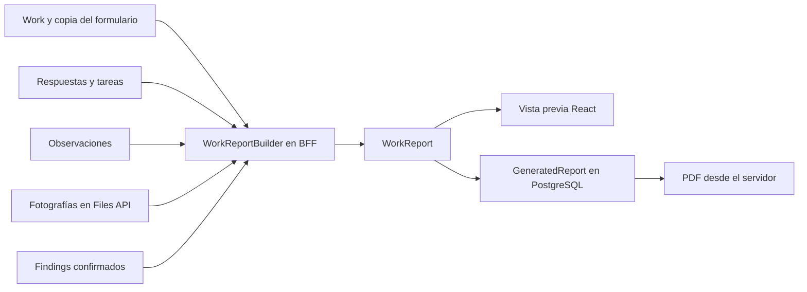
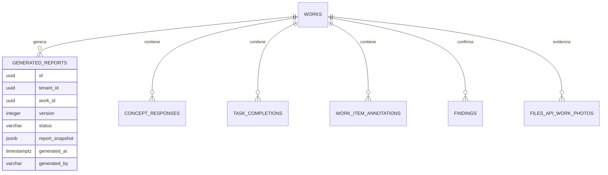
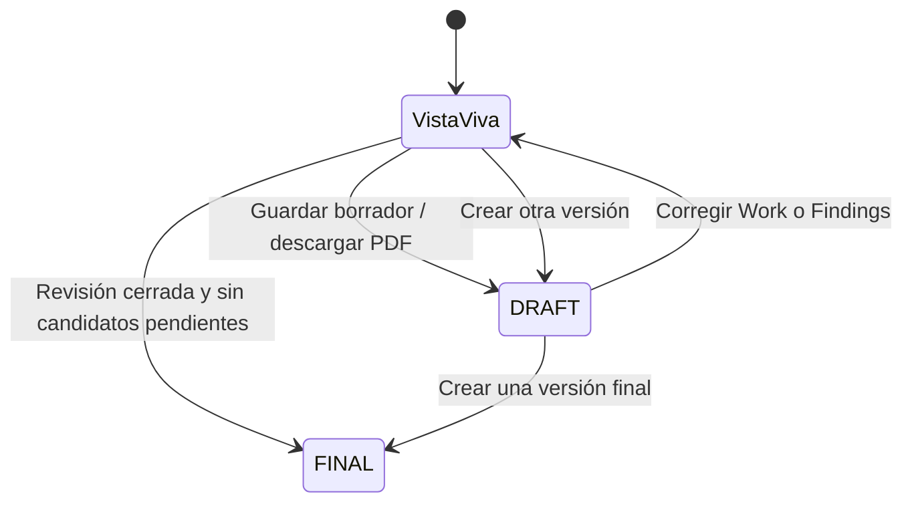

# Fase 3 — Informe del trabajo v1

## Qué resuelve

Un trabajo terminado ya contiene el formulario ejecutado, respuestas, tareas, comentarios, fotografías y hallazgos revisados. Esta fase los reúne en un **WorkReport** de solo lectura, muestra una vista previa y genera un PDF. No vuelve a evaluar conceptos, rangos ni criticidad.

El `WorkReportBuilder` vive en el BFF porque allí puede consultar Inspection API y Files API bajo la sesión y el acceso al tenant. La vista React solo presenta el modelo; el PDF usa el mismo modelo, ya sea recién armado o recuperado de una versión guardada.

## Modelo de datos

`GeneratedReport` es una versión **append-only**: cada guardado crea una fila nueva, con versión consecutiva por trabajo. La migración `1799101900000-CreateGeneratedReports.ts` agrega la tabla, la clave `(tenant_id, work_id, version)`, la referencia compuesta al trabajo y controles de estado y número de versión. No cambia las tablas de Work ni Finding.

El JSON `report_snapshot` guarda encabezado, branding, secciones, observaciones y tabla de hallazgos. Congela nombres, rutas, textos, valores, unidades, etiquetas digitales y criticidad al crear la versión. Las fotos se referencian por ID y caption. Un informe guardado solo se permite cuando el Work está `FINISHED` o `REVIEWED`; desde ese estado la aplicación ya impide modificar o borrar sus fotos. El PDF se puede regenerar desde la versión guardada.

`DRAFT` es una copia del estado revisable; no se edita esa fila. Para corregir un error se vuelve al trabajo/revisión y se genera otra versión. `FINAL` requiere Work `REVIEWED` y cero `FindingCandidate PENDING`, comprobado en Inspection API dentro de una transacción. Una versión FINAL tampoco se edita; otra emisión crea una nueva versión.

## Estructura del WorkReport

- **header**: tenant, trabajo, fecha, título, sitio, activo principal, tipo de trabajo, responsable, contratista y estado. Contenido, solicitado por, preparado por, aprobado por, distribución, recibido conforme e introducción son opcionales. La introducción puede arrancar desde la descripción del WorkType; el usuario autorizado puede ajustarla antes de guardar. Los campos no disponibles quedan vacíos.
- **branding**: `tenantId`, nombre de empresa y espacios para logo, color y texto de pie. No se dibujan logos no configurados.
- **sections**: grupos por activo y sección de la copia del FormTemplate del trabajo. Dentro de cada uno, los elementos siguen el orden de la plantilla.
- **observations**: `Work.notes`, en un bloque antes de hallazgos.
- **findings**: solo entidades `Finding` confirmadas, ordenadas por `sortOrder` e ID, numeradas desde 1.

Cada elemento de sección conserva su `assetPath`, tipo, título, descripción, respuesta/tarea, observación y fotos. Para un descendiente, la ruta se reconstruye desde `Asset.parentId` hasta el activo principal; por ejemplo `Transformador T1 › Radiador R2`. Si el catálogo ya no tiene ese activo, se usa el nombre guardado en la copia del Work. Nunca se reemplaza el activo hijo por el principal al identificar una medición o hallazgo.

| Elemento | Vista previa y PDF                                                         |
| -------- | -------------------------------------------------------------------------- |
| TASK     | Nombre, estado realizada/pendiente y comentario del elemento               |
| ANALOG   | Número y unidad de la copia del Concept (`51 °C`)                          |
| DIGITAL  | Etiqueta de la opción elegida, no UUID                                     |
| TEXT     | Texto ingresado                                                            |
| Foto     | Inmediatamente tras su elemento, con ruta del activo y título              |
| Finding  | Ruta, título y descripción revisados, criticidad guardada, HH y materiales |

No hay cálculo de rangos ni selección de candidatos durante la construcción. Un trabajo sin Findings muestra igualmente `Hallazgos` y el texto `No se registraron hallazgos durante la ejecución del trabajo.`

## APIs y permisos

Todas las rutas públicas pasan por JWT y comprobación de acceso al tenant en el BFF.

| Ruta BFF                                                     | Uso                                                   |
| ------------------------------------------------------------ | ----------------------------------------------------- |
| `GET /api/inspection/tenants/:tenantId/works/:workId/report` | Vista viva desde el estado actual                     |
| `GET .../report/versions`                                    | Versiones guardadas                                   |
| `GET .../report/versions/:reportId`                          | Una versión histórica                                 |
| `POST .../report/versions`                                   | Guardar DRAFT o FINAL; solo TENANT_ADMIN o SUPERVISOR |
| `GET .../report/pdf?reportId=:id`                            | PDF de una versión, con fotos autorizadas             |

El BFF llama a las rutas internas `GET/POST /api/tenants/:tenantId/works/:workId/reports` de Inspection API para conservar las versiones. Los archivos salen de Files API mediante el BFF; la descarga del PDF verifica de nuevo el acceso a cada foto.

## Vista previa y PDF

La nueva ruta `/works/:id/report?tenantId=...` se abre desde **Ver informe** en el detalle del trabajo. La página blanca incluye encabezado, introducción, grupos del formulario, actividades, mediciones, comentarios, fotografías, observaciones adicionales y tabla final. Permite completar campos opcionales y guardar versiones; elegir una versión histórica la presenta tal como se guardó. La generación y el PDF requieren conexión; no se agregó una cola offline.

El servidor genera el PDF con PDFKit. Sharp convierte JPG/PNG/WebP a una imagen compatible, corrige orientación y mantiene proporción. La paginación reserva espacio para títulos, filas e imágenes, y agrega encabezado de empresa/trabajo y pie con `Página X de Y`. Una fotografía no se parte entre páginas. Se utiliza una imagen grande o dos en una fila según proporción y espacio. El PDF v1 tiene diseño funcional y marcas genéricas; el branding avanzado queda preparado en el modelo.

## Archivos de la fase

| Archivo                                                                                                     | Responsabilidad                                       |
| ----------------------------------------------------------------------------------------------------------- | ----------------------------------------------------- |
| `apps/inspection-api/src/app/works/entities/generated-report.entity.ts`                                     | Entidad de la versión guardada                        |
| `apps/inspection-api/src/migrations/1799101900000-CreateGeneratedReports.ts`                                | Tabla, índices y restricciones                        |
| `apps/inspection-api/src/app/works/generated-reports.service.ts`                                            | Versionado, validación DRAFT/FINAL, lectura histórica |
| `apps/inspection-api/src/app/works/works.controller.ts`, `works.module.ts`                                  | Rutas internas y registro del servicio                |
| `apps/inspection-api/src/app/config/database.config.ts`                                                     | Registra entidad y migración                          |
| `apps/bff-api/src/app/inspection-api/work-report.ts`                                                        | DTO y ReportBuilder                                   |
| `apps/bff-api/src/app/inspection-api/work-report-pdf.ts`                                                    | Renderizador PDF                                      |
| `apps/bff-api/src/app/inspection-api/work-report.controller.ts`, `work-report.module.ts`                    | Rutas autenticadas, orquestación y exportación        |
| `apps/bff-api/src/app/inspection-api/inspection-api.client.ts`, `inspection-api.module.ts`, `app.module.ts` | Cliente interno y cableado de módulos                 |
| `apps/inspection-web/src/features/works/work-report-api.ts`                                                 | Cliente HTTP de informe y descarga                    |
| `apps/inspection-web/src/pages/work-report-page.tsx`                                                        | Vista previa, campos opcionales, versiones            |
| `apps/inspection-web/src/pages/work-detail-page.tsx`, `routes/app-routes.tsx`                               | Enlace y ruta                                         |
| `package.json`, `package-lock.json`                                                                         | PDFKit, Sharp y tipos                                 |
| `work-report.spec.ts`, `work-report-pdf.spec.ts`, `generated-reports.service.spec.ts`                       | Builder, PDF y reglas de finalización                 |

## Cómo probar

1. Termina un trabajo con un activo principal y descendientes, respuestas ANALOG/DIGITAL/TEXT, tareas, comentarios y fotos. Revisa sus candidatos.
2. Abre el trabajo y pulsa **Ver informe**. Comprueba que cada medición de un hijo muestre la ruta correcta y la foto junto al elemento.
3. Guarda un borrador. Comprueba que aparezca `v1 · Borrador` y que se pueda descargar el PDF. Si quedan candidatos pendientes, FINAL debe ser rechazado.
4. Finaliza la revisión del trabajo y pulsa **Finalizar informe**. Se crea otra versión FINAL. Cambiar catálogos después no debe alterar esa versión.
5. Prueba un trabajo sin Findings: la sección Hallazgos debe aparecer con el mensaje de ausencia.

Pruebas automatizadas: el builder verifica ruta de un activo hijo, respuestas, observación, foto y texto del Finding revisado; el servicio verifica la barrera de FINAL y el versionado; el PDF se prueba con 20 conceptos, 5 tareas, 8 fotos, 3 observaciones y 4 hallazgos. El artefacto de prueba se renderizó visualmente para verificar proporción y pie de página.

## Para convertirlo en entregable formal

Faltan definir con la minera el formato contractual definitivo, portada y numeración documental, logos/branding autorizados, firmas y aprobaciones externas, política de retención de PDF y evidencias, y una aceptación formal de la plantilla de informe. Word editable, firma electrónica, correo y portal del cliente quedan fuera de esta fase.
