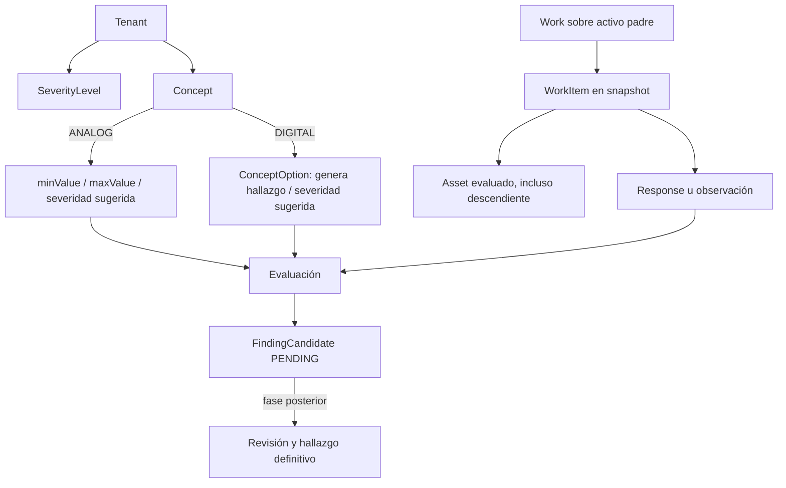

# Fase 1: criterios y candidatos de hallazgo

Esta fase agrega detección preliminar durante la ejecución de un trabajo. Un `FindingCandidate` indica una condición que merece revisión posterior; no es todavía un hallazgo aprobado ni aparece en un informe final.

## Modelo y reglas

- `severity_levels`: `id`, `tenant_id`, `code`, `name`, `sort_order`, `active`. Cada empresa administra sus niveles. No hay una lista fija de criticidades. La referencia desde un concepto u opción es una **sugerencia**.
- `concepts`: para `ANALOG`, `min_value`, `max_value` y `out_of_range_severity_id`. Se genera candidato cuando el valor es estrictamente menor que el mínimo o mayor que el máximo configurado. Un extremo vacío significa que no hay límite por ese lado. La igualdad con el límite es normal.
- `concept_options`: para `DIGITAL`, `generates_finding` y `suggested_severity_id`. Solo la opción seleccionada genera candidato cuando está marcada expresamente.
- `work_item_annotations`: `is_finding`. Un comentario ordinario se mantiene como comentario. Al marcarlo, se exige texto y aparece un candidato `MANUAL`.
- `finding_candidates`: conserva `tenant_id`, `work_id`, `work_item_id`, `asset_id`, `concept_id`, origen, título, descripción, valor, límites, severidad sugerida, estado y fechas. Su unicidad de base de datos es `(tenant_id, work_id, work_item_id, source)`.

El `Work` sigue perteneciendo únicamente al activo padre. Cada `WorkItem` guarda en el snapshot el activo al que aplica; el candidato toma ese `assetId`. Si una medición proviene del radiador hijo, el candidato queda asociado al radiador, aunque el trabajo sea del transformador.

La configuración de reglas se copia al snapshot cuando se crea el trabajo. Esto permite que una inspección iniciada conserve la interpretación de sus respuestas aunque después cambie el catálogo. Los trabajos creados antes de esta fase no adquieren reglas nuevas automáticamente: para aplicarles los criterios actuales se crea un trabajo nuevo.

## Ciclo de vida

1. Al guardar respuestas, el servidor evalúa todas las respuestas y anotaciones del trabajo dentro de la misma transacción. El Push offline usa el mismo evaluador después de aplicar los cambios recibidos.
2. Si una condición anómala sigue presente, el candidato `PENDING` se crea o actualiza. Su identificador estable y la restricción única evitan duplicados cuando una medición cambia de 95 a 96.
3. Si la respuesta vuelve a la normalidad, se elimina **solo** el candidato `PENDING`. Un candidato `CONFIRMED` o `DISCARDED` no se modifica ni elimina automáticamente, para no borrar decisiones humanas futuras.
4. La interfaz muestra una advertencia discreta junto al punto y una lista preliminar dentro del trabajo con activo, origen, valor, observación, severidad sugerida y estado. Los cambios no guardados aparecen como vista previa.

En esta fase no existe acción de confirmar o descartar. Esos estados están preparados para la fase de revisión; no debe confundirse `PENDING` con un hallazgo final.

## API y persistencia

La migración `1799101700000-CreateFindingCandidates.ts` crea `severity_levels` y `finding_candidates`, agrega columnas a conceptos, opciones y anotaciones, y registra triggers para Pull. Las claves y referencias de severidad están acotadas por tenant. El catálogo permite:

| Ruta bajo `/api/inspection`                            | Uso                                                       |
| ------------------------------------------------------ | --------------------------------------------------------- |
| `GET /tenants/:tenantId/severity-levels`               | Listar niveles                                            |
| `POST /tenants/:tenantId/severity-levels`              | Crear nivel (administrador de tenant)                     |
| `PATCH /tenants/:tenantId/severity-levels/:severityId` | Editar o activar/desactivar nivel                         |
| `GET/POST/PATCH /tenants/:tenantId/concepts...`        | Consultar/configurar reglas analógicas y digitales        |
| `PUT /tenants/:tenantId/works/:workId/responses`       | Guardar respuestas, marca manual y regenerar candidatos   |
| `GET /tenants/:tenantId/works`                         | Incluye `findingCandidates` y `severityLevels` del tenant |

El BFF conserva el control de membresía y permisos existente. La API de inspección valida tenant y referencias. En PostgreSQL, el evaluador corre en la transacción de respuestas y en la transacción de Push.

En el navegador, IndexedDB versión 4 añade `severityLevels` y `findingCandidates`. La descarga online guarda ambos y las reglas del catálogo. Durante trabajo offline se materializa la vista local de candidatos al guardar. No se agrega un segundo tipo de comando al outbox: el Push envía `RESPONSE` y `ANNOTATION` como antes, el servidor deriva los candidatos y el Pull los distribuye como `FINDING_CANDIDATE`. También distribuye cambios de configuración como `SEVERITY_LEVEL`. Esto evita que un cliente envíe candidatos arbitrarios o que cliente y servidor mantengan dos fuentes de verdad. El Pull filtra por tenant y sitio como el resto de los cambios.

## Archivos por responsabilidad

| Área                      | Archivos principales                                                                                                                                                                                                                                  | Cambio                                                                                                                |
| ------------------------- | ----------------------------------------------------------------------------------------------------------------------------------------------------------------------------------------------------------------------------------------------------- | --------------------------------------------------------------------------------------------------------------------- |
| PostgreSQL/ORM            | `apps/inspection-api/src/migrations/1799101700000-CreateFindingCandidates.ts`, `catalog/entities/{severity-level,concept,concept-option}.entity.ts`, `works/entities/{finding-candidate,work-item-annotation}.entity.ts`, `config/database.config.ts` | Tablas, columnas, restricciones, registro de entidades y migración.                                                   |
| Configuración de catálogo | `catalog/{catalog.controller,catalog.service,catalog.module}.ts`, `catalog/dto/{severity-level,create-concept}.dto.ts`                                                                                                                                | CRUD de severidades y validación de límites, opciones y referencias por tenant.                                       |
| Trabajo y reglas          | `works/{finding-candidate.service,works.service,work-snapshot}.ts`, `works/dto/save-work-responses.dto.ts`, `works/works.module.ts`                                                                                                                   | Copia de criterios al snapshot, evaluación transaccional y exposición de candidatos.                                  |
| Sincronización API        | `sync/{sync-work.processor,sync-change.parser,sync.types}.ts`                                                                                                                                                                                         | Marca manual en Push y evaluación derivada tras aplicar respuestas.                                                   |
| BFF                       | `apps/bff-api/src/app/inspection-api/{inspection-api.controller,inspection-api.client}.ts`                                                                                                                                                            | Rutas protegidas y contratos.                                                                                         |
| Formulario web            | `features/concepts/{models,concept-api,concept-schema}.ts`, `features/concepts/components/concept-form.tsx`, `pages/admin-concepts-page.tsx`                                                                                                          | Configurar severidades, límites y opciones que generan candidatos.                                                    |
| Ejecución web             | `features/works/{models,work-api,work-catalog-context,use-work-catalog,finding-candidates}.ts`, `features/works/components/{work-execution-form,work-item-additional-info}.tsx`, `pages/work-detail-page.tsx`                                         | Marca manual, avisos y vista preliminar.                                                                              |
| Offline                   | `db/inspection-db.ts`, `features/offline/models.ts`, `repositories/local-work-repository.ts`, `services/{cache-site-for-offline,apply-remote-changes}.ts`, `features/works/work-reference-loader.ts`                                                  | Almacenamiento local, reglas en snapshots y Pull de nuevas entidades.                                                 |
| Pruebas                   | `features/works/finding-candidates.test.ts`, `works/finding-candidate.service.spec.ts`, `repositories/local-work-repository.test.ts`, `services/apply-remote-changes.test.ts` y ajustes de constructores en pruebas existentes                        | Casos normales/anómalos, manual, actualización sin duplicado, conservación de revisados, persistencia offline y Pull. |

## Prueba manual breve

1. En Administración → Conceptos, selecciona la empresa y crea una severidad, por ejemplo `Alta`.
2. Configura un concepto digital con opción `Operativo` sin marca y `No operativo` con **Genera hallazgo** y severidad `Alta`. Configura otro analógico con rango `0–40`.
3. Crea un trabajo nuevo cuya plantilla incluya esos conceptos. Responde `Operativo` y `35`: la lista preliminar debe estar vacía.
4. Cambia a `No operativo` y `51`: deben aparecer dos candidatos. Si el ítem pertenece a un activo hijo, ese nombre debe verse en la lista. Guarda y recarga; los candidatos deben persistir.
5. Cambia `51` a `52`: debe seguir un solo candidato analógico, con valor actualizado. Cambia luego a `35`: el candidato analógico pendiente debe desaparecer.
6. Escribe una observación normal: no debe crear candidato. Activa **Marcar este comentario como posible hallazgo**: aparece uno manual. Prueba también sin conexión, guarda, reconecta y sincroniza; los candidatos deben llegar por Pull al otro dispositivo.

La siguiente fase debe ofrecer revisión supervisora: ver evidencia y contexto, confirmar o descartar cada candidato, definir criticidad final, registrar HH y materiales cuando corresponda, y recién entonces crear el hallazgo definitivo y la tabla del informe.
