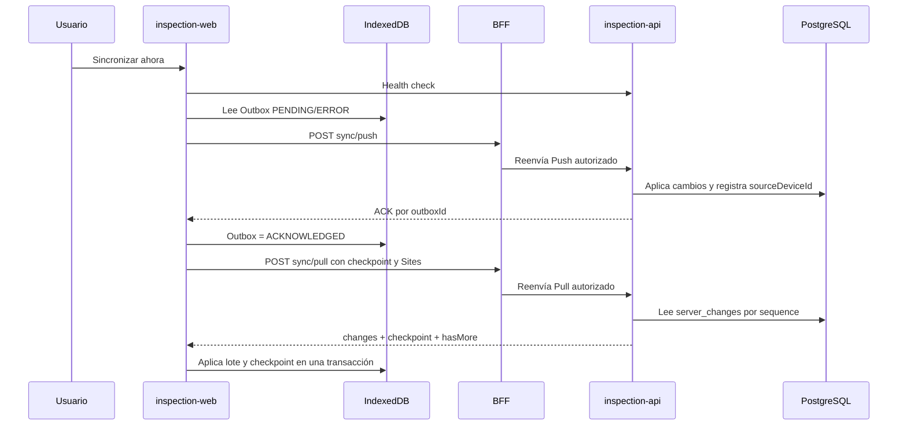

# Sync v2: Pull incremental y checkpoints

Este documento describe la cuarta fase offline de GridAssets. Sync v2 extiende
el Outbox y Push de Sync v1 con descarga incremental, checkpoints por
dispositivo y candidatos de conflicto.

## Estado verificado

| Componente                  | Estado                                             |
| --------------------------- | -------------------------------------------------- |
| Código local                | Implementado y preparado en el índice de Git       |
| `inspection-api` QA         | Desplegado y saludable                             |
| BFF QA                      | Desplegado y saludable                             |
| `inspection-web-qa`         | Desplegado y con interfaz Pull                     |
| Migración PostgreSQL        | `CreateServerChanges1799101600000` ejecutada       |
| Tabla `server_changes`      | Presente y recibiendo cambios                      |
| Endpoint Pull               | Responde con `changes`, `checkpoint` y `hasMore`   |
| Resolución de conflictos    | Pendiente; solo se detectan y preservan candidatos |
| Filtro de tenant en `/sync` | Desplegado en QA el 23 de septiembre de 2026       |

La auditoría del 21 de septiembre de 2026 comparó por checksum los archivos
locales de esta fase con el árbol remoto y no encontró diferencias de
contenido. La entrega quedó desplegada en QA, aunque todavía debe consolidarse
en un commit propio para recuperar trazabilidad entre Git y la versión remota.

## Flujo



La sincronización manual sigue este orden:

```text
CHECKING → PUSHING → PULLING → APPLYING
```

El Pull comienza solamente cuando el Push terminó sin errores. Esto evita
descargar una versión remota mientras existen cambios locales que todavía no
han sido aceptados por el servidor.

`cacheSiteForOffline(tenantId, siteId)` continúa siendo la descarga completa
inicial. Pull mantiene actualizados únicamente los Sites que ya están marcados
como `READY` en IndexedDB.

## Server Change Log

PostgreSQL agrega `server_changes` con:

```text
sequence BIGSERIAL
tenant_id
site_id opcional
source_device_id opcional
entity_type
entity_id
operation
payload JSONB
changed_at
```

Triggers sobre las entidades sincronizables escriben el cambio dentro de la
misma transacción de la mutación. Si la escritura principal falla, su entrada
en `server_changes` también se revierte.

La función del trigger toma `pg_advisory_xact_lock(17991016)` antes de asignar
la secuencia. Esto evita que una secuencia menor se confirme después de que un
Pull haya avanzado más allá de ella. La serialización es apropiada para el
volumen del MVP; un volumen alto deberá evaluar CDC o particionamiento.

No se utiliza `updatedAt` como cursor porque dos filas pueden compartir fecha,
el reloj puede variar y una eliminación física deja de estar disponible en la
tabla de dominio. `sequence` define un orden único.

La migración no hace backfill. La descarga completa crea el estado base del
dispositivo y `server_changes` representa las mutaciones posteriores a la
migración.

## Endpoint y seguridad

Ruta pública del BFF:

```http
POST /api/inspection/tenants/:tenantId/sync/pull
```

Ruta interna de `inspection-api`:

```http
POST /api/tenants/:tenantId/sync/pull
```

Request:

```json
{
  "deviceId": "uuid",
  "checkpoint": 1500,
  "siteIds": ["uuid"]
}
```

Response:

```json
{
  "changes": [
    {
      "sequence": 1501,
      "entityType": "WORK",
      "entityId": "uuid",
      "operation": "UPDATE",
      "sourceDeviceId": "uuid",
      "payload": {},
      "serverUpdatedAt": "2026-09-21T12:00:00.000Z"
    }
  ],
  "checkpoint": 1501,
  "hasMore": false
}
```

El BFF exige JWT, membresía y uno de los roles `TENANT_ADMIN`, `SUPERVISOR`,
`INSPECTOR` o `VIEWER`. `inspection-api` valida que todos los `siteIds`
pertenezcan al tenant de la ruta. El cliente no decide el tenant mediante el
payload.

El servidor toma una marca de agua alta, devuelve lotes de hasta 100 cambios
ordenados y utiliza `hasMore` para indicar que el cliente debe solicitar otra
página. El checkpoint solo avanza después de aplicar el lote localmente.

## Scope de datos

Cambios globales del tenant:

- `ASSET_TYPE`;
- `WORK_TYPE`;
- `CONCEPT`;
- `CONCEPT_OPTION`;
- `FORM_TEMPLATE`;
- `FORM_SECTION`;
- `FORM_ITEM`.

Cambios acotados a los Sites descargados:

- `SITE`;
- `ASSET`;
- `WORK`;
- `RESPONSE`;
- `TASK_COMPLETION`;
- `ANNOTATION`.

Respuestas, tareas y anotaciones resuelven su `siteId` desde el Work padre. Al
descargar un Site nuevo después de haber avanzado el checkpoint, su descarga
completa crea el estado base y Pull se ocupa de cambios posteriores.

### Aislamiento en el centro de sincronización

La pantalla `/sync` exige seleccionar una empresa. El tenant elegido delimita
en conjunto:

- el Outbox mostrado y enviado por Push;
- los Sites `READY` incluidos en Pull;
- el checkpoint presentado y actualizado;
- los candidatos de conflicto;
- la fecha de última sincronización.

Seleccionar una empresa no combina ni procesa la cola de otra. Los contadores
globales del indicador de conexión pueden resumir el dispositivo completo,
pero la pantalla y el botón de sincronización operan con un único `tenantId`.

## IndexedDB

Dexie sube a la versión 3 y agrega:

```typescript
interface SyncCheckpoint {
  id: string;
  tenantId: string;
  deviceId: string;
  checkpoint: number;
  updatedAt: string;
}

interface SyncConflictCandidate {
  id: string;
  tenantId: string;
  entityType: PullEntityType;
  entityId: string;
  localData: unknown;
  remoteData: unknown;
  remoteSequence: number;
  detectedAt: string;
  status: 'PENDING';
}
```

Cada lote se valida y se aplica dentro de una única transacción Dexie que
incluye el checkpoint. Si un cambio falla, se revierten todas las entidades y
el checkpoint. Reintentar el lote es seguro porque `put` conserva UUID y
`delete` es idempotente.

## ACK, eco y conflictos

Después de un Push aceptado, el Outbox pasa a `ACKNOWLEDGED`. Cuando Pull recibe
un cambio con el mismo `sourceDeviceId`, lo reconoce como eco propio y no lo
trata como una edición de otro dispositivo.

Si un registro tiene `LOCAL_ONLY`, `MODIFIED` o un Outbox no confirmado, un
cambio remoto no lo sobrescribe. Se conservan ambas versiones en
`syncConflictCandidates` y el checkpoint puede avanzar.

La pantalla `/sync` muestra el número de candidatos, pero esta fase no permite
elegir versión local, versión remota o una mezcla. Esa resolución pertenece a
la fase siguiente.

### Hallazgo de revisión sobre ACK

La implementación desplegada ejecuta `finalizeAcknowledged(tenantId)` al
terminar satisfactoriamente todos los lotes Pull. Esta función convierte en
`SYNCED` cualquier Outbox `ACKNOWLEDGED` restante, incluso si ese ciclo no
observó explícitamente su eco en `server_changes`.

El Push ya tiene un ACK idempotente del servidor, por lo que no implica que el
registro no se haya guardado. Sin embargo, es menos estricto que la regla
documentada de esperar el eco concreto. Antes de construir la resolución de
conflictos se debe decidir una de estas políticas y cubrirla con una prueba:

1. confiar en el ACK del Push y marcar `SYNCED` inmediatamente; o
2. exigir el `sourceDeviceId` correspondiente antes de cerrar el Outbox.

La ruta Pull utiliza `POST` y actualmente conserva la respuesta HTTP 201 que
Nest asigna por defecto a ese decorador. El cliente acepta cualquier respuesta
2xx, por lo que no afecta el flujo. Se puede declarar HTTP 200 de forma
explícita en una limpieza posterior para expresar mejor que la operación solo
consulta cambios.

## Archivos de la fase

### BFF

| Archivo                                                                 | Responsabilidad                                                     |
| ----------------------------------------------------------------------- | ------------------------------------------------------------------- |
| `apps/bff-api/src/app/inspection-api/inspection-api.client.ts`          | Define el payload Pull y reenvía el request a `inspection-api`.     |
| `apps/bff-api/src/app/inspection-api/inspection-api.client.spec.ts`     | Comprueba URL, método y body enviados al API interno.               |
| `apps/bff-api/src/app/inspection-api/inspection-api.controller.ts`      | Publica la ruta autenticada y autoriza los cuatro roles del tenant. |
| `apps/bff-api/src/app/inspection-api/inspection-api.controller.spec.ts` | Verifica la metadata de roles del endpoint.                         |

### inspection-api

| Archivo                                                                   | Responsabilidad                                                                           |
| ------------------------------------------------------------------------- | ----------------------------------------------------------------------------------------- |
| `apps/inspection-api/src/app/config/database.config.ts`                   | Registra `ServerChangeEntity` y la migración del log.                                     |
| `apps/inspection-api/src/app/sync/dto/sync-pull.dto.ts`                   | Valida checkpoint, dispositivo y un máximo de 100 Sites; define el contrato de respuesta. |
| `apps/inspection-api/src/app/sync/entities/server-change.entity.ts`       | Mapea `server_changes` y sus índices.                                                     |
| `apps/inspection-api/src/app/sync/sync.controller.ts`                     | Expone `POST /sync/pull` dentro del API interno.                                          |
| `apps/inspection-api/src/app/sync/sync.module.ts`                         | Registra el repositorio de cambios del servidor.                                          |
| `apps/inspection-api/src/app/sync/sync.service.ts`                        | Valida el scope, calcula marca alta, pagina y transforma payloads a camelCase.            |
| `apps/inspection-api/src/app/sync/sync.service.spec.ts`                   | Prueba paginación, orden y rechazo de Sites de otro tenant.                               |
| `apps/inspection-api/src/migrations/1799101600000-CreateServerChanges.ts` | Crea tabla, índices, función y triggers transaccionales.                                  |

### inspection-web

| Archivo                                                                       | Responsabilidad                                                                |
| ----------------------------------------------------------------------------- | ------------------------------------------------------------------------------ |
| `apps/inspection-web/src/db/inspection-db.ts`                                 | Agrega la versión 3 de Dexie, checkpoints y candidatos de conflicto.           |
| `apps/inspection-web/src/features/offline/components/connectivity-status.tsx` | Aclara que el indicador superior resume todo el dispositivo.                   |
| `apps/inspection-web/src/features/offline/models.ts`                          | Define estados `ACKNOWLEDGED`, contratos Pull, progreso, resumen y conflictos. |
| `apps/inspection-web/src/features/offline/offline-context.tsx`                | Orquesta una sincronización limitada al tenant seleccionado.                   |
| `apps/inspection-web/src/features/offline/sync-api.ts`                        | Implementa el request autenticado a `/sync/pull`.                              |
| `apps/inspection-web/src/features/tenants/tenant-access-context.tsx`          | Expone los tenants accesibles al selector de sincronización.                   |
| `apps/inspection-web/src/pages/sync-page.tsx`                                 | Selecciona empresa y presenta solamente sus conteos, checkpoint y conflictos.  |
| `apps/inspection-web/src/repositories/offline-repository.ts`                  | Calcula pendientes y metadata filtrados por `tenantId`.                        |
| `apps/inspection-web/src/repositories/offline-repository.test.ts`             | Prueba que los resúmenes no mezclen empresas.                                  |
| `apps/inspection-web/src/repositories/outbox-repository.ts`                   | Consulta elementos del Outbox por tenant y conserva copias del payload.        |
| `apps/inspection-web/src/services/apply-remote-changes.ts`                    | Valida secuencias, aplica CRUD en Dexie y preserva conflictos.                 |
| `apps/inspection-web/src/services/apply-remote-changes.test.ts`               | Prueba actualización remota, conflicto, eco propio y rollback transaccional.   |
| `apps/inspection-web/src/services/sync-service.ts`                            | Ejecuta Push y Pull paginado para una sola empresa por ciclo.                  |
| `apps/inspection-web/src/services/sync-service.test.ts`                       | Prueba ACK, reintento, paginación, checkpoint y aislamiento multi-tenant.      |

### Documentación relacionada

| Archivo                                | Responsabilidad                                                  |
| -------------------------------------- | ---------------------------------------------------------------- |
| `docs/offline-sync-v2.md`              | Fuente principal de Sync v2, inventario y prueba QA.             |
| `docs/INSPECTION_OFFLINE_FIRST.md`     | Actualiza la evolución general hasta Pull.                       |
| `docs/INSPECTION_PWA_AIRPLANE_MODE.md` | Enlaza la fase PWA con la evolución posterior de sincronización. |
| `docs/INSPECTION_SYNC_PUSH.md`         | Enlaza la continuación de Push en Sync v2.                       |
| `docs/INSPECTION_RULES.md`             | Registra reglas vigentes de Pull, checkpoint y conflicto.        |
| `apps/inspection-api/README.md`        | Incluye el endpoint Pull en el contrato interno.                 |
| `apps/inspection-web/README.md`        | Refleja el alcance offline actual del frontend.                  |

## Validaciones ejecutadas

```text
Frontend Pull:       9 tests aprobados
inspection-api:     41 tests aprobados
bff-api:            51 tests aprobados
TypeScript web:      aprobado
TypeScript API:      aprobado
TypeScript BFF:      aprobado
Prettier:            aprobado
git diff --check:    aprobado
```

La auditoría remota comprobó:

```text
server_changes: presente
migración CreateServerChanges1799101600000: registrada
endpoint Pull interno: contrato válido
interfaz Pull de QA: presente
inspection-api, BFF y frontend QA: saludables
```

## Prueba manual en QA

QA comparte el backend operativo. Realizar la prueba en un tenant y activo de
pruebas, usando un nombre claramente identificable.

### Preparar dispositivo A

1. Abrir `https://qa-inspection.atomdev.cl` en Chrome normal.
2. Iniciar sesión, seleccionar tenant y Site.
3. Pulsar **Descargar para uso offline**.
4. Abrir `/sync` y pulsar **Sincronizar ahora** para establecer el checkpoint.
5. Anotar el valor de **Checkpoint**.

### Producir un cambio desde dispositivo B

1. Abrir QA en incógnito, otro navegador o un teléfono.
2. Iniciar sesión y entrar al mismo tenant y Site.
3. Crear un Work online llamado `PRUEBA PULL QA <fecha-hora>`.
4. Confirmar que B lo muestra en modo remoto.

### Descargarlo mediante Pull en A

1. Volver al dispositivo A sin recargar su almacenamiento local.
2. Abrir `/sync` y pulsar **Sincronizar ahora**.
3. Comprobar las fases **Descargando cambios** y **Aplicando cambios**.
4. Confirmar que **recibidos** es mayor que cero y el checkpoint aumentó.
5. Abrir la copia local del Site.
6. Activar modo avión o `DevTools > Network > Offline`.
7. Buscar `PRUEBA PULL QA <fecha-hora>`.

Ver el Work sin red demuestra el recorrido:

```text
Dispositivo B → PostgreSQL → server_changes → Pull → IndexedDB de A
```

En escritorio también se puede comprobar en:

```text
DevTools
└── Application
    └── IndexedDB
        └── gridassets-inspection
            ├── works
            ├── syncCheckpoints
            └── syncConflictCandidates
```

## Fuera de alcance

- resolución de candidatos de conflicto;
- merge automático o last-write-wins;
- fotografías y blobs offline;
- sincronización automática al recuperar conexión;
- Background Sync, polling y WebSockets;
- limpieza o retención definitiva de `server_changes`;
- prueba E2E automatizada con dos navegadores reales.
